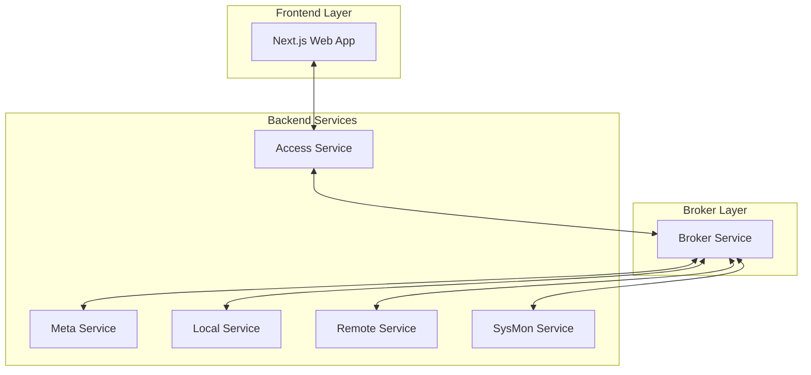

# v2e

A sophisticated Go-based system that demonstrates a broker-first architecture for orchestrating multiple subprocess services that communicate via RPC messages over stdin/stdout. The system provides a comprehensive CVE (Common Vulnerabilities and Exposures) management platform with integrated CWE (Common Weakness Enumeration) and CAPEC (Common Attack Pattern Enumeration and Classification) data handling.

## Executive Summary

The v2e project implements a broker-first architecture where `cmd/broker` serves as the central process manager that spawns, monitors, and manages all subprocess services. This design enforces a strict communication pattern where all inter-service communication flows through the broker, preventing direct subprocess-to-subprocess interaction. The architecture ensures clean separation of concerns while maintaining robust message routing and process lifecycle management.

Key architectural principles:
- **Centralized Process Management**: The broker is the sole orchestrator of all subprocess services
- **Enforced Communication Pattern**: All inter-service communication occurs through broker routing
- **RPC-Based Messaging**: Services communicate via structured JSON RPC messages over stdin/stdout
- **Frontend Integration**: A Next.js-based web application provides user interface access
- **Performance Monitoring**: Built-in metrics collection and system monitoring capabilities

## System Architecture



## Component Breakdown

### Core Services

- **Broker Service** ([cmd/broker](file:///home/cyw0ng/projects/v2e-qoder/cmd/broker)): The central orchestrator responsible for:
  - Spawning and managing all subprocess services
  - Routing RPC messages between services
  - Maintaining process lifecycle and health
  - Tracking message statistics and performance metrics
  - Providing system-wide coordination capabilities

- **Access Service** ([cmd/access](file:///home/cyw0ng/projects/v2e-qoder/cmd/access)): The REST gateway that:
  - Serves as the primary interface for the Next.js frontend
  - Exposes `/restful/rpc` endpoint for RPC forwarding
  - Translates HTTP requests to RPC calls and responses back
  - Provides health checks and basic service discovery

- **Meta Service** ([cmd/meta](file:///home/cyw0ng/projects/v2e-qoder/cmd/meta)): The orchestration layer that:
  - Manages job scheduling and execution
  - Coordinates complex multi-step operations
  - Handles session management and state persistence
  - Provides workflow control mechanisms

- **Local Service** ([cmd/local](file:///home/cyw0ng/projects/v2e-qoder/cmd/local)): The data persistence layer that:
  - Manages local SQLite databases for CVE, CWE, and CAPEC data
  - Provides CRUD operations for vulnerability information
  - Handles data indexing and querying
  - Implements caching mechanisms for improved performance

- **Remote Service** ([cmd/remote](file:///home/cyw0ng/projects/v2e-qoder/cmd/remote)): The data acquisition layer that:
  - Fetches vulnerability data from external APIs (NVD, etc.)
  - Implements rate limiting and retry mechanisms
  - Handles data transformation and normalization
  - Manages API credentials and authentication

- **SysMon Service** ([cmd/sysmon](file:///home/cyw0ng/projects/v2e-qoder/cmd/sysmon)): The system monitoring layer that:
  - Collects performance metrics and system statistics
  - Monitors resource utilization across services
  - Provides health indicators for operational awareness
  - Reports system status to the frontend

## Communication Flow

The system uses a sophisticated RPC-over-stdin/stdout communication mechanism:

- **Custom File Descriptors**: RPC subprocesses use file descriptors 3 and 4 (instead of stdin/stdout) to avoid conflicts with standard I/O streams
- **Message Types**: Four distinct message types (Request, Response, Event, Error) with correlation IDs for request-response matching
- **Routing Logic**: Messages are intelligently routed based on target process ID, with special handling for responses using correlation IDs
- **Message Statistics**: Comprehensive tracking of message counts, types, and timing per process

The communication pattern follows this flow:
1. External requests → Access REST API → Broker → Backend Services
2. All inter-service communication happens exclusively through broker routing
3. No direct subprocess-to-subprocess communication is allowed
4. The broker maintains message correlation and response tracking

## Frontend Integration

The Next.js-based frontend ([website](file:///home/cyw0ng/projects/v2e-qoder/website)) provides:

- **REST Gateway Interface**: Access service exposes `/restful/rpc` endpoint for frontend-backend communication
- **Sophisticated RPC Client**: Handles automatic case conversion (camelCase ↔ snake_case) and comprehensive error handling
- **Rich Component Architecture**: Tabbed interface supporting CVE, CWE, CAPEC, and system monitoring data
- **Real-time Updates**: Session control and live metrics display
- **Responsive Design**: Adaptable interface for various screen sizes and devices

The frontend includes dedicated sections for:
- CVE Database browsing and management
- CWE Database and view management
- CAPEC data visualization
- System monitoring and performance metrics
- Session control for data fetching jobs

## Quickstart

Prerequisites: Go 1.24+, Node.js 18+, and basic shell tools.

Build all commands:

```bash
# Build backend binaries
go build ./cmd/...
```

Build the frontend:

```bash
# Navigate to website directory and install dependencies
cd website
npm install
# Build the frontend
npm run build
```

Run with the broker (recommended):

```bash
# Start the broker which spawns configured subprocesses
./broker config.json
```

## Development Workflow

### Live Development

To enable live development, use the `-r` option with the `build.sh` script. This option streamlines development by automatically restarting the broker and Node.js processes when changes are detected in Go source files or frontend assets.

Run the following command from the project root:

```bash
./build.sh -r
```

Features:
- **Automatic Restart**: The broker and Node.js processes restart automatically on file changes
- **Debouncing**: Prevents rapid restarts with a delay between file change detection and process restarts
- **Process Cleanup**: Ensures all subprocesses terminate properly before restarting

Notes:
- This workflow is for development only, not for production environments
- Ensure all dependencies are installed before using the `-r` option

### Testing

Run unit tests:

```bash
# Run Go unit tests
./build.sh -t
```

Run integration tests:

```bash
# Run Python integration tests
./build.sh -i
```

Run performance benchmarks:

```bash
# Execute performance benchmarks
./build.sh -b
```

## Configuration Guide

The system is configured through `config.json`, which controls:

- Process definitions and startup parameters
- Logging configuration and output destinations
- Service-specific settings
- RPC communication parameters
- Performance tuning options

The broker reads this configuration at startup and uses it to determine which subprocess services to spawn and how to configure them.

## Performance Characteristics

The broker-first architecture provides several performance benefits:

- **Efficient Message Routing**: Direct process-to-process communication through the broker minimizes overhead
- **Scalable Process Management**: The broker can manage dozens of subprocess services with minimal resource impact
- **Built-in Metrics Collection**: Comprehensive performance monitoring built into the architecture
- **Optimized Communication**: Custom file descriptor usage avoids I/O conflicts and improves throughput

Performance monitoring capabilities include:
- Message throughput statistics
- Process response times
- System resource utilization
- Error rate tracking

## Project Layout

- **cmd/** - Service implementations
  - broker/ - Process manager and RPC router
  - access/ - REST gateway (subprocess)
  - local/ - Local data storage service (CVE/CWE/CAPEC)
  - remote/ - Remote data fetching service
  - meta/ - Orchestration and job control
  - sysmon/ - System monitoring service
- **pkg/** - Shared packages
  - proc/subprocess - Subprocess framework (stdin/stdout RPC)
  - cve - CVE domain types and helpers
  - cwe - CWE domain types and helpers
  - capec - CAPEC domain types and helpers
  - common - Config and logging utilities
- **tests/** - Integration tests (pytest)
- **website/** - Next.js frontend application

## Notes and Conventions

- All subprocesses must be started and managed by the broker; never run backend subprocesses directly in production or integration tests
- Subprocesses communicate exclusively via JSON RPC messages over stdin/stdout
- Configuration (process list, logging) is controlled through `config.json`
- The authoritative RPC API specification for each subprocess can be found in the top comment of its `cmd/*/main.go` file
- All inter-service communication flows through the broker to maintain architectural integrity

## Where to Look Next

- [cmd/broker](file:///home/cyw0ng/projects/v2e-qoder/cmd/broker) — Broker implementation and message routing
- [pkg/proc/subprocess](file:///home/cyw0ng/projects/v2e-qoder/pkg/proc/subprocess) — Helper framework for subprocesses
- [cmd/access](file:///home/cyw0ng/projects/v2e-qoder/cmd/access) — REST gateway and example of using the RPC client
- [website/](file:///home/cyw0ng/projects/v2e-qoder/website) — Next.js frontend implementation
- [tests/](file:///home/cyw0ng/projects/v2e-qoder/tests) — Integration tests demonstrating usage patterns

## License

MIT
