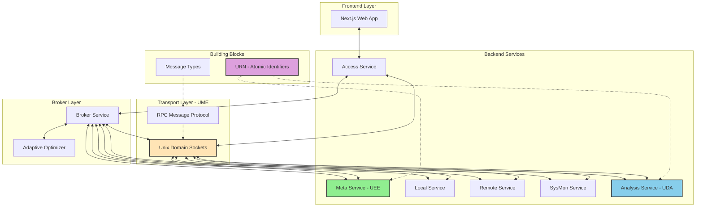
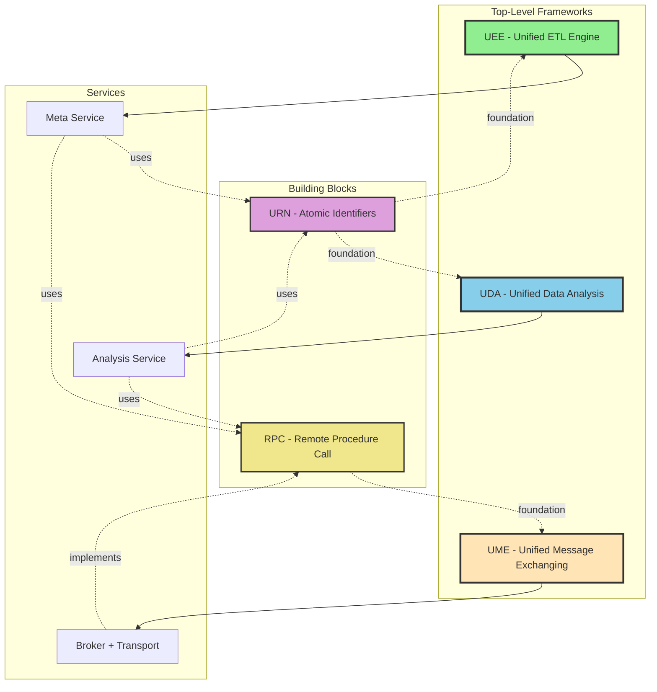
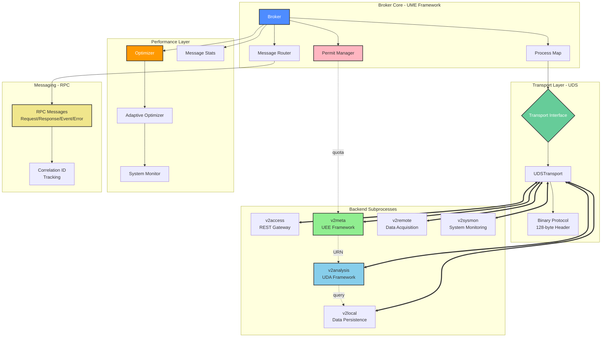

# v2e

A sophisticated Go-based system that demonstrates a broker-first architecture for orchestrating multiple subprocess services that communicate via RPC messages over stdin/stdout. The system provides a comprehensive security data management platform with integrated CVE (Common Vulnerabilities and Exposures), CWE (Common Weakness Enumeration), CAPEC (Common Attack Pattern Enumeration and Classification), ATT&CK (Adversarial Tactics, Techniques, and Common Knowledge), and OWASP ASVS (Application Security Verification Standard) framework data handling.

## Executive Summary

The v2e project implements a broker-first architecture where `cmd/v2broker` serves as the central process manager that spawns, monitors, and manages all subprocess services. This design enforces a strict communication pattern where all inter-service communication flows through the broker, preventing direct subprocess-to-subprocess interaction. The architecture ensures clean separation of concerns while maintaining robust message routing and process lifecycle management.

Key architectural principles:
- **Centralized Process Management**: The broker is the sole orchestrator of all subprocess services
- **Enforced Communication Pattern**: All inter-service communication occurs through broker routing
- **RPC-Based Messaging**: Services communicate via structured JSON RPC messages over stdin/stdout
- **Comprehensive Security Data**: Integrated CVE, CWE, CAPEC, ATT&CK, and OWASP ASVS data management
- **Frontend Integration**: A Next.js-based web application provides user interface access
- **Performance Monitoring**: Built-in metrics collection and system monitoring capabilities
- **Message Optimization**: Asynchronous message routing with configurable buffering and batching
- **Adaptive Optimization**: Dynamic performance tuning based on workload with adaptive algorithms
- **Enhanced Configuration**: Advanced configuration management via vconfig tool with TUI interface
- **Cross-Platform Support**: Containerized development environment for macOS with Linux support
- **Linux-Native Performance**: CPU affinity binding, thread pinning, and kernel memory hints for deterministic low-latency operation
- **Binary Message Protocol**: High-performance 128-byte fixed header with multiple encoding options (JSON/GOB/PLAIN)
- **Comprehensive Telemetry**: Wire-size tracking, encoding distribution, and per-process metrics

## Binary Message Protocol

The v2e broker implements an optimized binary message protocol with a 128-byte fixed header, providing significant performance improvements over pure JSON encoding.

### Header Layout

The binary header consists of exactly 128 bytes with the following structure:

| Offset | Size | Field | Description |
|--------|------|-------|-------------|
| 0-1 | 2 bytes | Magic | Protocol identifier (0x56 0x32 = 'V2') |
| 2 | 1 byte | Version | Protocol version (0x01) |
| 3 | 1 byte | Encoding | Payload encoding (0=JSON, 1=GOB, 2=PLAIN) |
| 4 | 1 byte | MsgType | Message type (0=Request, 1=Response, 2=Event, 3=Error) |
| 5-7 | 3 bytes | Reserved | Reserved for future use |
| 8-11 | 4 bytes | PayloadLen | Payload length (uint32, big-endian) |
| 12-43 | 32 bytes | MessageID | Message ID (null-terminated string) |
| 44-75 | 32 bytes | SourceID | Source process ID (null-terminated string) |
| 76-107 | 32 bytes | TargetID | Target process ID (null-terminated string) |
| 108-127 | 20 bytes | CorrelationID | Correlation ID for request-response matching |

### Encoding Options

Three encoding types are supported for payload serialization:

1. **JSON (Type 0)** - Default encoding, fastest for small messages
   - Best for messages < 1KB
   - Unmarshal: 236 ns/op, 304 B/op
   - Marshal: 418 ns/op, 424 B/op

2. **GOB (Type 1)** - Go-native binary encoding
   - Better for large structured payloads
   - Unmarshal: 1592 ns/op, 1432 B/op
   - Marshal: 1286 ns/op, 1360 B/op

3. **PLAIN (Type 2)** - Raw bytes without encoding
   - Most efficient for binary data
   - No serialization overhead

### Benchmark Results

Performance comparison (Intel Xeon 8370C @ 2.80GHz):

| Operation | JSON | GOB | PlainJSON | Winner |
|-----------|------|-----|-----------|--------|
| Small Message Marshal | 418 ns/op | 1286 ns/op | 669 ns/op | **JSON** (3.1x faster than GOB) |
| Small Message Unmarshal | 236 ns/op | 1592 ns/op | 2060 ns/op | **JSON** (6.7x faster than GOB) |
| Round-trip | 2139 ns/op | 4595 ns/op | 4508 ns/op | **JSON** (2.1x faster than GOB) |
| Large Payload Marshal | 5430 ns/op | 17359 ns/op | 106225 ns/op | **JSON** (3.2x faster than GOB) |

**Recommendation**: Use JSON encoding (default) for optimal performance on typical message sizes.

### Linux-Specific Optimizations

On Linux platforms, the following optimizations are automatically enabled:

- **Zero-copy operations**: `splice()` and `sendfile()` syscalls for efficient data transfer
- **Socket tuning**: TCP_NODELAY, TCP_QUICKACK, optimized buffer sizes
- **Memory hints**: `madvise()` for sequential access patterns
- **CPU affinity**: Thread pinning for deterministic latency
- **Optimized memcpy**: Direct memory operations bypassing bounds checking

### Usage Example

```go
import "github.com/cyw0ng95/v2e/pkg/proc"

// Create and marshal a message (default JSON encoding)
msg, _ := proc.NewRequestMessage("RPCGetStatus", map[string]string{
    "component": "broker",
})
msg.Source = "client"
msg.Target = "broker"

data, _ := msg.MarshalBinary() // Uses JSON encoding by default

// Check message type
if proc.IsBinaryMessage(data) {
    decoded, _ := proc.UnmarshalBinary(data)
    // Process decoded message
}

// Use GOB encoding for large structured data
largeData, _ := proc.MarshalBinaryWithEncoding(msg, proc.EncodingGOB)
```

### Metrics & Telemetry

The broker tracks comprehensive message statistics:

- **Global metrics**: Total messages/bytes sent/received, encoding distribution
- **Per-process metrics**: Message counts and byte totals per process
- **Encoding distribution**: Breakdown of JSON/GOB/PLAIN usage
- **Wire-size tracking**: Accurate byte-level bandwidth monitoring

Access metrics via RPC:
```go
// Get detailed statistics
stats, _ := broker.HandleRPCGetMessageStats(reqMsg)
// Returns: total_bytes_sent, total_bytes_received, encoding_distribution, per_process stats

// Get message count
count, _ := broker.HandleRPCGetMessageCount(reqMsg)
```

## System Architecture



The system utilizes a Unix Domain Sockets (UDS) transport layer with 0600 permissions for secure inter-process communication. The broker incorporates an advanced adaptive optimizer that dynamically adjusts performance parameters based on system load and message throughput.

## Architectural Frameworks

The v2e system is built on three unified architectural frameworks, with URN and RPC serving as foundational building blocks. This layered architecture provides separation of concerns while enabling comprehensive security data management and analysis.

### Framework Hierarchy



### Building Blocks

#### URN (Uniform Resource Name) - Atomic Identifiers

URNs provide hierarchical, immutable identification for all security data entities in the v2e system.

**Format**: `v2e::<provider>::<type>::<atomic_id>`

**Purpose**:
- **Immutable Identity**: Unique identification across all services and databases
- **Type Safety**: Structured validation of provider, type, and ID components
- **Cross-References**: Enable relationship tracking between CVE, CWE, CAPEC, ATT&CK, and SSG entities
- **Resumable Workflows**: Support checkpoint/resume operations in ETL pipelines
- **Graph Nodes**: Serve as node identifiers in the UDA relationship graph

**Examples**:
```
v2e::nvd::cve::CVE-2024-12233       # National Vulnerability Database CVE
v2e::mitre::cwe::CWE-79             # MITRE Common Weakness Enumeration
v2e::mitre::capec::CAPEC-66         # MITRE Attack Pattern
v2e::mitre::attack::T1566           # MITRE ATT&CK Technique
v2e::ssg::ssg::rhel9-guide-ospp     # SCAP Security Guide
```

**Supported Providers**: `nvd`, `mitre`, `ssg`  
**Supported Types**: `cve`, `cwe`, `capec`, `attack`, `ssg`

**Implementation**: See [pkg/urn](pkg/urn) for parsing, validation, and utilities.

#### RPC (Remote Procedure Call) - Inter-Service Communication

RPC provides the foundational communication protocol for all inter-service interactions, implemented through structured JSON messages over stdin/stdout.

**Message Types**:
- **Request**: Method invocation with parameters
- **Response**: Successful result from a request
- **Event**: Asynchronous notification (e.g., quota updates, state changes)
- **Error**: Error response with detailed information

**Message Structure**:
```json
{
  "type": "request|response|event|error",
  "id": "unique-message-id",
  "payload": { ... },
  "source": "service-id",
  "target": "service-id",
  "correlation_id": "request-response-matching"
}
```

**Key Features**:
- **Broker-Mediated**: All RPC messages routed through the central broker
- **Correlation IDs**: Request-response matching for asynchronous operations
- **Binary Protocol**: Optional 128-byte header with JSON/GOB/PLAIN encoding
- **Timeout Handling**: Configurable timeouts with automatic cleanup
- **Pooled Objects**: Message object pooling for reduced allocations

**Implementation**: See [pkg/proc/message.go](pkg/proc/message.go) and [pkg/rpc](pkg/rpc).

### Top-Level Frameworks

#### UEE (Unified ETL Engine)

**Service**: Meta Service ([cmd/v2meta](cmd/v2meta))  
**Purpose**: Resource-aware ETL orchestration for security data ingestion

**Key Concepts**:
- **Master-Slave Architecture**: Broker manages resources, Meta orchestrates ETL logic
- **Hierarchical FSM**: Macro FSM (orchestration) + Provider FSMs (worker execution)
- **Worker Permits**: Global concurrency control with dynamic quota management
- **Auto-Recovery**: Resume providers from checkpoints after restart
- **URN Checkpointing**: Persist progress every 100 items using URN identifiers

**Provider FSM States**:
```
IDLE → ACQUIRING → RUNNING → WAITING_QUOTA/WAITING_BACKOFF → PAUSED → TERMINATED
```

**Data Providers**:
- **CVEProvider**: NVD API with incremental `lastModStartDate` updates
- **CWEProvider**: MITRE CWE from `assets/cwe-raw.json`
- **CAPECProvider**: MITRE CAPEC from XML with XSD validation
- **ATTACKProvider**: MITRE ATT&CK techniques from XLSX

**Advanced Features**:
- Field-level diffing (reduces I/O by 50-80% on updates)
- Circuit breaker (auto-pause on 10% error threshold)
- Graceful shutdown with checkpoint persistence
- Dead Letter Queue for failed items

See [Unified ETL Engine (UEE) Architecture](#unified-etl-engine-uee-architecture) section below for details.

#### UDA (Unified Data Analysis)

**Service**: Analysis Service ([cmd/v2analysis](cmd/v2analysis))  
**Purpose**: URN-based relationship graph analysis and security entity correlation

**Key Concepts**:
- **In-Memory Graph Database**: URN-based nodes with typed directed edges
- **Relationship Types**: references, related_to, mitigates, exploits, contains
- **Path Finding**: BFS algorithm for attack path discovery (CVE → CWE → CAPEC → ATT&CK)
- **FSM-Based Lifecycle**: GraphFSM (graph operations) + AnalyzeFSM (service lifecycle)
- **BoltDB Persistence**: Save/load graph state with metadata tracking

**Graph Operations**:
- Add/retrieve nodes and edges by URN
- Find neighbors (incoming/outgoing connections)
- Find shortest path between entities
- Filter nodes by type or provider
- Query graph statistics

**Integration with UEE**:
- Monitor UEE status via RPC to meta service
- Build graphs from fresh ETL data
- Analyze relationships after data population

**Performance**:
- AddNode: ~150-200 ns/op
- GetNode: ~100-150 ns/op
- FindPath: ~10-15 µs/op (4-node path)
- Thread-safe with RWMutex for concurrent reads

**Example Use Case**: Trace attack paths from a specific CVE through CWE weaknesses and CAPEC attack patterns to ATT&CK techniques, identifying the complete attack chain.

See [cmd/v2analysis/service.md](cmd/v2analysis/service.md) for complete RPC API specification.

#### UME (Unified Message Exchanging)

**Service**: Broker Service ([cmd/v2broker](cmd/v2broker))  
**Purpose**: High-performance message routing and transport management

**Key Concepts**:
- **Binary Message Protocol**: 128-byte fixed header with JSON/GOB/PLAIN encoding
- **Unix Domain Sockets**: 0600 permissions for secure IPC
- **Adaptive Optimization**: Dynamic tuning of buffers, batching, and worker pools
- **Message Statistics**: Per-process tracking, encoding distribution, wire-size telemetry

**Transport Features**:
- **Zero-Copy Operations**: Linux `splice()` and `sendfile()` syscalls
- **Connection Pooling**: Efficient socket reuse
- **Backpressure Handling**: Dynamic throttling based on buffer saturation
- **Linux Optimizations**: CPU affinity, thread pinning, `madvise()` hints

**Message Routing**:
- Source/Target-based routing through process map
- Correlation ID tracking for request-response matching
- Broadcast support for events (e.g., quota updates)
- Dead process cleanup and zombie reaping

**Performance Benchmarks**:
- JSON encoding: 418 ns/op (marshal), 236 ns/op (unmarshal)
- GOB encoding: 1286 ns/op (marshal), 1592 ns/op (unmarshal)
- Round-trip latency: ~2.1µs (JSON), ~4.6µs (GOB)

**Adaptive Algorithms**:
- Worker count: CPU utilization + queue depth
- Buffer capacity: Throughput patterns
- Batch size: Throughput vs. latency trade-off
- Flush interval: Latency requirements

See [Binary Message Protocol](#binary-message-protocol) section above for encoding details.

### Unified ETL Engine (UEE) Architecture

The v2e system implements a **Master-Slave hierarchical FSM (Finite State Machine) model** for resource-aware ETL orchestration, replacing hardcoded sync loops with an observable, resumable workflow engine.

#### Master-Slave Roles

- **Master (Broker)**: The technical resource authority
  - Manages a global pool of "Worker Permits" for concurrency control
  - Monitors kernel metrics: P99 latency (< 20ms target), buffer saturation, message rates
  - Revokes permits when thresholds breach (P99 > 30ms OR buffer > 80%)
  - Broadcasts `RPCOnQuotaUpdate` events to providers
  - **Pure technical layer**: No business logic, only resource management

- **Slave (Meta Service)**: The ETL orchestrator
  - Manages domain logic (what to fetch, how to parse, where to store)
  - Requests permits before starting providers
  - Handles quota revocations gracefully (transitions providers to `WAITING_QUOTA`)
  - Coordinates hierarchical state machines (Macro FSM + Provider FSMs)

#### Hierarchical State Machines

**Macro FSM (High-Level Orchestration)**:
```
BOOTSTRAPPING → ORCHESTRATING → STABILIZING → DRAINING
                      ↓
                (emergency drain)
```

**Provider FSM (Worker-Level Execution)**:
```
IDLE → ACQUIRING → RUNNING → WAITING_QUOTA/WAITING_BACKOFF → PAUSED → TERMINATED
                      ↓
              (permit granted)
```

#### URN Atomic Identifiers

All ETL items use hierarchical URN keys:
```
v2e::<provider>::<type>::<atomic_id>
Examples:
  v2e::nvd::cve::CVE-2024-12233
  v2e::mitre::cwe::CWE-79
  v2e::mitre::capec::CAPEC-66
```

URNs enable:
- Immutable identity across checkpoints and lookups
- Resumable workflows (checkpointed every 100 items)
- URN-validated persistence in BoltDB

#### Auto-Recovery

On service restart:
- **RUNNING providers**: Resume execution with permit re-acquisition
- **PAUSED providers**: Remain paused (manual resume required)
- **WAITING_QUOTA providers**: Retry permit requests
- **WAITING_BACKOFF providers**: Maintain state (auto-retry timer continues)
- **TERMINATED providers**: Skipped (not recovered)

### Extended Production Features

Building on the UEE foundation, v2e implements 15 advanced production-ready features:

#### 1. Data Provider System

Four specialized providers orchestrated by MacroFSM:
- **CVEProvider**: NVD API integration with incremental `lastModStartDate` updates
- **CWEProvider**: MITRE CWE import from `assets/cwe-raw.json`
- **CAPECProvider**: MITRE CAPEC import from XML
- **ATTACKProvider**: MITRE ATT&CK techniques import

**Field-level Diffing**: Providers compare incoming data with existing records and update only changed fields, reducing disk I/O by 50-80% on incremental updates.

**Auto-pause on 10% Error Threshold**: If a provider's error rate exceeds 10%, it automatically pauses to prevent data corruption. Manual intervention required to resume.

#### 2. Graceful Shutdown (SIGTERM Handling)

PermitExecutor ensures clean shutdown:
1. Save final URN checkpoints for all running providers
2. Execute registered shutdown hooks
3. Release permits back to broker
4. Persist FSM state to BoltDB

#### 3. Structured FSM Logging

Every state transition is logged with full context:
```
[FSM_TRANSITION] provider_id=cve-1 old_state=ACQUIRING new_state=RUNNING 
  trigger=permits_granted urn=v2e::nvd::cve::CVE-2024-1234 processed=5000 errors=15
```

#### 4. Dead Letter Queue (DLQ)

Failed RPC messages are captured in BoltDB for inspection and replay:
- Retry tracking with failure counts and timestamps
- HTTP API: `GET /api/dlq`, `POST /api/dlq/{id}/replay`
- Max size: 10,000 messages (configurable)

#### 5. Circuit Breaker Pattern

Per-subprocess circuit breakers with 3 states:
- **CLOSED**: Normal operation (< 5 failures)
- **OPEN**: Blocking requests (≥5 failures, 30s timeout)
- **HALF_OPEN**: Testing recovery (1 failure → OPEN again)

Prevents cascading failures when a subprocess becomes unresponsive.

#### 6. Subprocess Heartbeats

HeartbeatMonitor pings each subprocess every 10 seconds:
- Timeout: 5 seconds
- Auto-restart after 3 consecutive misses
- Tracks average response time for performance monitoring

#### 7. Standardized Error Registry

User-friendly error codes replace cryptic Go errors:

| Code | Description | Retryable |
|------|-------------|-----------|
| `SYS_1004` | Operation timed out | ✓ |
| `RPC_2007` | Circuit breaker open | ✓ |
| `PROV_3005` | Error threshold exceeded (10%) | ✗ |
| `PERM_5002` | Permits revoked by broker | ✓ |
| `API_7000` | External API rate limit | ✓ |

#### 8. Parallel Provider Execution

Independent providers (CWE, CAPEC) run concurrently:
- Event-driven MacroFSM with async processing
- Per-provider permit allocation
- Automatic load balancing

#### 9. Anti-Flapping in AdaptiveOptimizer

Prevents permit thrashing:
- Requires **2 consecutive** P99 > 30ms OR buffer > 80% breaches
- Revokes 20% of allocated permits proportionally
- Logs all permit adjustments

#### 10. Recovery Manager

Auto-recovery logic on meta service startup:
- Resumes RUNNING providers with permit re-acquisition
- Retries WAITING_QUOTA providers
- Keeps PAUSED providers paused (manual resume)
- Skips TERMINATED/IDLE providers

#### Architecture Flow

```
Meta Service (Slave)              Broker (Master)
    │                                 │
    │ StartProvider("cve", 5)         │
    ├─ RPCRequestPermits(5) ─────────→│
    │                                 │ Allocate 5 permits
    │←────────────────────────────────┤ Response: granted=5
    │                                 │
    │ provider.OnQuotaGranted(5)      │
    │  → RUNNING state                │
    │                                 │
    │ [Execute: fetch/parse/store]    │ [Monitor: P99 latency]
    │                                 │
    │                                 │ P99 > 30ms detected!
    │←─ RPCOnQuotaUpdate(revoked=2) ──┤
    │                                 │
    │ provider.OnQuotaRevoked(2)      │
    │  → WAITING_QUOTA state          │
```

## Component Breakdown

### Core Services

The v2e system consists of six core backend services, each implementing specific functionality within the architectural frameworks:

- **Broker Service** ([cmd/v2broker](cmd/v2broker)) - **UME (Unified Message Exchanging)**: The central orchestrator responsible for:
  - Spawning and managing all subprocess services with robust supervision and restart policies
  - Routing RPC messages via a high-performance Unix Domain Sockets (UDS) transport layer
  - Utilizing `bytedance/sonic` for zero-copy JSON serialization/deserialization
  - Implementing an adaptive traffic optimizer with configurable batching, buffering, and backpressure
  - Maintaining process lifecycle, health checks, and zombie process reaping
  - Tracking comprehensive real-time message statistics and performance metrics
  - Supporting advanced logging with dual output (console + file) and configurable log levels
  - Providing dynamic configuration of performance parameters via adaptive optimization algorithms
  - Managing the global Worker Permit pool for UEE quota control
  - **Linux-native performance optimizations**: CPU affinity binding, thread pinning, process/I/O priority tuning for deterministic low-latency message routing (see [docs/LINUX_PERFORMANCE.md](docs/LINUX_PERFORMANCE.md))

- **Access Service** ([cmd/v2access](cmd/v2access)): The REST gateway that:
  - Serves as the primary interface for the Next.js frontend
  - Exposes `/restful/rpc` endpoint for RPC forwarding
  - Translates HTTP requests to RPC calls and responses back
  - Provides health checks and basic service discovery

- **Meta Service** ([cmd/v2meta](cmd/v2meta)) - **UEE (Unified ETL Engine)**: The ETL orchestration layer that:
  - Coordinates data population operations using the UEE framework
  - Manages ETL providers for CVE, CWE, CAPEC, and ATT&CK data sources with hierarchical FSM-based state management
  - Implements field-level diffing to reduce I/O by 50-80% on incremental updates
  - Handles URN-based checkpointing for resumable workflows
  - Requests and manages Worker Permits from the broker
  - Performs automatic CWE and CAPEC imports at startup
  - Provides memory card management (delegates to local service):
    - RPCCreateMemoryCard, RPCGetMemoryCard, RPCUpdateMemoryCard
    - RPCDeleteMemoryCard, RPCListMemoryCards

- **Local Service** ([cmd/v2local](cmd/v2local)): The data persistence layer that:
  - Manages local SQLite databases for CVE, CWE, CAPEC, ATT&CK, and OWASP ASVS data
  - Provides CRUD operations for vulnerability information
  - Handles data indexing and querying
  - Implements caching mechanisms for improved performance
  - Imports ATT&CK data from XLSX files and provides access to techniques, tactics, mitigations, software, and groups
  - Supports CAPEC XML schema validation and catalog metadata retrieval
  - Offers CWE view management with storage and retrieval capabilities
  - Provides OWASP ASVS v5.0.0 security requirements management:
    - RPCImportASVS (from official OWASP CSV), RPCListASVS (with filtering), RPCGetASVSByID
    - Supports filtering by chapter (V1-V14) and security level (1-3)
  - Provides memory card storage for bookmark/knowledge management:
    - RPCCreateMemoryCard, RPCGetMemoryCard, RPCUpdateMemoryCard
    - RPCDeleteMemoryCard, RPCListMemoryCards
    - Supports TipTap JSON content, classification fields, and metadata

- **Remote Service** ([cmd/v2remote](cmd/v2remote)): The data acquisition layer that:
  - Fetches vulnerability data from external APIs (NVD, etc.)
  - Implements rate limiting and retry mechanisms
  - Handles data transformation and normalization
  - Manages API credentials and authentication

- **SysMon Service** ([cmd/v2sysmon](cmd/v2sysmon)): The system monitoring layer that:
  - Collects performance metrics and system statistics
  - Monitors resource utilization across services
  - Provides health indicators for operational awareness
  - Reports system status to the frontend

- **Analysis Service** ([cmd/v2analysis](cmd/v2analysis)) - **UDA (Unified Data Analysis)**: The relationship graph analysis layer that:
  - Maintains an in-memory URN-based graph database for security entity relationships
  - Provides graph operations: add/retrieve nodes and edges, find paths, query neighbors
  - Implements FSM-based lifecycle management (GraphFSM + AnalyzeFSM)
  - Persists graph state to BoltDB with automatic load/save on startup/shutdown
  - Builds relationship graphs from CVE, CWE, CAPEC, and ATT&CK data
  - Finds attack paths between security entities (e.g., CVE → CWE → CAPEC → ATT&CK)
  - Monitors UEE status via RPC to meta service for coordinated data analysis
  - Thread-safe operations with RWMutex for efficient concurrent reads
  - Performance characteristics: ~150-200 ns/op for node operations, ~10-15 µs/op for path finding

### Framework Distribution Summary

| Framework | Primary Service | Secondary Services | Building Blocks Used |
|-----------|----------------|-------------------|----------------------|
| **UEE** (Unified ETL Engine) | v2meta | v2local, v2remote | URN (checkpointing), RPC (coordination) |
| **UDA** (Unified Data Analysis) | v2analysis | v2local (data source) | URN (node IDs), RPC (queries) |
| **UME** (Unified Message Exchanging) | v2broker | All services | RPC (message protocol) |

## Configuration

The system uses a hybrid configuration approach: build-time configuration via `vconfig` (ldflags) for compile-time settings, and runtime configuration via `.config` for process definitions.

### vconfig TUI

Run `./build.sh -c` to access the interactive configuration manager.

#### Logging Configuration

| Option | Type | Default | Description |
|--------|------|---------|-------------|
| `CONFIG_MIN_LOG_LEVEL` | string | `INFO` | Minimum log level (DEBUG, INFO, WARN, ERROR) |
| `CONFIG_LOGGING_DIR` | string | `./logs` | Directory for log files |
| `CONFIG_LOGGING_REFRESH` | bool | `true` | Remove log directory first for fresh logs |

#### Access Service Configuration

| Option | Type | Default | Description |
|--------|------|---------|-------------|
| `CONFIG_ACCESS_SERVERADDR` | string | `0.0.0.0:8080` | Server address for access service |
| `CONFIG_ACCESS_STATICDIR` | string | `website` | Static directory for access service |

#### Transport Configuration

| Option | Type | Default | Description |
|--------|------|---------|-------------|
| `CONFIG_PROC_UDS_BASEPATH` | string | `/tmp/v2e_uds` | Base path for subprocess UDS sockets |
| `CONFIG_BROKER_UDS_BASEPATH` | string | `/tmp/v2e_uds` | Base path for broker UDS sockets |

#### Optimizer Configuration

| Option | Type | Default | Description |
|--------|------|---------|-------------|
| `CONFIG_OPTIMIZER_BUFFER` | int | `1000` | Message channel buffer capacity |
| `CONFIG_OPTIMIZER_WORKERS` | int | `4` | Worker goroutines count |
| `CONFIG_OPTIMIZER_BATCH` | int | `1` | Message batch size |
| `CONFIG_OPTIMIZER_FLUSH` | int | `10` | Flush interval (milliseconds) |
| `CONFIG_OPTIMIZER_POLICY` | string | `drop` | Offer policy (drop, wait, reject) |

## Transport & Communication

The system uses a **UDS-only** (Unix Domain Sockets) RPC communication mechanism designed for high throughput and low latency. Legacy stdin/stdout FD pipe support has been removed - all subprocess communication now exclusively uses UDS.

### Transport Architecture

```
Frontend → Access Service → Broker → Backend Services
                      ↓           ↓
                HTTP/REST      UDS (only)
                                    ↓
                            Subprocess Services
```

### Message Flow

1. **External requests** → Access REST API (`/restful/rpc`) → Broker
2. **Broker routing** → Backend Services via UDS (exclusively)
3. **Response path** → Broker → Access Service → Frontend
4. **No direct subprocess-to-subprocess communication** is allowed
5. **UDS-only transport**: All broker-to-subprocess communication uses Unix Domain Sockets with 0600 permissions

### Message Types

| Type | Purpose |
|------|---------|
| Request | RPC call with correlation ID |
| Response | RPC response matching correlation ID |
| Event | Asynchronous notification |
| Error | Error response with details |

### Key Features

- **Message Pooling**: `sync.Pool` for reduced GC pressure
- **Zero-Copy JSON**: `bytedance/sonic` for serialization
- **Correlation IDs**: Request-response matching
- **Per-Process Statistics**: Message counts and timing

## Frontend Integration

The Next.js-based frontend ([website](website)) provides:

- **REST Gateway Interface**: Access service exposes `/restful/rpc` endpoint for frontend-backend communication
- **Sophisticated RPC Client**: Handles automatic case conversion (camelCase ↔ snake_case) and comprehensive error handling
- **Rich Component Architecture**: Tabbed interface supporting CVE, CWE, CAPEC, ATT&CK, OWASP ASVS, and system monitoring data
- **Real-time Updates**: Provider status monitoring and live metrics display
- **Responsive Design**: Adaptable interface for various screen sizes and devices
- **Modern Tech Stack**: Uses Next.js 16+, React 19+, with TypeScript, Tailwind CSS, and Radix UI components
- **Data Visualization**: Recharts for performance metrics and data visualization

The frontend includes dedicated sections for:
- CVE Database browsing and management
- CWE Database and view management
- CAPEC data visualization
- ATT&CK framework data (techniques, tactics, mitigations, software, groups)
- OWASP ASVS v5.0.0 security requirements (browsable by chapter and level)
- System monitoring and performance metrics
- ETL provider status and control

## Quickstart

Prerequisites: Go 1.21+, Node.js 20+, npm 10+, and basic shell tools. For macOS users, Podman is required for containerized development.

**IMPORTANT:** Always use `./build.sh` for all builds and tests. Do not use direct `go build` or `go test` commands - the wrapper handles build tags, environment setup, and proper test configuration.

### Build Script Options

| Option | Description |
|--------|-------------|
| `-c` | Run vconfig TUI to configure build options |
| `-t` | Run unit tests (excludes fuzz tests, uses `-run='^Test'`) |
| `-f` | Run fuzz tests (5 seconds per target) |
| `-m` | Run benchmarks with reporting |
| `-p` | Build and package binaries + assets |
| `-r` | Run full system: broker + all subprocesses + frontend dev server |
| `-v` | Enable verbose output |
| `-h` | Show help message |

### Common Workflows

```bash
# Configure build options (vconfig TUI)
./build.sh -c

# Run unit tests
./build.sh -t

# Run fuzz tests
./build.sh -f

# Run performance benchmarks
./build.sh -m

# Build and package everything
./build.sh -p

# Run full development environment (recommended for testing)
./build.sh -r
```

### Development Mode (`./build.sh -r`)

Starts the complete system for integration testing and development:
- Broker with all subprocesses (access, local, meta, remote, sysmon)
- Frontend dev server on http://localhost:3000
- Logs written to `.build/package/logs/`

Press Ctrl+C to stop all services cleanly.

## Development Workflow

### Containerized Development Environment

For macOS users, a containerized development environment is available via `runenv.sh`:

```bash
# Run any command in containerized environment
./runenv.sh -t  # Run unit tests in container
./runenv.sh -f  # Run fuzz tests in container
./runenv.sh -m  # Run benchmarks in container
./runenv.sh -p  # Package in container
./runenv.sh -r  # Run development mode in container
```

On Linux, the containerized environment can be used with the `USE_CONTAINER=true` environment variable:

```bash
USE_CONTAINER=true ./runenv.sh -t  # Run tests in container on Linux
```
## Automatic Data Imports

The meta service performs automatic imports at startup:
- **CWE Import**: Triggers CWE import from `assets/cwe-raw.json` after 2-second delay
- **CAPEC Import**: Checks for existing CAPEC data and imports from `assets/capec_contents_latest.xml` if not present
- **ATT&CK Import**: Local service automatically imports ATT&CK data from XLSX files found in assets directory

## Configuration Guide

The system is configured through `config.json`, which controls:

- Process definitions and startup parameters
- Logging configuration and output destinations
- Service-specific settings
- RPC communication parameters
- Performance tuning options
- Optimizer runtime parameters for message routing

The broker reads this configuration at startup and uses it to determine which subprocess services to spawn and how to configure them.

### Broker Configuration Options

The broker supports the following configuration parameters in `config.json`:

- `broker.processes`: Array of process configurations with ID, command, arguments, RPC flag, and restart policy
- `broker.log_file`: Path to log file for dual output (stdout + file)
- `broker.logs_dir`: Directory where logs are stored
- `broker.authentication`: Authentication settings for RPC endpoints
- `broker.optimizer_*`: Various optimization parameters including buffer capacity, worker count, batching, and timeouts

## Performance Characteristics

The broker-first architecture provides several performance benefits through configurable optimization parameters.

### Optimizer Configuration

Build-time configurable via vconfig (`CONFIG_OPTIMIZER_*` options):

| Parameter | Default | Description |
|-----------|---------|-------------|
| `BufferCap` | 1000 | Message channel buffer capacity |
| `NumWorkers` | 4 | Number of parallel processing workers |
| `BatchSize` | 1 | Message batch size for throughput |
| `FlushInterval` | 10ms | Maximum time before flushing batches |
| `OfferPolicy` | drop | Strategy when buffer is full (drop/wait/reject) |

### Performance Benefits

| Feature | Benefit |
|---------|---------|
| **Efficient Message Routing** | Direct process-to-process communication through broker minimizes overhead |
| **Scalable Process Management** | Broker manages dozens of subprocess services with minimal resource impact |
| **Zero-Copy JSON** | `bytedance/sonic` for JIT-optimized serialization |
| **Message Pooling** | `sync.Pool` reduces garbage collection pressure |
| **UEE Provider Architecture** | Hierarchical FSM-based orchestration with worker permits and resource-aware execution |
| **Configurable Buffering** | Tunable buffer capacity for high-volume scenarios |
| **Worker Pools** | Adjustable worker count for CPU-bound processing |
| **Message Batching** | Configurable batch size and flush interval for throughput optimization |
| **Linux-Native Optimizations** | CPU affinity binding, thread pinning, RT I/O priority for deterministic performance (>40% jitter reduction) |
| **Kernel Memory Hints** | madvise hints for HTML parsing reduce page faults by >30% on large files |

### Performance Monitoring

Available metrics include:
- Message throughput statistics
- Process response times
- System resource utilization
- Error rate tracking
- Per-process message statistics
- Optimizer metrics and performance counters

## Project Layout

- **cmd/** - Service implementations
  - v2broker/ - Process manager and RPC router with message optimization (UME framework)
  - v2access/ - REST gateway (subprocess)
  - v2local/ - Local data storage service (CVE/CWE/CAPEC/ATT&CK/ASVS)
  - v2remote/ - Remote data fetching service
  - v2meta/ - UEE orchestration and ETL provider management (UEE framework)
  - v2sysmon/ - System monitoring service
  - v2analysis/ - Relationship graph analysis service (UDA framework)
- **pkg/** - Shared packages
  - proc/subprocess - Subprocess framework (stdin/stdout RPC)
  - proc/message - Optimized message handling with pooling
  - urn/ - URN atomic identifiers (building block)
  - rpc/ - RPC client and parameter helpers (building block)
  - graph/ - In-memory graph database for UDA
  - analysis/ - FSM and storage for UDA framework
  - cve/taskflow - ETL executor framework with persistent state
  - cve - CVE domain types and helpers
  - cwe - CWE domain types and helpers
  - capec - CAPEC domain types and helpers
  - attack - ATT&CK framework domain types and helpers
  - common - Config and logging utilities
  - broker - Broker interfaces and types
  - jsonutil - JSON utility functions
  - rpc - RPC parameter types
  - testutils - Test utilities
- **tool/vconfig** - Configuration management tool with TUI interface
- **tests/** - Integration tests (pytest)
- **website/** - Next.js frontend application
- **assets/** - Data assets (CWE raw JSON, CAPEC XML/XSD, ATT&CK XLSX files)
- **.build/** - Build artifacts and packaged distribution

## Broker Interfaces and Internal Data Structures

The broker (microkernel) is organized into three primary layers:

### 1. Core Layer (`cmd/v2broker/core`)
Central management logic responsible for process supervision and message routing.
- **Broker**: The main struct orchestrating the system.
- **Process**: Represents a managed subprocess with its lifecycle state (`ProcessInfo`) and I/O pipes.
- **ProcessInfo**: Serializable struct containing PID, status (`running`, `exited`, `failed`), command, and start/end times.
- **Router Interface**: Defines how messages are routed between processes.

### 2. Transport Layer (`cmd/v2broker/transport`)
Handles low-level communication mechanics.
- **Transport Interface**: Defines the contract for IPC.
  - `Connect() error`: Establishes the connection.
  - `Close() error`: Terminates the connection.
  - `Send(msg *proc.Message) error`: Sends a structured message.
  - `Receive() (*proc.Message, error)`: Reads a structured message.
- **UDSTransport**: High-performance implementation using Unix Domain Sockets.

### 3. Performance Layer (`cmd/v2broker/perf`)
Decoupled optimization module for high-throughput message handling.
- **Optimizer**: Manages worker pools and message batching.
- **AdaptiveOptimizer**: Monitors system load and dynamically adjusts:
  - `BufferCapacity`: Channel size.
  - `WorkerCount`: Number of concurrent processors.
  - `BatchSize` & `FlushInterval`: For throughput tuning.

### Broker Architecture Diagram




### Adaptive Optimization Algorithms
The broker implements intelligent adaptive tuning that responds to system and application loads:
- Dynamic worker count adjustment based on CPU utilization and queue depth
- Buffer capacity scaling based on throughput patterns
- Batch size optimization based on throughput and latency
- Flush interval tuning based on latency requirements
- Offer policy adjustment based on system load conditions

## Notes and Conventions

- All subprocesses must be started and managed by the broker; never run backend subprocesses directly in production or integration tests
- Subprocesses communicate exclusively via **UDS (Unix Domain Sockets)** - stdin/stdout FD pipe support has been removed
- Configuration (process list, logging) is controlled through `config.json`
- The authoritative RPC API specification for each subprocess can be found in `cmd/*/service.md`
- All inter-service communication flows through the broker to maintain architectural integrity
- ETL providers use the UEE framework with hierarchical FSM-based state management
- Data imports are managed through the provider system with resource-aware orchestration

## Where to Look Next

### Framework Documentation
- [Architectural Frameworks](#architectural-frameworks) — Overview of UEE, UDA, and UME frameworks
- [cmd/v2meta](cmd/v2meta) — UEE orchestration and ETL provider management
- [cmd/v2analysis](cmd/v2analysis) — UDA relationship graph analysis
- [cmd/v2broker](cmd/v2broker) — UME message routing and broker implementation

### Building Blocks
- [pkg/urn](pkg/urn) — URN atomic identifiers for entity identification
- [pkg/rpc](pkg/rpc) — RPC client for inter-service communication
- [pkg/proc](pkg/proc) — Message protocol and subprocess framework

### Core Implementations
- [cmd/v2meta/providers](cmd/v2meta/providers) — ETL provider implementations (CVE, CWE, CAPEC, ATT&CK)
- [pkg/graph](pkg/graph) — In-memory graph database for relationship analysis
- [pkg/analysis](pkg/analysis) — FSM and storage for UDA framework
- [pkg/cve/taskflow](pkg/cve/taskflow) — ETL executor framework

### Integration & Examples
- [cmd/v2access](cmd/v2access) — REST gateway and example of using the RPC client
- [website/](website/) — Next.js frontend implementation
- [tests/](tests/) — Integration tests demonstrating usage patterns

## License

MIT

## Additional Documentation

### Containerized Development

For macOS users or when isolation is required, the project includes a containerized development environment:

- **runenv.sh**: Shell script that detects the operating system and runs the build environment in a container
- **Container Image**: Uses `assets/dev.Containerfile` to create the development environment
- **Go Module Cache**: Mounts the Go module cache inside the container for faster builds
- **Cross-platform**: Works on both macOS and Linux (optional on Linux with USE_CONTAINER=true)

### Testing Methodologies

The v2e project uses a hierarchical testing system that organizes tests by complexity and resource requirements. This allows developers to run fast unit tests during development while ensuring comprehensive testing in CI.

#### Test Levels (Cumulative)

Tests are organized into three levels controlled by the `V2E_TEST_LEVEL` environment variable with **cumulative behavior**:

- **V2E_TEST_LEVEL=1**: Runs only Level 1 tests
  - Pure logic, mock-based, no external dependencies, minimal database operations
  - Fast execution (milliseconds)
  - Safe for parallel execution
  - Default level if `V2E_TEST_LEVEL` is not set
  
- **V2E_TEST_LEVEL=2**: Runs Level 1 AND Level 2 tests
  - Includes Level 1 tests
  - Plus: Database (GORM) operations with transaction isolation
  - Uses automatic transaction rollback for test isolation
  - Tests run in parallel within transactions
  - No persistent side effects
  
- **V2E_TEST_LEVEL=3**: Runs Level 1, Level 2, AND Level 3 tests (all tests)
  - Includes Level 1 and Level 2 tests
  - Plus: External APIs, E2E, and heavy integration tests
  - May require external services
  - Longer execution time
  - Used in CI for comprehensive validation

#### Writing Tests with testutils.Run()

All tests use the unified `testutils.Run()` wrapper for automatic parallelization, level filtering, and optional transaction isolation:

```go
import "github.com/cyw0ng95/v2e/pkg/testutils"

// Level 1: Pure logic test (no database)
func TestBusinessLogic(t *testing.T) {
    testutils.Run(t, testutils.Level1, "BasicCalculation", nil, func(t *testing.T, tx *gorm.DB) {
        // Test implementation (tx will be nil)
        result := Calculate(10, 20)
        if result != 30 {
            t.Errorf("Expected 30, got %d", result)
        }
    })
}

// Level 2: Database test with automatic transaction isolation
func TestDatabaseOperation(t *testing.T) {
    db := setupTestDB(t)
    
    testutils.Run(t, testutils.Level2, "InsertRecord", db, func(t *testing.T, tx *gorm.DB) {
        // All database operations use tx (transaction)
        // Automatic rollback ensures no side effects
        record := &MyRecord{Name: "test"}
        if err := tx.Create(record).Error; err != nil {
            t.Fatalf("Failed to create: %v", err)
        }
    })
}
```

#### Running Tests at Different Levels

```bash
# Run Level 1 tests only (default, fastest)
./build.sh -t

# Run Level 1 and Level 2 tests (cumulative)
V2E_TEST_LEVEL=2 ./build.sh -t

# Run all tests - Level 1, 2, and 3 (cumulative)
V2E_TEST_LEVEL=3 ./build.sh -t

# Run specific test at a specific level
V2E_TEST_LEVEL=2 go test -v ./pkg/notes/...
```

In CI, V2E_TEST_LEVEL=3 runs all tests in a single job for comprehensive coverage.

- **Unit Tests**: Standard Go unit tests with coverage reporting
  ```bash
  # Run all unit tests (excludes fuzz tests)
  ./build.sh -t
  
  # Run tests for specific packages
  go test -run='^Test' ./pkg/cve/...
  go test -run='^Test' ./cmd/v2broker/...
  
  # Run tests with coverage
  go test -run='^Test' -coverprofile=coverage.out ./...
  go tool cover -html=coverage.out
  ```

- **Fuzz Tests**: Fuzz testing for key interfaces to discover edge cases
  ```bash
  # Run all fuzz tests (5 seconds per target)
  ./build.sh -f
  
  # Run specific fuzz test with custom duration
  go test -fuzz=FuzzValidateCVEID -fuzztime=30s ./pkg/cve/remote
  go test -fuzz=FuzzSaveCVE -fuzztime=1m ./pkg/cve/local
  
  # Note: Fuzz tests automatically discover edge cases and save failing inputs to testdata/fuzz/
  ```

- **Performance Benchmarks**: Comprehensive benchmarking with statistical analysis
  ```bash
  # Run all benchmarks with full reporting
  ./build.sh -m
  
  # Run specific benchmarks
  go test -bench=BenchmarkSendMessage -benchmem ./pkg/proc/subprocess
  go test -bench=BenchmarkGetCVE -benchmem ./pkg/cve/local
  
  # Run benchmarks with memory allocation profiling
  go test -bench=. -benchmem -memprofile=mem.out ./cmd/v2broker/perf
  go tool pprof -http=:8080 mem.out
  
  # Compare benchmark results
  go test -bench=. -count=5 ./pkg/cve/local > old.txt
  # ... make changes ...
  go test -bench=. -count=5 ./pkg/cve/local > new.txt
  benchstat old.txt new.txt
  ```

- **Integration Tests**: Pytest-based integration tests in the `tests/` directory
  ```bash
  # Run integration tests (requires broker to be running)
  ./build.sh -r  # Start full system first
  # In another terminal:
  pytest tests/
  ```
