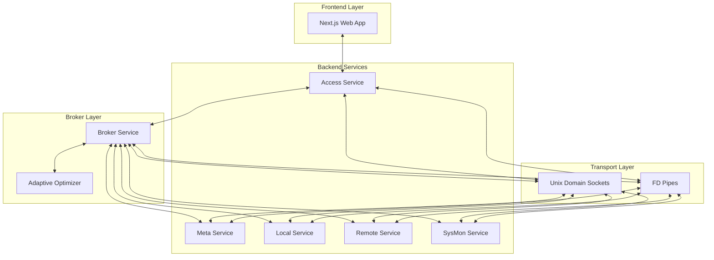
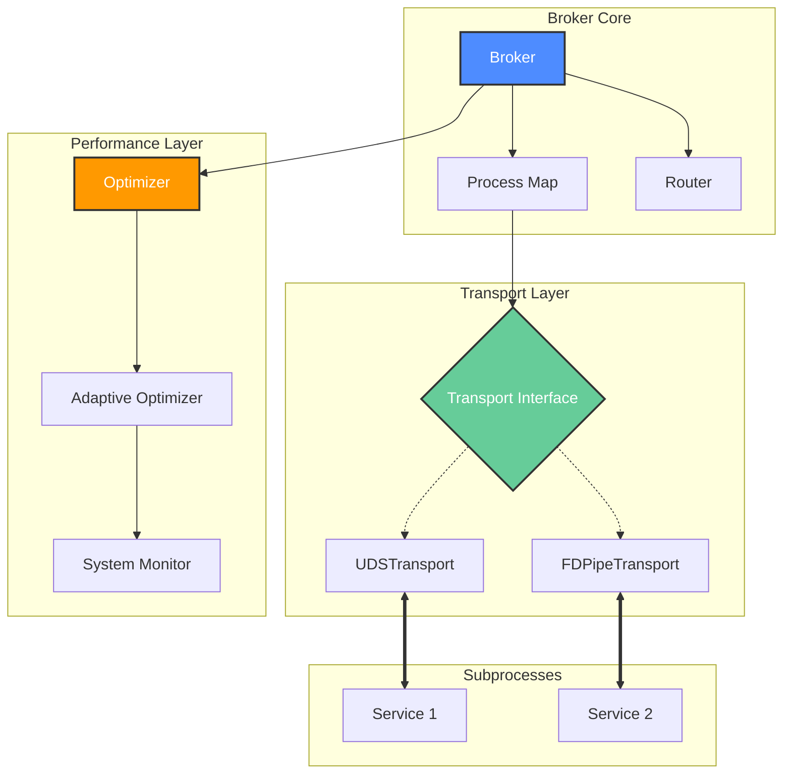

# v2e

A sophisticated Go-based system that demonstrates a broker-first architecture for orchestrating multiple subprocess services that communicate via RPC messages over stdin/stdout. The system provides a comprehensive CVE (Common Vulnerabilities and Exposures) management platform with integrated CWE (Common Weakness Enumeration), CAPEC (Common Attack Pattern Enumeration and Classification), and ATT&CK (Adversarial Tactics, Techniques, and Common Knowledge) framework data handling.

## Executive Summary

The v2e project implements a broker-first architecture where `cmd/broker` serves as the central process manager that spawns, monitors, and manages all subprocess services. This design enforces a strict communication pattern where all inter-service communication flows through the broker, preventing direct subprocess-to-subprocess interaction. The architecture ensures clean separation of concerns while maintaining robust message routing and process lifecycle management.

Key architectural principles:
- **Centralized Process Management**: The broker is the sole orchestrator of all subprocess services
- **Enforced Communication Pattern**: All inter-service communication occurs through broker routing
- **RPC-Based Messaging**: Services communicate via structured JSON RPC messages over stdin/stdout
- **Comprehensive Data Handling**: Integrated CVE, CWE, CAPEC, and ATT&CK data management
- **Frontend Integration**: A Next.js-based web application provides user interface access
- **Performance Monitoring**: Built-in metrics collection and system monitoring capabilities
- **Message Optimization**: Asynchronous message routing with configurable buffering and batching
- **Adaptive Optimization**: Dynamic performance tuning based on workload with adaptive algorithms
- **Enhanced Configuration**: Advanced configuration management via vconfig tool with TUI interface
- **Cross-Platform Support**: Containerized development environment for macOS with Linux support

## System Architecture



The system utilizes a sophisticated dual-mode transport layer with both Unix Domain Sockets (UDS) as the default and File Descriptor Pipes (FD Pipes) as a fallback mechanism. The broker incorporates an advanced adaptive optimizer that dynamically adjusts performance parameters based on system load and message throughput.

## Component Breakdown

### Core Services

- **Broker Service** ([cmd/broker](cmd/broker)): The central orchestrator responsible for:
  - Spawning and managing all subprocess services with robust supervision and restart policies
  - Routing RPC messages via a high-performance, dual-mode transport layer (Unix Domain Sockets & FD Pipes)
  - Utilizing `bytedance/sonic` for zero-copy JSON serialization/deserialization
  - Implementing an adaptive traffic optimizer with configurable batching, buffering, and backpressure
  - Maintaining process lifecycle, health checks, and zombie process reaping
  - Tracking comprehensive real-time message statistics and performance metrics
  - Supporting advanced logging with dual output (console + file) and configurable log levels
  - Providing dynamic configuration of performance parameters via adaptive optimization algorithms

- **Access Service** ([cmd/access](cmd/access)): The REST gateway that:
  - Serves as the primary interface for the Next.js frontend
  - Exposes `/restful/rpc` endpoint for RPC forwarding
  - Translates HTTP requests to RPC calls and responses back
  - Provides health checks and basic service discovery

- **Meta Service** ([cmd/meta](cmd/meta)): The orchestration layer that:
  - Manages job scheduling and execution using go-taskflow
  - Coordinates complex multi-step operations
  - Handles session management and state persistence
  - Provides workflow control mechanisms
  - Orchestrates CVE/CWE data fetching jobs with persistent state management
  - Performs automatic CWE and CAPEC imports at startup

- **Local Service** ([cmd/local](cmd/local)): The data persistence layer that:
  - Manages local SQLite databases for CVE, CWE, CAPEC, and ATT&CK data
  - Provides CRUD operations for vulnerability information
  - Handles data indexing and querying
  - Implements caching mechanisms for improved performance
  - Imports ATT&CK data from XLSX files and provides access to techniques, tactics, mitigations, software, and groups
  - Supports CAPEC XML schema validation and catalog metadata retrieval
  - Offers CWE view management with storage and retrieval capabilities

- **Remote Service** ([cmd/remote](cmd/remote)): The data acquisition layer that:
  - Fetches vulnerability data from external APIs (NVD, etc.)
  - Implements rate limiting and retry mechanisms
  - Handles data transformation and normalization
  - Manages API credentials and authentication

- **SysMon Service** ([cmd/sysmon](cmd/sysmon)): The system monitoring layer that:
  - Collects performance metrics and system statistics
  - Monitors resource utilization across services
  - Provides health indicators for operational awareness
  - Reports system status to the frontend

## Configuration

The broker is configured via `config.json`. Key configuration areas include:

- **Transport**: Choose between `uds` (default) or `fd_pipe`.
- **Optimizer**: Tune the performance characteristics of the message broker.
  - `optimizer_buffer_cap`: Size of the message buffer.
  - `optimizer_num_workers`: Number of parallel processing workers.
  - `optimizer_offer_policy`: Strategy when buffer is full (`drop`, `block`, `timeout`, `drop_oldest`).
  - `optimizer_enable_adaptive`: Enable dynamic self-tuning of batch sizes and worker counts.
- **Processes**: Define the subprocesses to be managed by the broker.

### Advanced Configuration Management

The project includes a dedicated configuration management tool (`vconfig`) with the following features:

- **TUI Interface**: Interactive text-based user interface for configuration management
- **Build Flag Generation**: Automatic generation of build flags based on configuration
- **Default Configuration**: Generation of configuration files with default values
- **Validation**: Configuration validation and error checking

## Transport & Communication

The system uses a sophisticated, hybrid RPC communication mechanism designed for high throughput and low latency:

- **Dual-Mode Transport Layer**:
  - **Unix Domain Sockets (UDS)**: The default, high-performance transport method. Provides secure (0600 permissions), efficient, and standard IPC.
  - **FD Pipes (Legacy/Fallback)**: Uses custom file descriptors 3 and 4 to avoid conflicts with standard I/O streams.
- **Adaptive Optimization**: The broker includes a traffic optimizer that dynamically adjusts batch sizes and worker counts based on load.
- **Message Types**: Four distinct message types (Request, Response, Event, Error) with correlation IDs for request-response matching.
- **Routing Logic**: Messages are intelligently routed based on target process ID, with special handling for responses using correlation IDs.
- **Message Statistics**: Comprehensive tracking of message counts, types, and timing per process.
 - **Build-time Configuration**: File descriptor numbers for FD Pipe transport are configured at build time (ldflags). Runtime environment variables are no longer used for RPC transport configuration.
- **Message Pooling**: Optimized message allocation using sync.Pool for reduced garbage collection

The communication pattern follows this flow:
1. External requests → Access REST API → Broker → Backend Services
2. All inter-service communication happens exclusively through broker routing
3. No direct subprocess-to-subprocess communication is allowed
4. The broker maintains message correlation and response tracking
5. Optional message optimization layer handles high-volume traffic with configurable parameters

## Frontend Integration

The Next.js-based frontend ([website](website)) provides:

- **REST Gateway Interface**: Access service exposes `/restful/rpc` endpoint for frontend-backend communication
- **Sophisticated RPC Client**: Handles automatic case conversion (camelCase ↔ snake_case) and comprehensive error handling
- **Rich Component Architecture**: Tabbed interface supporting CVE, CWE, CAPEC, and system monitoring data
- **Real-time Updates**: Session control and live metrics display
- **Responsive Design**: Adaptable interface for various screen sizes and devices
- **Modern Tech Stack**: Uses Next.js 16+, React 19+, with TypeScript, Tailwind CSS, and Radix UI components
- **Data Visualization**: Recharts for performance metrics and data visualization

The frontend includes dedicated sections for:
- CVE Database browsing and management
- CWE Database and view management
- CAPEC data visualization
- ATT&CK framework data (techniques, tactics, mitigations, software, groups)
- System monitoring and performance metrics
- Session control for data fetching jobs

## Quickstart

Prerequisites: Go 1.21+, Node.js 20+, npm 10+, and basic shell tools. For macOS users, Podman is required for the containerized development environment.

### Build Script Options

The project includes an enhanced build script (`build.sh`) with multiple options:

- `-c`: Run vconfig TUI to configure build options
- `-t`: Run unit tests and return result for GitHub CI
- `-f`: Run fuzz tests on key interfaces (5 seconds per test)
- `-m`: Run performance benchmarks and generate report
- `-p`: Build and package binaries with assets
- `-r`: Run Node.js process and broker (for development)
- `-v`: Enable verbose output
- `-h`: Show help message

Build all commands:

```bash
# Build backend binaries
go build ./cmd/...
```

Build the frontend:

```bash
# Navigate to website directory and install dependencies
cd website
npm install
# Build the frontend
npm run build
```

Run with the broker (recommended):

```bash
# Start the broker which spawns configured subprocesses
./broker config.json
```

Alternatively, use the build script for different workflows:

```bash
# Run unit tests
./build.sh -t

# Run fuzz tests
./build.sh -f

# Run performance benchmarks
./build.sh -m

# Build and package binaries with assets
./build.sh -p

# Run development mode with auto-reload
./build.sh -r
```

## Development Workflow

### Live Development

To enable live development, use the `-r` option with the `build.sh` script. This option streamlines development by automatically restarting the broker and Node.js processes when changes are detected in Go source files or frontend assets.

Run the following command from the project root:

```bash
./build.sh -r
```

Features:
- **Automatic Restart**: The broker and Node.js processes restart automatically on file changes
- **Debouncing**: Prevents rapid restarts with a delay between file change detection and process restarts
- **Process Cleanup**: Ensures all subprocesses terminate properly before restarting
- **Verbose Output**: Use `-v` flag with any option for detailed logging

Notes:
- This workflow is for development only, not for production environments
- Ensure all dependencies are installed before using the `-r` option

### Testing

Run unit tests:

```bash
# Run Go unit tests
./build.sh -t
```

Run fuzz tests:

```bash
# Run fuzz tests on key interfaces
./build.sh -f
```

Run performance benchmarks:

```bash
# Execute performance benchmarks
./build.sh -m
```

Build and package:

```bash
# Build and package binaries with assets
./build.sh -p
```

### Build Script Options

The build script supports the following options:

- `-c`: Run vconfig TUI to configure build options
- `-t`: Run unit tests and return result for CI
- `-f`: Run fuzz tests on key interfaces (5 seconds per test)
- `-m`: Run performance benchmarks and generate report
- `-p`: Build and package binaries with assets
- `-r`: Run Node.js process and broker (for development)
- `-v`: Enable verbose output
- `-h`: Show help message

### Containerized Development Environment

For macOS users, a containerized development environment is available via `runenv.sh`:

```bash
# Run any command in containerized environment
./runenv.sh -t  # Run unit tests in container
./runenv.sh -f  # Run fuzz tests in container
./runenv.sh -m  # Run benchmarks in container
./runenv.sh -p  # Package in container
./runenv.sh -r  # Run development mode in container
```

On Linux, the containerized environment can be used with the `USE_CONTAINER=true` environment variable:

```bash
USE_CONTAINER=true ./runenv.sh -t  # Run tests in container on Linux
```
## Job Session Management & State Machine

The meta service orchestrates CVE/CWE data fetching jobs using go-taskflow with persistent state management. Job runs are stored in BoltDB and survive service restarts. The system also performs automatic CWE and CAPEC imports at startup.

### Job States

The system supports six job states with strictly defined transitions:


**State Descriptions:**

- **Queued**: Job created but not yet started
- **Running**: Job actively fetching and storing data
- **Paused**: Job temporarily paused by user (can be resumed)
- **Completed**: Job finished successfully (all data fetched)
- **Failed**: Job encountered fatal error
- **Stopped**: Job manually stopped by user

**Terminal States**: Completed, Failed, Stopped (cannot transition further)

### Session Persistence & Recovery

- **Single Active Run Policy**: Only one job run can be active (running or paused) at time
- **BoltDB Storage**: Job runs persist in `session.db` (configurable via `SESSION_DB_PATH` env var)
- **Auto-Recovery**: On service restart:
  - Running jobs: Automatically resumed
  - Paused jobs: Remain paused (manual resume required)
  - Terminal states: No action taken

### RPC API for Job Control

**Start Session:**
```json
{
  "method": "RPCStartSession",
  "params": {
    "session_id": "my-job-001",
    "start_index": 0,
    "results_per_batch": 100
  }
}
```

**Stop Session:**
```json
{
  "method": "RPCStopSession",
  "params": {}
}
```

**Pause Job:**
```json
{
  "method": "RPCPauseJob",
  "params": {}
}
```

**Resume Job:**
```json
{
  "method": "RPCResumeJob",
  "params": {}
}
```

**Get Status:**
```json
{
  "method": "RPCGetSessionStatus",
  "params": {}
}
```

Response includes: `state`, `session_id`, `fetched_count`, `stored_count`, `error_count`, `error_message`

### Task Orchestration with go-taskflow

The meta service uses go-taskflow to orchestrate multi-step jobs:

1. **Fetch** task: Retrieve CVE batch from remote NVD API
2. **Store** task: Save CVEs to local database

Tasks are organized in a directed acyclic graph (DAG) with dependency management, retries, and cancellation support.

### Automatic Imports

The meta service performs automatic imports at startup:
- **CWE Import**: Triggers CWE import from `assets/cwe-raw.json` after 2-second delay
- **CAPEC Import**: Checks for existing CAPEC data and imports from `assets/capec_contents_latest.xml` if not present
- **ATT&CK Import**: Local service automatically imports ATT&CK data from XLSX files found in assets directory

## Configuration Guide

The system is configured through `config.json`, which controls:

- Process definitions and startup parameters
- Logging configuration and output destinations
- Service-specific settings
- RPC communication parameters
- Performance tuning options
- Optimizer runtime parameters for message routing

The broker reads this configuration at startup and uses it to determine which subprocess services to spawn and how to configure them.

### Broker Configuration Options

The broker supports the following configuration parameters in `config.json`:

- `broker.processes`: Array of process configurations with ID, command, arguments, RPC flag, and restart policy
- `broker.log_file`: Path to log file for dual output (stdout + file)
- `broker.logs_dir`: Directory where logs are stored
- `broker.authentication`: Authentication settings for RPC endpoints
- `broker.rpc_input_fd` / `broker.rpc_output_fd`: Optional overrides for RPC file descriptor numbers
- `broker.optimizer_*`: Various optimization parameters including buffer capacity, worker count, batching, and timeouts

## Performance Characteristics

The broker-first architecture provides several performance benefits:

- **Efficient Message Routing**: Direct process-to-process communication through the broker minimizes overhead
- **Scalable Process Management**: The broker can manage dozens of subprocess services with minimal resource impact
- **Built-in Metrics Collection**: Comprehensive performance monitoring built into the architecture
- **Optimized Communication**: Custom file descriptor usage avoids I/O conflicts and improves throughput
- **Asynchronous Message Optimization**: Configurable buffering, batching, and worker pools for high-volume scenarios
- **Message Pooling**: Reduced garbage collection through sync.Pool-based message allocation
- **Concurrent Task Execution**: go-taskflow enables parallel execution of tasks with up to 100 concurrent goroutines
- **Adaptive Optimization**: Dynamic adjustment of performance parameters based on system load and throughput
- **Enhanced Benchmarking**: Comprehensive performance benchmarking with detailed reporting capabilities

Performance monitoring capabilities include:
- Message throughput statistics
- Process response times
- System resource utilization
- Error rate tracking
- Per-process message statistics
- Optimizer metrics and performance counters
- Adaptive algorithm effectiveness metrics
- Detailed benchmark reports with statistical analysis

## Project Layout

- **cmd/** - Service implementations
  - broker/ - Process manager and RPC router with message optimization
  - access/ - REST gateway (subprocess)
  - local/ - Local data storage service (CVE/CWE/CAPEC/ATT&CK)
  - remote/ - Remote data fetching service
  - meta/ - Orchestration and job control (with Taskflow)
  - sysmon/ - System monitoring service
- **pkg/** - Shared packages
  - proc/subprocess - Subprocess framework (stdin/stdout RPC)
  - proc/message - Optimized message handling with pooling
  - cve/taskflow - Taskflow-based job executor with persistent state
  - cve - CVE domain types and helpers
  - cwe - CWE domain types and helpers
  - capec - CAPEC domain types and helpers
  - attack - ATT&CK framework domain types and helpers
  - common - Config and logging utilities
  - broker - Broker interfaces and types
  - jsonutil - JSON utility functions
  - rpc - RPC parameter types
  - testutils - Test utilities
- **tool/vconfig** - Configuration management tool with TUI interface
- **tests/** - Integration tests (pytest)
- **website/** - Next.js frontend application
- **assets/** - Data assets (CWE raw JSON, CAPEC XML/XSD, ATT&CK XLSX files)
- **.build/** - Build artifacts and packaged distribution

## Broker Interfaces and Internal Data Structures

The broker (microkernel) is organized into three primary layers:

### 1. Core Layer (`cmd/broker/core`)
Central management logic responsible for process supervision and message routing.
- **Broker**: The main struct orchestrating the system.
- **Process**: Represents a managed subprocess with its lifecycle state (`ProcessInfo`) and I/O pipes.
- **ProcessInfo**: Serializable struct containing PID, status (`running`, `exited`, `failed`), command, and start/end times.
- **Router Interface**: Defines how messages are routed between processes.

### 2. Transport Layer (`cmd/broker/transport`)
Handles low-level communication mechanics.
- **Transport Interface**: Defines the contract for IPC.
  - `Connect() error`: Establishes the connection.
  - `Close() error`: Terminates the connection.
  - `Send(msg *proc.Message) error`: Sends a structured message.
  - `Receive() (*proc.Message, error)`: Reads a structured message.
- **UDSTransport**: High-performance implementation using Unix Domain Sockets.
- **FDPipeTransport**: Legacy implementation using inherited file descriptors (3 & 4).

### 3. Performance Layer (`cmd/broker/perf`)
Decoupled optimization module for high-throughput message handling.
- **Optimizer**: Manages worker pools and message batching.
- **AdaptiveOptimizer**: Monitors system load and dynamically adjusts:
  - `BufferCapacity`: Channel size.
  - `WorkerCount`: Number of concurrent processors.
  - `BatchSize` & `FlushInterval`: For throughput tuning.

### Broker Architecture Diagram




### Adaptive Optimization Algorithms
The broker implements intelligent adaptive tuning that responds to system and application loads:
- Dynamic worker count adjustment based on CPU utilization and queue depth
- Buffer capacity scaling based on throughput patterns
- Batch size optimization based on throughput and latency
- Flush interval tuning based on latency requirements
- Offer policy adjustment based on system load conditions

## Notes and Conventions

- All subprocesses must be started and managed by the broker; never run backend subprocesses directly in production or integration tests
- Subprocesses communicate exclusively via JSON RPC messages over stdin/stdout
- Configuration (process list, logging) is controlled through `config.json`
- The authoritative RPC API specification for each subprocess can be found in the top comment of its `cmd/*/main.go` file
- All inter-service communication flows through the broker to maintain architectural integrity
- Job sessions persist across service restarts; only one active run is allowed at a time

## Where to Look Next

- [cmd/broker](cmd/broker) — Broker implementation and message routing
- [pkg/proc/subprocess](pkg/proc/subprocess) — Helper framework for subprocesses
- [pkg/cve/taskflow](pkg/cve/taskflow) — Taskflow-based job executor
- [cmd/access](cmd/access) — REST gateway and example of using the RPC client
- [cmd/meta](cmd/meta) — Job orchestration and session management
- [website/](website/) — Next.js frontend implementation
- [tests/](tests/) — Integration tests demonstrating usage patterns

## License

MIT

## Additional Documentation

### Containerized Development

For macOS users or when isolation is required, the project includes a containerized development environment:

- **runenv.sh**: Shell script that detects the operating system and runs the build environment in a container
- **Container Image**: Uses `assets/dev.Containerfile` to create the development environment
- **Go Module Cache**: Mounts the Go module cache inside the container for faster builds
- **Cross-platform**: Works on both macOS and Linux (optional on Linux with USE_CONTAINER=true)

### Configuration Management

The project includes a dedicated configuration management tool:

- **Location**: `tool/vconfig/`
- **Purpose**: Provides a TUI interface and command-line options for configuration management
- **Features**: 
  - Interactive TUI mode for easy configuration
  - Default configuration generation
  - Build flag generation based on configuration
  - Validation of configuration parameters

### Enhanced Testing

The project includes multiple testing methodologies:

- **Unit Tests**: Standard Go unit tests with coverage reporting
- **Fuzz Tests**: Fuzz testing for key interfaces to discover edge cases
- **Performance Benchmarks**: Comprehensive benchmarking with statistical analysis
- **Integration Tests**: Pytest-based integration tests in the `tests/` directory

### Build Options

The build script (`build.sh`) provides multiple options for different workflows:

- **Development**: Incremental builds with dependency checking
- **Packaging**: Complete packaging with all assets and binaries
- **Testing**: Dedicated test execution with coverage reports
- **Benchmarking**: Performance benchmarking with detailed reports
- **Continuous Integration**: CI-ready test execution
