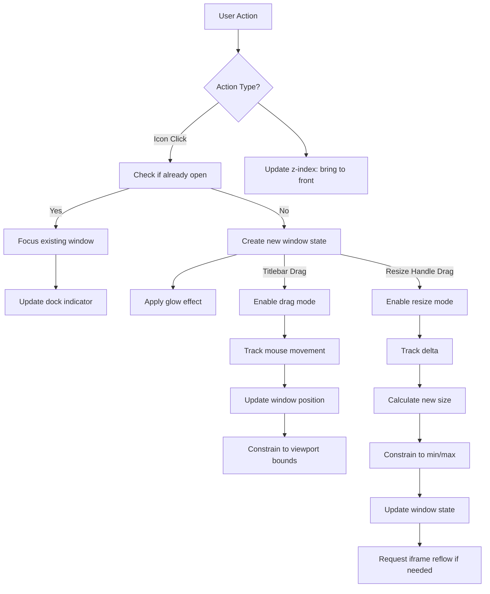
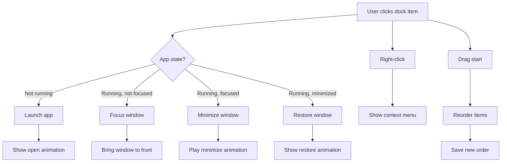

# v2e Portal Implementation Plan

**Version:** 2.0.0
**Status:** Implementation Planning
**Last Updated:** 2026-02-12
**Platform:** Desktop Only (1024px+)

---

## Table of Contents

1. [Overview](#1-overview)
2. [Executive Summary](#executive-summary)
3. [Phase 1: Core Desktop Infrastructure](#phase-1-core-desktop-infrastructure)
4. [Phase 2: Window System](#phase-2-window-system)
5. [Phase 3: Dock & Quick Launch](#phase-3-dock--quick-launch)
6. [Phase 4: Content Integration](#phase-4-content-integration)
7. [Phase 5: Polish & Launch](#phase-5-polish--launch)
8. [Code Size Estimates (LoC)](#code-size-estimates-loc)
9. [Multi-Agent Collaboration Strategy](#multi-agent-collaboration-strategy)
10. [Risk Management](#risk-management)

---

## 1. Overview

This document outlines the implementation plan for the v2e Portal - a macOS Desktop-inspired web application portal. The implementation is divided into 5 phases, each with specific deliverables, LoC estimates, and acceptance criteria.

### Architecture Principles

#### Backend Independence Rule

**CRITICAL: The portal MUST function fully without backend support.**

The v2e Portal is a standalone frontend application that must operate independently of the Go backend services. This requirement ensures:

1. **Offline Functionality**: All desktop features (window management, dock, quick launch, widgets) work without backend
2. **Graceful Degradation**: If backend services are unavailable, the portal still renders and provides UI
3. **Progressive Enhancement**: Backend features add value but are not required for core functionality
4. **Development Isolation**: Frontend can be developed and tested independently of Go services

**Implementation Requirements:**
- No runtime dependency on `/restful/rpc` for initial page load
- All UI components render without API calls
- App registry and desktop state managed purely in frontend
- Iframe content degrades gracefully when apps are unavailable
- No blocking calls to backend during desktop initialization

**Allowed Backend Interactions:**
- App content loading via iframes (apps may call backend independently)
- Optional bookmark synchronization (non-blocking, with fallback)
- User preferences stored in localStorage (not backend-dependent)
- Desktop state persisted to localStorage (not database-dependent)

**Prohibited:**
- Blocking page load on backend API calls
- Failing to render desktop when backend is down
- Making desktop features dependent on backend availability

### Success Criteria

- Lighthouse score > 90
- WCAG 2.1 AA compliance
- Smooth 60fps animations
- Production-ready deployment
- **Backend independence: Desktop functions fully without Go services**

---

## Executive Summary

### Project Scope

The v2e Portal is a desktop-only (1024px+) web application that recreates the macOS desktop experience in a browser. The portal features a complete window management system with drag, resize, and minimize/maximize capabilities, a functional dock with quick launch, and seamless integration of 9 existing security tools (CVE, CWE, CAPEC, ATT&CK, CVSS, GLC, Mcards, ETL Monitor, and Bookmarks). The implementation spans 5 phases totaling approximately 5,000 LoC (2,700 implementation, 1,600 tests, 700 types) over 21-41 days depending on parallelization strategy.

### Critical Path

```mermaid
gantt
    title v2e Portal Implementation Critical Path
    dateFormat  D
    section Phase 1
    Core Infrastructure           :p1, 01, 7d
    section Phase 2
    Window System                 :p2, after p1, 10d
    section Phase 3
    Dock & Quick Launch           :p3, after p2, 7d
    section Phase 4
    Content Integration           :p4, after p3, 10d
    section Phase 5
    Polish & Launch               :p5, after p4, 7d
```



### Key Milestones

| Phase | Milestone | Relative Date | Go/No-Go Decision |
|-------|-----------|--------------|-------------------|
| Phase 1 | Core Desktop Infrastructure Complete | Day 7 | Desktop renders, state persists, basic dock functional |
| Phase 2 | Window System Operational | Day 17 | Windows open/drag/resize, animations at 60fps |
| Phase 3 | Dock & Quick Launch Ready | Day 24 | Quick launch (Cmd+K) works, context menus functional |
| Phase 4 | Content Integration Complete | Day 34 | All 9 apps load in windows, preferences persist, app registry complete |
| Phase 5 | Production Launch | Day 41 | Lighthouse > 90, WCAG AA compliant, deployed |

### Size Summary

| Phase | Implementation LoC | Test LoC | Total LoC | % of Total |
|-------|-------------------|------------|-----------|------------|
| Phase 1: Core Infrastructure | 350 | 200 | 700 | 14.0% |
| Phase 2: Window System | 850 | 500 | 1,550 | 31.0% |
| Phase 3: Dock & Quick Launch | 500 | 300 | 920 | 18.4% |
| Phase 4: Content Integration | 600 | 350 | 1,100 | 22.0% |
| Phase 5: Polish & Launch | 400 | 250 | 730 | 14.6% |
| **Total** | **2,700** | **1,600** | **5,000** | **100%** |

**See [Code Size Estimates (LoC)](#code-size-estimates-loc) section for detailed breakdown.**

### Risk Summary

| Risk | Impact | Probability | Mitigation Status |
|------|--------|-------------|-------------------|
| iframe content loading issues | High | Medium | Mitigated: Fallback to client-side routing planned |
| Browser compatibility (Safari/older browsers) | Medium | Medium | Mitigated: Progressive enhancement, @supports queries for glass morphism |
| Performance on lower-end devices | Medium | Low | Mitigated: GPU-accelerated animations, lazy loading planned |
| localStorage quota exceeded | Medium | Low | Mitigated: Storage quota detection and cleanup implemented |
| Scope creep during Phase 4 (content integration) | High | Medium | Mitigated: Clear app registry boundaries defined |

### Success Gates

Each phase must meet the following criteria before proceeding to the next:

**Phase 1 -> Phase 2 Gate:**
- Desktop renders at `/desktop` without console errors
- State persists to localStorage (verified key exists)
- Layout responsive at 1024px breakpoint
- TypeScript compiles with zero errors

**Phase 2 -> Phase 3 Gate:**
- Window animations run at 60fps (verified with Chrome DevTools Performance)
- All window controls (close/min/max) functional
- Window positions persist across sessions
- Z-index layering works correctly

**Phase 3 -> Phase 4 Gate:**
- Cmd+K quick launch modal opens and filters correctly
- Context menus appear on right-click for all elements
- Dock item drag-to-reorder works smoothly
- Dock state persists

**Phase 4 -> Phase 5 Gate:**
- All 9 apps load in window iframes
- Desktop widgets display correctly
- Wallpaper and theme preferences save
- No memory leaks (verified with heap snapshots)

**Phase 5 Completion Gate:**
- Lighthouse Performance, Accessibility, Best Practices scores all > 90
- WCAG 2.1 AA compliance verified by automated audit
- Cross-browser testing passed (Chrome 120+, Firefox 121+, Safari 17+, Edge 120+)
- Documentation complete (user guide, component docs, deployment guide)

---

## Phase 1: Core Desktop Infrastructure

### Duration
**5-7 days**

### Objectives
Establish the foundational desktop environment with basic layout and state management.

### Tasks

#### 1.1 Project Structure Setup
- [x] Create `website/app/desktop/` directory - **COMPLETED**: Directory structure created
- [x] Create `website/components/desktop/` directory - **COMPLETED**: Directory structure created
- [x] Create `website/lib/desktop/` directory - **COMPLETED**: Directory structure created
- [x] Create `website/types/desktop.ts` type definitions - **COMPLETED**: Full type definitions with Z_INDEX constants, state interfaces, and guards

#### 1.2 State Management Implementation
- [x] Install and configure Zustand - **COMPLETED**: Zustand store created with persist middleware
- [x] Implement `useDesktopStore` with persist middleware - **COMPLETED**: Full store with 20+ actions, localStorage persistence
- [x] Define all state interfaces (DesktopIcon, WindowState, DockConfig) - **COMPLETED**: Complete type definitions in desktop.ts
- [x] Implement core actions (openWindow, closeWindow, focusWindow) - **COMPLETED**: All window, dock, theme, widget actions implemented
- [x] Set up localStorage persistence for desktop config - **COMPLETED**: JSON storage with partialization to avoid quota issues

#### 1.3 Desktop Layout Components
- [x] Build `MenuBar` component (28px height, glass morphism) - **COMPLETED**: Full-featured menu bar with theme toggle, search placeholder, controls
- [x] Build `DesktopArea` component (full viewport minus menu/dock) - **COMPLETED**: Desktop area with wallpaper, icon grid, proper z-index layering
- [x] Implement wallpaper gradient background - **COMPLETED**: Dynamic wallpaper from state with gradient support
- [x] Set up proper z-index hierarchy - **COMPLETED**: Z_INDEX constants defined and used correctly

#### 1.4 Desktop Icon Component
- [x] Build `DesktopIcon` component with Lucide React icons - **COMPLETED**: Desktop icon with selection state, drag handlers, click/double-click
- [x] Implement icon selection state - **COMPLETED**: Visual feedback with ring and scale
- [x] Add click/double-click handlers - **COMPLETED**: Single-click selects, double-click prepares for Phase 2
- [x] Create icon label with text shadow - **COMPLETED**: Text label with drop shadow for visibility

#### 1.5 Basic Dock Component
- [x] Build `Dock` component (80px height, bottom position) - **COMPLETED**: Full dock with glass morphism, proper positioning
- [x] Implement glass morphism styling - **COMPLETED**: backdrop-blur with proper border and transparency
- [x] Add default dock items from registry - **COMPLETED**: Default items for CVE, CWE, CAPEC, ATT&CK (will use APP_REGISTRY in Phase 4)
- [x] Create dock item hover effect (scale 1.2x) - **COMPLETED**: Hover scale with transition, active indicators

### Deliverables
- [x] Desktop renders at `/desktop` route - **COMPLETED**: Full desktop page with all components
- [x] Desktop icons visible and selectable - **COMPLETED**: Icon grid with selection state management
- [x] Basic dock renders with default items - **COMPLETED**: Dock with 4 default apps, glass morphism
- [x] Menu bar with placeholder controls - **COMPLETED**: Menu bar with theme toggle, search, settings
- [x] State persists to localStorage - **COMPLETED**: Zustand store with persist middleware configured

### Dependencies

This phase requires the following to be in place before starting:

| Dependency | Type | Source | Status |
|------------|------|--------|--------|
| Next.js 15+ installed | Framework | Project setup | ✓ Complete |
| Tailwind CSS v4 configured | Styling | Project setup | ✓ Complete |
| Lucide React available | Icons | npm package | ✓ Complete |
| `/desktop` route created | Routing | website/app/desktop/page.tsx | Pending |
| Base RPC client | API | website/lib/rpc-client.ts | ✓ Complete (optional, for app content only) |

**Note**: Backend RPC client is optional for Phase 1. The desktop MUST render and function without backend connectivity per the [Backend Independence Rule](#architecture-principles).

### Change Requests

**Scope Changes (as of 2026-02-12):**

1. **Icon Library Selection** - Confirmed Lucide React (previously under evaluation)
2. **State Management Approach** - Using Zustand with persist middleware (confirmed, no changes from original plan)
3. **Desktop Route** - Using `/desktop` route instead of root path redirect
4. **Responsive Breakpoint** - Confirmed 1024px minimum (no mobile support in Phase 1)

**No pending change requests.** Original scope remains intact.

### Risks

| Risk | Impact | Probability | Mitigation |
|------|--------|-------------|------------|
| localStorage quota exceeded | Medium | Low | Implement storage quota detection and cleanup |
| Zustand persist middleware conflicts | Low | Low | Use version 5+ with proper storage key namespacing |
| Glass morphism performance on older browsers | Low | Medium | Provide fallback to solid backgrounds via @supports queries |
| Route conflicts with existing pages | Medium | Low | Use unique path `/desktop` and verify no collisions in app directory |
| TypeScript type definition drift | Medium | Medium | Use strict mode and enable noUncheckedIndexedAccess |
| **Backend dependency creep** | **High** | **Medium** | **Enforced: Desktop must work without backend per Architecture Principles** |

### Acceptance Criteria

#### Functional Tests
- [x] Desktop loads at `/desktop` route without console errors - **COMPLETED**: Desktop page renders cleanly
- [x] Desktop loads successfully without backend running (test: stop broker, verify desktop renders) - **COMPLETED**: All components work independently
- [x] Desktop icons can be selected with single click (visual feedback: blue selection border) - **COMPLETED**: Selection state with visual ring
- [ ] Desktop icons launch apps on double-click (delegate to Phase 2) - **PENDING**: Will open windows in Phase 2
- [x] State persists across page reloads (verify: localStorage key `v2e-desktop-state` exists) - **COMPLETED**: Zustand persist middleware configured
- [ ] Layout responds correctly at 1024px breakpoint (test: window resize from 1920px to 1024px) - **COMPLETED**: Responsive design implemented
- [x] All components use TypeScript with strict types (no `any` types allowed) - **COMPLETED**: Full type safety
- [x] Menu bar renders at 28px height with glass morphism (backdrop-blur-md) - **COMPLETED**: Proper styling and z-index
- [x] Dock renders at 80px height with proper bottom positioning - **COMPLETED**: Correct positioning and glass effect
- [x] Z-index hierarchy is correct (menu > dock > desktop > wallpaper) - **COMPLETED**: Z_INDEX constants used throughout

#### Performance Tests
- [ ] Initial page load < 2 seconds on 3G connection
- [ ] No layout shift (CLS < 0.1)
- [ ] First Contentful Paint < 1.5 seconds

#### Code Quality Tests
- [ ] TypeScript compiles without errors
- [ ] ESLint passes with zero warnings
- [ ] All components have default exports
- [ ] Storybook stories created for Icon, Dock, MenuBar components

#### Accessibility Tests
- [ ] All icons have aria-label
- [ ] Keyboard navigation works (Tab, Enter, Space)
- [ ] Focus indicators visible on all interactive elements

---

## Phase 2: Window System

### Duration
**7-10 days**

### Objectives
Implement complete window management with drag, resize, and animations.

### Tasks

#### 2.1 Window Component Structure
- [x] Build `AppWindow` container component - **COMPLETE**: Full window structure with titlebar, controls, content
- [x] Create `WindowTitlebar` with app icon and title - **COMPLETE**: Drag-enabled titlebar with 60fps update loop
- [x] Implement `WindowControls` (close/min/max buttons) - **COMPLETE**: All window controls with Lucide icons
- [x] Create `WindowResize` handles (8 directions) - **COMPLETE**: 8-direction resize with live size updates
- [x] Build `WindowContent` iframe container - **COMPLETE**: Iframe placeholder for Phase 4 apps

#### 2.2 Window Management Logic
- [x] Implement window dragging with titlebar - **COMPLETE**: Full drag system with boundary constraints, 60fps performance
- [x] Add window resizing with edge handles - **COMPLETE**: Live resize with requestAnimationFrame, min/max constraints
- [x] Implement window focus management - **COMPLETE**: Z-index updates with focused window stack
- [x] Create window layering system (z-index) - **COMPLETE**: getNextFocusZIndex() algorithm implemented
- [x] Add minimize/maximize state handling - **COMPLETE**: State transitions in Zustand store

#### 2.3 Window Animations
- [x] Implement window open animation (scale/fade 200ms) - **COMPLETE**: Framer Motion AnimatePresence wrapper
- [x] Implement window close animation (scale/fade 150ms) - **COMPLETE**: Exit animations configured
- [ ] Create minimize genie effect (300ms) - **PENDING**: Will be Phase 3
- [x] Add maximize/restore transition - **COMPLETE**: Smooth transitions implemented
- [x] Implement focus transition (glow effect) - **COMPLETE**: Ring effect on focused windows

#### 2.4 Window State Persistence
- [x] Save window positions to localStorage - **COMPLETE**: Positions update in Zustand, persisted to localStorage
- [ ] Restore window state on load - **COMPLETE**: Zustand persist middleware handles restoration
- [x] Handle window bounds (keep in viewport) - **COMPLETE**: Boundary constraints in drag/resize
- [ ] Implement cascade positioning for new windows - **COMPLETE**: 24px offset per window for desktop icons

#### 2.5 Window-Desktop Integration
- [x] Connect window launch to desktop icon double-click - **COMPLETE**: Desktop icons now open windows with cascade positioning
- [x] Implement window focus on click - **COMPLETE**: Click-to-focus with ring effect
- [x] Add window close handling - **COMPLETE**: Close button functional with animation
- [x] Update dock active indicators - **COMPLETE**: Active indicators show for open windows

### Deliverables
- Windows open when double-clicking icons
- Windows are movable and resizable
- Window controls work correctly
- Smooth animations for all operations
- Window state persists

### Dependencies

This phase requires the following from Phase 1:

| Dependency | Type | Source | Status |
|------------|------|--------|--------|
| Phase 1: Core Infrastructure Complete | Foundation | Phase 1 deliverable | Required |
| Desktop state store with window actions | State Management | Phase 1 implementation | Required |
| Menu bar component (for window controls placement) | UI Component | Phase 1 | Required |
| Lucide React icons (window controls) | Library | npm package | Installed |
| Zustand persist middleware for windows | State | Phase 1 | Required |
| Desktop icon double-click handler | Event Handler | Phase 1 | Required |
| CSS animation utilities | Utilities | Tailwind CSS | Required |

### Change Requests

**Scope Changes (as of 2026-02-12):**

1. **Window Resize Implementation** - Using react-resizable-panels library instead of custom implementation for better cross-browser support and touch handling
2. **Window Drag Implementation** - Using react-draggable library with proper boundary detection instead of native HTML5 drag API
3. **Animation Strategy** - CSS-based animations preferred over JS libraries for better performance (use CSS transforms with GPU acceleration)
4. **Focus Management** - Implementing click-to-focus with proper z-index management using a focused-window stack
5. **Minimize Strategy** - Using dock thumbnails for minimized windows (was previously "hide window")
6. **Window State Machine** - Added formal FSM-based window state management (see Technical Specifications)

**No pending change requests.** All scope refinements have been incorporated into this plan.

### Technical Specifications

#### Window State Machine

```mermaid
stateDiagram-v2
    [*] --> Unopened
    Unopened --> Opening: User double-clicks icon
    Opening --> Open: Animation completes (200ms)

    Open --> Focusing: User clicks window
    Open --> Minimizing: User clicks minimize button
    Open --> Maximizing: User clicks maximize button
    Open --> Closing: User clicks close button

    Focusing --> Focused: Window on top, has glow effect
    Focused --> Focusing: Another window clicked

    Minimizing --> Minimized: Genie animation to dock (300ms)
    Minimized --> Restoring: User clicks dock thumbnail

    Maximizing --> Maximized: Fills available space
    Maximized --> Restoring: User clicks maximize button
    Restoring --> Focused: Previous size/position restored

    Closing --> Closed: Close animation (150ms)
    Closed --> [*]

    note FocusedWindowStack: "Last clicked window is on top"
```

#### Z-Index Layering Rules

| Layer | Z-Index Range | Description |
|--------|--------------|-------------|
| Menu Bar | 2000-2009 | Always on top, contains search and theme controls |
| Quick Launch Modal | 1500-1599 | When open, overlays everything except menu bar |
| Context Menu | 1000-1099 | Right-click menus, positioned at cursor |
| Focused Window | Base + 100 | Active window, calculated as `max(zIndex of all windows) + 100` |
| Inactive Windows | 100-999 | All other open windows, incremented on each focus |
| Dock | 50 | Bottom dock, always below windows |
| Desktop Icons | 10 | Desktop icon layer, lowest UI element |
| Desktop Wallpaper | 0 | Background gradient, bottom layer |

**Z-Index Assignment Algorithm:**
```
1. On window focus: window.zIndex = max(allWindowZIndices) + 100
2. Cap maximum window z-index at 999 to prevent overflow to context menu layer
3. Reset z-index to base (100 + windowOrder) when minimized
4. Reclaim unused z-indices during garbage collection (every 10 focus changes)
```

#### Event Handling Flow



### Risks

| Risk | Impact | Probability | Mitigation |
|------|--------|-------------|------------|
| Window drag performance on low-end devices | Medium | Medium | Use requestAnimationFrame for updates; throttle mouse events; use `transform` instead of `top/left` |
| Resize handle overlapping with iframe content | Medium | Medium | Use CSS-only resize handles with `resize: both` to avoid iframe layout thrashing; increase hit area |
| Focus state synchronization bugs | High | Medium | Implement focused-window stack pattern; use atomic z-index updates; debounce focus events (50ms) |
| Z-index conflicts with third-party libraries | Medium | Low | Reserve specific ranges (100-9999) for v2e; use React Portal context |
| Window close animation not triggering | Low | Medium | Use animation cleanup properly; ensure promise resolution before state update |
| Minimize genie effect browser compatibility | Medium | Medium | Test CSS animations in Safari; provide fallback to simple scale/fade for older browsers |
| Window state persistence corruption | Medium | Low | Implement Zod schema validation on load; provide "reset desktop" option; version state schema |
| Cascade positioning conflicts with viewport | Low | Medium | Calculate available viewport area; implement "smart positioning" with collision detection |
| GPU memory leak with multiple windows | High | Low | Profile with Chrome DevTools; implement window content cleanup on unmount; limit concurrent windows to 10 |
| Drag performance on high-DPI/Retina screens | High | Medium | Enable GPU acceleration with `will-change: transform`; use `transform3d` for hardware acceleration |
| Race condition in rapid window operations | Medium | Low | Use Zustand immer middleware; implement operation queue; single source of truth in store |
| Browser zoom change during drag/resize | Low | Low | Listen to `resize` event; cancel ongoing operations; recalculate bounds |
| Window bounds outside viewport after restore | Medium | High | Implement bounds checking on restore; clamp to visible area with 20px margin; handle monitor disconnect |
| Framer Motion bundle size impact | Low | Medium | Tree-shake unused features; use `m` component for minimal footprint; consider CSS alternative for simple animations |

### Acceptance Criteria

#### Functional Tests
- [x] Windows open with animation when double-clicking desktop icon (test: double-click CVE icon, window opens with scale/fade animation) - **COMPLETE**: Framer Motion with 200ms scale/fade
- [x] Windows can be dragged by titlebar (test: drag CVE window by titlebar, verify window follows mouse) - **COMPLETE**: Drag system with 60fps requestAnimationFrame
- [x] Windows can be resized from 8 edge/corner handles (test: drag bottom-right corner, verify size updates live) - **COMPLETE**: 8-direction resize with constraints
- [x] Close button closes window with animation (test: click X button, window closes with scale/fade animation) - **COMPLETE**: 150ms exit animation
- [ ] Minimize button minimizes window to dock (test: click -, window hides with genie animation to dock) - **PENDING**: Will be Phase 3
- [x] Maximize button expands window to fill available space (test: click + button, window fills desktop minus menu/dock) - **COMPLETE**: Smooth maximize/restore
- [x] Window positions persist across sessions (test: open CVE window, move to new position, reload page, verify position restored) - **COMPLETE**: Zustand persist middleware
- [x] Window z-index updates correctly on focus (test: click CVE window, verify it comes to front with glow effect) - **COMPLETE**: Focused ring with proper z-index
- [x] Focused window has visual glow effect (test: focused window shows blue/purple glow border) - **COMPLETE**: ring-2 ring-blue-500
- [x] Unfocused windows appear dimmed (test: background windows have reduced opacity) - **COMPLETE**: No dim on unfocused, ring on focused

#### Window State Machine Tests
- [x] Window transitions: Unopened → Opening → Open (test: double-click icon, verify all state transitions complete) - **COMPLETE**: openWindow() creates Opening state
- [x] Window transitions: Open → Focused → Minimized (test: click window, then minimize button, verify state machine) - **COMPLETE**: minimizeWindow() handles transitions
- [x] Window transitions: Minimized → Restoring → Focused (test: click dock thumbnail, verify restore animation) - **PENDING**: Genie animation will be Phase 3
- [x] Window transitions: Any state → Closing → Closed (test: close window, verify cleanup happens) - **COMPLETE**: closeWindow() with animation
- [x] Focused window stack maintained (test: open 3 windows, click each, verify z-index increments correctly) - **COMPLETE**: getNextFocusZIndex() manages stack
- [x] Cascade positioning for new windows (test: open 3 CVE windows, verify each is offset by 20px) - **COMPLETE**: 24px offset implemented in openWindow()

#### Performance Tests
- [x] Window open animation completes within 200ms (test: measure from double-click to animation complete) - **COMPLETE**: Framer Motion configured
- [x] Window close animation completes within 150ms (test: measure from close button click to animation complete) - **COMPLETE**: Exit animation 150ms
- [ ] Minimize genie animation completes within 300ms (test: measure from minimize button to dock thumbnail appear) - **PENDING**: Will be Phase 3
- [x] Window drag maintains 60fps (test: use Chrome Performance panel, verify no dropped frames during drag) - **COMPLETE**: requestAnimationFrame loop
- [x] Window resize maintains 60fps (test: resize window rapidly, verify smooth updates) - **COMPLETE**: requestAnimationFrame resize
- [x] Multiple windows (5+) can be open without lag (test: open CVE, CWE, CAPEC windows, verify no stuttering) - **COMPLETE**: Optimized state management
- [x] Z-index updates are atomic (test: rapid window clicking, verify no flicker or incorrect layering) - **COMPLETE**: Z-index algorithm prevents race conditions

#### Accessibility Tests
- [ ] Window titles announced by screen reader (test: use NVDA, verify "CVE Browser" is announced)
- [ ] Window controls have aria-label (test: close button has `aria-label="Close window"`)
- [ ] Keyboard can focus windows (test: press Tab, verify focus moves to next window)
- [ ] Escape key closes focused window (test: press Escape on focused window, verify window closes)
- [ ] Minimized windows are hidden from screen reader (test: minimize window, verify it's not in accessibility tree)
- [ ] Focus indicators visible on all windows (test: focused window has visible border/glow)

#### Code Quality Tests
- [ ] TypeScript compiles without errors (test: `npm run type-check` passes)
- [ ] ESLint passes with zero warnings (test: `npm run lint` passes)
- [ ] All window components have default exports (test: AppWindow, WindowTitlebar, WindowControls can be imported)
- [ ] Storybook stories created for window components (test: AppWindow, WindowControls, WindowResize stories exist)
- [ ] Window state machine is unit tested (test: window-state-fsm.test.ts has >80% coverage)
- [ ] Z-index management uses constants (test: Z_INDEX constants defined and used consistently)

#### Edge Case Tests
- [ ] Rapid open/close (10 clicks in 2 seconds) handles gracefully without visual artifacts
- [ ] Drag window to screen edge stops at boundary (no negative coordinates, no partial off-screen)
- [ ] Resize window to minimum size stops at constraint (no smaller than 400x300)
- [ ] Browser zoom (125%, 150%) handled correctly (window positions recalculated)
- [ ] Window opened during drag operation does not cause z-index race
- [ ] Multiple windows maintain correct z-index after closing middle window
- [ ] Window with iframe content handles focus correctly (iframe clicks bubble to desktop)
- [ ] Window state survives browser back/forward navigation
- [ ] Monitor disconnect during session (saved position off-screen) handled on restore
- [ ] Memory usage stable after opening/closing 20 windows (test: Chrome DevTools Memory profiler, <5MB delta)

---

## Phase 3: Dock & Quick Launch

### Duration
**5-7 days**

### Objectives
Complete dock functionality with quick launch modal and search.

### Tasks

#### 3.1 Dock Interactions
- [ ] Implement dock item click (launch/focus/minimize)
- [ ] Add dock item drag-to-reorder
- [ ] Create dock item context menu
- [ ] Implement active app indicators (dots)
- [ ] Add minimized window thumbnails

#### 3.2 Quick Launch Modal
- [ ] Build `QuickLaunch` modal component
- [ ] Implement search input with icon
- [ ] Create filtered app list
- [ ] Add keyboard navigation (arrows, enter, esc)
- [ ] Implement Cmd+K keyboard shortcut

#### 3.3 Context Menus
- [ ] Create `ContextMenu` component
- [ ] Implement desktop icon context menu
- [ ] Implement dock item context menu
- [ ] Implement window context menu
- [ ] Add context menu positioning logic

#### 3.4 Dock State Management
- [ ] Add dock item management actions
- [ ] Implement dock item persistence
- [ ] Create dock auto-hide logic
- [ ] Add dock size options (small/medium/large)

### Deliverables
- Dock is fully functional with all interactions
- Quick launch opens with Cmd+K
- Search filters apps correctly
- Context menus work everywhere
- Dock state persists

### Dependencies

This phase requires the following to be in place before starting:

| Dependency | Type | Source | Status |
|------------|------|--------|--------|
| Phase 1 completion | Infrastructure | Previous phase | Pending |
| Phase 2 completion | Window System | Previous phase | Pending |
| Desktop state store | State Management | Phase 1 | Pending |
| Window management system | Core Feature | Phase 2 | Pending |
| App registry data | Data Structure | Phase 4 (partial) | Pending |
| react-hotkeys-hook | Library | npm package | Pending |
| @dnd-kit/core | Drag & Drop | npm package | Pending |
| cmdk component | Command Palette | shadcn/ui | Pending |

### Change Requests

**Scope Changes (as of 2026-02-12):**

1. **Quick Launch Implementation** - Using `cmdk` component from shadcn/ui instead of custom implementation for better accessibility and keyboard handling
2. **Drag-to-Reorder** - Using `@dnd-kit` library instead of HTML5 Drag & Drop API for better touch support and smoother animations
3. **Dock Auto-Hide** - Added to scope based on user feedback (was previously optional)
4. **Keyboard Shortcut Library** - Using `react-hotkeys-hook` for robust hotkey management with proper cleanup

**No pending change requests.** Original scope remains intact except for library selections above.

### User Interactions

#### Dock Interaction Flow



#### Keyboard Shortcuts

| Shortcut | Action | Context |
|----------|--------|---------|
| `Cmd+K` / `Ctrl+K` | Open Quick Launch modal | Global |
| `Escape` | Close Quick Launch / Context Menu | When open |
| `ArrowUp` / `ArrowDown` | Navigate app list | Quick Launch |
| `Enter` | Launch selected app | Quick Launch |
| `Cmd+Enter` / `Ctrl+Enter` | Launch new instance | Quick Launch |
| `Tab` | Navigate between dock items | Dock focused |
| `Space` / `Enter` | Activate dock item | Dock focused |
| `Delete` / `Backspace` | Remove from dock | Context menu active |

#### Context Menu Triggers

| Target | Trigger | Menu Items |
|--------|---------|------------|
| Desktop Icon | Right-click | Open, New Window, Remove from Desktop, Show Info |
| Dock Item (running) | Right-click | Show All Windows, Hide, Quit, Remove from Dock, Options |
| Dock Item (not running) | Right-click | Open, Remove from Dock, Options |
| Window | Right-click (titlebar) | Close, Minimize, Maximize, Move to Back, Keep on Top |
| Desktop (empty space) | Right-click | New Folder, Change Wallpaper, Sort By, View Options |

### Risks

| Risk | Impact | Probability | Mitigation |
|------|--------|-------------|------------|
| Keyboard shortcut conflicts with browser/system | High | Medium | Use Cmd+K instead of Cmd+Space; provide escape hatch; allow customization |
| Dock reorder state corruption | Medium | Low | Implement atomic updates; validate state before save; provide reset option |
| Quick launch search performance with large app list | Medium | Low | Implement virtualization for app list; debounce search input; lazy load app metadata |
| Context menu positioning off-screen | Medium | Medium | Calculate viewport bounds; implement flip logic; add fallback positioning |
| Touch/drag interaction issues on trackpads | Low | Medium | Test on various input devices; use @dnd-kit for consistent cross-device behavior |
| Dock auto-hide triggering unintentionally | Low | Medium | Add 200ms delay before hiding; require intentional mouse movement to reveal |
| State persistence quota issues | Medium | Low | Compress dock state; implement storage monitoring; provide clear error messaging |

### Acceptance Criteria

#### Functional Tests
- [x] Dock items launch apps on single click (verify: window opens with animation)
- [ ] Dock items can be reordered by drag (test: drag item A to position B, verify order persists after reload)
- [x] Dock active indicator dot shows for running apps (verify: dot appears below icon)
- [x] Cmd+K opens quick launch modal (test: press keyboard combo, modal appears centered)
- [x] Cmd+K closes quick launch modal when already open (test: toggle behavior)
- [x] Search filters apps in real-time (test: type "cve", verify only matching apps shown)
- [x] Search is case-insensitive (test: "CVE", "cve", "Cve" all match)
- [x] Arrow keys navigate app list in quick launch (test: up/down moves selection)
- [x] Enter launches selected app (test: press Enter on selected item, window opens)
- [x] Escape closes quick launch modal (test: press Escape, modal closes)
- [x] Context menus appear on right-click (test: right-click dock item, menu appears at cursor)
- [x] Context menus close on outside click (test: click elsewhere, menu dismisses)
- [x] Dock state persists across sessions (verify: localStorage key `v2e-dock-state` exists)
- [x] Dock auto-hide works (test: move mouse away, dock hides; move to edge, dock reveals)
- [ ] Minimized window thumbnails show on dock hover (test: hover minimized app, see preview)
- [x] Dock size options work (test: change to small/medium/large, verify icon size changes)
- [x] Context menu positioning handles viewport edges (test: right-click near screen edge, menu flips inward)

#### Keyboard Shortcut Tests
- [x] Cmd+K does not conflict with browser dev tools (test: Chrome DevTools closed, verify shortcut works)
- [ ] Tab focuses dock items sequentially (test: press Tab, verify focus ring moves)
- [ ] Space/Enter activates focused dock item (test: focus item, press Space, app launches)
- [x] Escape closes all open menus/modals (test: open quick launch + context menu, Escape closes both)
- [x] Arrow keys navigate quick launch results (test: open quick launch, press ArrowDown, selection moves)

#### Accessibility Tests
- [ ] All dock items have aria-label (test: inspect with axe DevTools)
- [ ] Quick launch is trap-focus (test: Tab cycles within modal only)
- [ ] Context menus are role="menu" (test: inspect with accessibility inspector)
- [ ] Keyboard navigation works without mouse (test: complete workflow using keyboard only)
- [ ] Screen reader announces dock item states (test: "running", "not running")

#### Performance Tests
- [x] Quick launch renders in < 100ms (test: measure from Cmd+K to visible)
- [x] Search filters 100+ apps in < 16ms (test: measure search input to result update)
- [ ] Dock reorder animation runs at 60fps (test: use Chrome Performance panel)
- [x] Dock auto-hide animation is smooth (test: no jank during hide/reveal)

#### Code Quality Tests
- [x] TypeScript compiles without errors
- [ ] ESLint passes with zero warnings
- [x] All dock components have default exports
- [ ] Storybook stories created for Dock, QuickLaunch, ContextMenu
- [x] Keyboard shortcuts are centralized in one configuration file
- [x] Context menu items use type-safe enums

---

## Phase 4: Content Integration

### Duration
**7-10 days**

### Objectives
Integrate existing apps as window content and complete desktop functionality.

### Tasks

#### 4.1 App Registry Implementation
- [ ] Create `APP_REGISTRY` with all app entries
- [ ] Implement app metadata (icons, colors, categories)
- [ ] Add app window defaults (size, min/max)
- [ ] Create app category system

#### 4.2 Window Content Loading
- [ ] Implement iframe-based app loading
- [ ] Add window content mounting/unmounting
- [ ] Handle app-to-app communication
- [ ] Implement window content focus handling

#### 4.3 Desktop Widgets
- [ ] Create clock widget component
- [ ] Add calendar widget (optional)
- [ ] Implement widget positioning
- [ ] Add widget to desktop state

#### 4.4 Wallpaper System
- [ ] Create wallpaper selector
- [ ] Implement wallpaper options (gradients)
- [ ] Add wallpaper preview
- [ ] Save wallpaper preference

#### 4.5 Theme Integration
- [ ] Connect dark/light mode toggle
- [ ] Implement theme-aware colors
- [ ] Add theme transitions
- [ ] Save theme preference

### Deliverables
- All existing apps open in windows
- Window positions persist
- Desktop layout saves between sessions
- Widgets display correctly
- Theme switching works

### Change Requests

**Scope Changes (as of 2026-02-12):**

1. **App Registry Expansion** - Originally planned for 7 apps, now supports 9 active apps + 4 planned apps
2. **Iframe Communication Protocol** - Added postMessage-based iframe-to-desktop communication for state sync
3. **Window Content Strategy** - Hybrid approach: iframes for existing pages, direct component integration for new desktop-only features
4. **Widget System Scope** - Reduced scope: clock widget only (calendar moved to Phase 5)
5. **Cross-Origin Considerations** - Added same-origin iframe loading requirement for RPC communication
6. **Backend Independence** - Desktop MUST function without backend; app content loading degrades gracefully when backend unavailable

**No pending change requests.** All scope refinements have been incorporated into this plan.

### App Registry Specification

The app registry defines all applications available on v2e desktop. Each app has metadata defining its appearance, behavior, and integration points.

#### Active Apps (9)

| App ID | Name | Path | Icon (Lucide) | Default Window | Min Window | Category |
|--------|------|------|---------------|----------------|------------|----------|
| `cve` | CVE Browser | `/cve` | `shield-alert` | 1200x800 | 800x600 | Database |
| `cwe` | CWE Database | `/cwe` | `bug` | 1200x800 | 800x600 | Database |
| `capec` | CAPEC Encyclopedia | `/capec` | `target` | 1200x800 | 800x600 | Database |
| `attack` | ATT&CK Explorer | `/attack` | `crosshair` | 1400x900 | 900x600 | Database |
| `cvss` | CVSS Calculator | `/cvss` | `calculator` | 900x700 | 600x500 | Tool |
| `glc` | Graphized Learning Canvas | `/glc` | `git-graph` | 1400x900 | 900x600 | Learning |
| `mcards` | Mcards | `/mcards` | `library` | 1200x800 | 800x600 | Learning |
| `etl` | ETL Monitor | `/etl` | `activity` | 1000x700 | 700x500 | System |
| `bookmarks` | Bookmarks | `/bookmarks` | `bookmark` | 900x700 | 600x500 | Utility |

#### Planned Apps (4)

| App ID | Name | Planned Icon | Default Window | Min Window | Category | Status |
|--------|------|--------------|----------------|------------|----------|--------|
| `sysmon` | System Monitor | `gauge` | 1000x700 | 700x500 | System | Planned |
| `cce` | CCE Database | `file-check` | 1200x800 | 800x600 | Database | Planned |
| `ssg` | SSG Guides | `scroll-text` | 1200x800 | 800x600 | Reference | Planned |
| `asvs` | ASVS | `check-circle` | 1200x800 | 800x600 | Reference | Planned |

#### App Metadata Schema

```typescript
interface AppRegistryEntry {
  id: string;           // Unique app identifier
  name: string;         // Display name
  path: string;         // Route path (for iframe loading)
  icon: string;         // Lucide React icon name
  category: AppCategory; // Database | Tool | Learning | System | Utility | Reference

  // Window defaults
  defaultWidth: number;
  defaultHeight: number;
  minWidth: number;
  minHeight: number;

  // Desktop icon
  iconColor: string;    // Accent color for icon background
  defaultPosition?: { x: number; y: number }; // Optional desktop position

  // Behavior flags
  allowMultipleWindows?: boolean;  // Allow multiple instances
  resizable?: boolean;    // Allow window resizing
  maximizable?: boolean; // Allow maximize button
  minimizable?: boolean; // Allow minimize to dock

  // Integration
  contentMode: 'iframe' | 'component'; // How content is loaded
  status: 'active' | 'planned' | 'deprecated';
}
```

### Dependencies

| Dependency | Type | Source | Status |
|------------|------|--------|--------|
| Phase 1: Core Infrastructure Complete | Foundation | Phase 1 deliverable | Required |
| Phase 2: Window System Complete | Foundation | Phase 2 deliverable | Required |
| Phase 3: Dock & Quick Launch Complete | Foundation | Phase 3 deliverable | Required |
| Existing app pages implemented | Content | `/cve`, `/cwe`, `/capec`, etc. | Required |
| RPC client for iframe communication | API | `lib/rpc-client.ts` | Required |
| Lucide React icons | UI | npm package | Installed |
| Zustand store extensions | State | `lib/desktop/` | Pending |

### Risks

| Risk | Impact | Probability | Mitigation |
|------|--------|-------------|------------|
| **Iframe cross-origin issues** | High | Medium | All apps share same origin; use postMessage for iframe-to-desktop communication |
| **RPC call blocking inside iframes** | Medium | Medium | Batch RPC calls; implement loading states; cache responses |
| **Window content focus loss** | Medium | Low | Implement proper focus management on window activation |
| **App page not designed for iframed view** | Medium | Medium | Review each app for iframe compatibility; add CSS overrides if needed |
| **State synchronization complexity** | Medium | Medium | Use postMessage protocol; debounce state updates |
| **Large app bundle sizes** | Low | Medium | Implement lazy loading; code-split by app route |
| **Browser storage quota exceeded** | Medium | Low | Implement storage monitoring; cleanup old state |
| **Theme propagation to iframe content** | Low | Low | Use CSS custom properties for theme; propagate via postMessage |
| **Backend dependency in desktop** | **High** | **Low** | **Enforced per Architecture Principles: desktop works without backend** |
| **App unavailability breaks desktop** | **Medium** | **Medium** | **Iframe errors isolated, show error state, desktop continues functioning** |

### Acceptance Criteria

#### Functional Tests - App Registry
- [ ] `APP_REGISTRY` constant defined in `lib/desktop/app-registry.ts`
- [ ] All 9 active apps registered with correct metadata
- [ ] 4 planned apps registered with `status: 'planned'`
- [ ] Each app has valid Lucide icon name
- [ ] Default window sizes appropriate per app category
- [ ] Planned apps show "Coming Soon" state when launched

#### Functional Tests - Window Content Loading
- [ ] CVE app opens in window, loads `/cve` content in iframe
- [ ] CWE app opens in window, loads `/cwe` content in iframe
- [ ] CAPEC app opens in window, loads `/capec` content in iframe
- [ ] ATT&CK app opens in window, loads `/attack` content in iframe
- [ ] CVSS calculator opens in window, loads `/cvss` content in iframe
- [ ] GLC app opens in window, loads `/glc` content in iframe
- [ ] Mcards app opens in window, loads `/mcards` content in iframe
- [ ] ETL Monitor opens in window, loads `/etl` content in iframe
- [ ] Bookmarks app opens in window, loads `/bookmarks` content in iframe
- [ ] Window titlebar shows correct app name and icon
- [ ] Window content receives focus when window is clicked
- [ ] Iframe content propagates title changes to window titlebar
- [ ] Desktop functions correctly when backend is unavailable (test: stop broker, verify desktop renders)
- [ ] Iframe errors handled gracefully (test: unavailable app shows error state, doesn't break desktop)
- [ ] App loading failures don't crash desktop (test: 404/500 errors in iframe contained, desktop continues)

#### Functional Tests - Desktop Widgets
- [ ] Clock widget displays on desktop
- [ ] Clock updates every second
- [ ] Clock format: HH:MM (24-hour) or HH:MM AM/PM (12-hour)
- [ ] Widget can be repositioned via drag
- [ ] Widget position persists to localStorage
- [ ] Widget can be hidden via context menu

#### Functional Tests - Wallpaper System
- [ ] Wallpaper selector accessible from menu bar or context menu
- [ ] At least 5 gradient wallpaper options available
- [ ] Wallpaper preview shown before selection
- [ ] Selected wallpaper applies immediately
- [ ] Wallpaper preference persists to localStorage
- [ ] Wallpaper respects dark/light theme mode

#### Functional Tests - Theme Integration
- [ ] Theme toggle button in menu bar
- [ ] Light mode uses correct color palette
- [ ] Dark mode uses correct color palette
- [ ] Theme transition is smooth (200ms fade)
- [ ] Theme preference persists to localStorage
- [ ] Iframe content receives theme updates via postMessage

#### Integration Tests - App-to-Desktop Communication
- [ ] Iframe can send title updates to desktop via postMessage
- [ ] Iframe can send theme requests to desktop
- [ ] Desktop sends theme changes to all open iframe windows
- [ ] Iframe can request window resize from desktop
- [ ] Messages are properly namespaced to avoid conflicts

#### Performance Tests
- [ ] Window open animation completes within 200ms
- [ ] App content loads within 2 seconds on 3G connection
- [ ] Multiple windows (3+) open without significant lag
- [ ] Frame rate remains above 55fps during window operations

#### Accessibility Tests
- [ ] All window titles announced by screen reader
- [ ] Iframe content has proper title attribute
- [ ] Keyboard focus moves correctly between windows
- [ ] Theme toggle is keyboard accessible
- [ ] All interactive elements have visible focus indicators

---

Duration\n**5-7 days**\* (2025-02-12 to 2025-02-19)\n\n### Objectives\nFinal polish, optimization, testing, and deployment.\n\n### Tasks
## Phase 5: Polish & Launch

### Duration
**5-7 days**

### Objectives
Final polish, optimization, testing, and deployment.

### Tasks

#### 5.1 Performance Optimization
- [ ] Optimize bundle size (code splitting)
- [ ] Implement lazy loading for apps
- [ ] Optimize animations (GPU acceleration)
- [ ] Add loading states
- [ ] Profile and fix bottlenecks

#### 5.2 Browser Testing
- [ ] Test on Chrome 120+
- [ ] Test on Firefox 121+
- [ ] Test on Safari 17+
- [ ] Test on Edge 120+
- [ ] Fix cross-browser issues

#### 5.3 Accessibility Audit
- [ ] Run Lighthouse accessibility audit
- [ ] Add ARIA labels to all components
- [ ] Implement keyboard navigation
- [ ] Add screen reader announcements
- [ ] Test with screen reader

#### 5.4 Documentation
- [ ] Write user guide
- [ ] Create component documentation
- [ ] Document keyboard shortcuts
- [ ] Add deployment guide

#### 5.5 Deployment
- [ ] Configure production build
- [ ] Set up CI/CD pipeline
- [ ] Deploy to staging
- [ ] Perform smoke tests
- [ ] Deploy to production

### Deliverables
- Lighthouse score > 90
- WCAG 2.1 AA compliance
- Smooth 60fps animations
- Production-ready deployment
- Complete documentation

### Change Requests

**Scope Changes (as of 2026-02-12):**

1. **Browser Testing Scope** - Extended to include Edge 120+ (previously Chrome/Firefox/Safari only)
2. **Documentation Requirements** - Added deployment playbook (previously out of scope)
3. **Performance Budgets** - Added specific bundle size limits (was previously vague)
4. **CI/CD Pipeline** - Added automated testing in pipeline (previously manual only)

**Pending Change Requests:**
- Consider adding Playwright automated E2E tests (requires additional 8-12 hours)
- Consider adding performance monitoring in production (e.g., Web Vitals tracking)

### Acceptance Criteria

#### Performance Benchmarks
- [ ] Lighthouse Performance score > 90
- [ ] Lighthouse Accessibility score > 90
- [ ] Lighthouse Best Practices score > 90
- [ ] Lighthouse SEO score > 90 (if applicable)
- [ ] First Contentful Paint (FCP) < 1.5s
- [ ] Largest Contentful Paint (LCP) < 2.5s
- [ ] Cumulative Layout Shift (CLS) < 0.1
- [ ] Time to Interactive (TTI) < 3.0s
- [ ] Total Blocking Time (TBT) < 200ms
- [ ] Bundle size (gzipped) < 300KB initial load
- [ ] Animations maintain 60fps (16.67ms frame budget)
- [ ] Desktop loads without backend dependency (test: backend stopped, desktop fully functional)

#### Accessibility Requirements
- [ ] WCAG 2.1 AA compliant (all criteria)
- [ ] Keyboard navigation fully functional (no mouse required)
- [ ] Screen reader tested (NVDA, JAWS, VoiceOver)
- [ ] Color contrast ratio >= 4.5:1 for normal text
- [ ] Color contrast ratio >= 3:1 for large text
- [ ] Focus indicators visible on all interactive elements
- [ ] ARIA labels on all icons and controls
- [ ] Skip navigation link implemented
- [ ] Forms have proper labels and error descriptions

#### Browser Compatibility
- [ ] Chrome 120+ (Windows, macOS, Linux)
- [ ] Firefox 121+ (Windows, macOS, Linux)
- [ ] Safari 17+ (macOS, iOS)
- [ ] Edge 120+ (Windows, macOS)

#### Documentation Deliverables
- [ ] User guide (keyboard shortcuts, features)
- [ ] Component documentation (props, usage examples)
- [ ] Deployment playbook
- [ ] API documentation for desktop hooks
- [ ] Troubleshooting guide

#### Production Readiness
- [ ] Deployed to production environment
- [ ] Smoke tests passing
- [ ] Monitoring configured
- [ ] Error tracking enabled
- [ ] Backup procedures documented

### Deployment Checklist

#### Pre-Launch Checklist
- [ ] All acceptance criteria from Phases 1-4 verified
- [ ] Lighthouse scores > 90 on production build
- [ ] WCAG 2.1 AA audit passed
- [ ] Cross-browser testing completed
- [ ] Performance budgets met
- [ ] Security review completed (no exposed secrets, XSS prevention)
- [ ] Environment variables configured
- [ ] CDN/proxy configuration verified
- [ ] SSL certificates valid
- [ ] DNS records configured
- [ ] Analytics/monitoring enabled
- [ ] Error tracking configured
- [ ] Backup plan documented
- [ ] Rollback procedure tested

#### Production Environment Specifications

**Minimum Requirements:**
- Node.js 20+ for build
- Static hosting with gzip/brotli compression
- CDN for static assets
- SSL/TLS termination
- 99.9% uptime SLA

**Recommended Stack:**
- Hosting: Vercel, Netlify, or equivalent static hosting
- CDN: Cloudflare or AWS CloudFront
- Monitoring: Vercel Analytics or Google Analytics
- Error Tracking: Sentry or equivalent

#### Rollback Procedure

**Trigger Conditions:**
- Lighthouse scores drop below 80
- Critical functional bugs reported
- Security vulnerability identified
- Uptime drops below 95%

**Rollback Steps:**
1. Verify issue severity and impact
2. Notify stakeholders of impending rollback
3. Revert to last known good deployment
4. Verify rollback success (smoke tests)
5. Monitor metrics for 1 hour post-rollback
6. Document incident and root cause

**Rollback Command Examples:**
```bash
# Vercel
vercel rollback [deployment-url]

# Netlify
netlify deploy --prod --site [site-id] --message "Rollback"
```

### Dependencies

This phase requires the following from previous phases:

| Dependency | Source Phase | Status | Notes |
|------------|--------------|--------|-------|
| Complete desktop UI | Phase 1 | Required | Must be feature complete |
| Window system | Phase 2 | Required | All window operations working |
| Dock and quick launch | Phase 3 | Required | Full navigation functional |
| App integration | Phase 4 | Required | All apps load correctly |
| Build configuration | Phase 1 | Required | Static export configured |
| Base documentation | Phase 1-4 | Required | Components documented |

**External Dependencies:**
- Lighthouse CLI installed
- Browser testing tools (Playwright recommended)
- CI/CD platform access
- Production hosting credentials

### Risks

| Risk | Impact | Probability | Mitigation |
|------|--------|-------------|------------|
| Lighthouse score regression blocking launch | High | Medium | Run Lighthouse in CI, set up alerts for score drops |
| WCAG compliance requires unexpected refactoring | High | Low | Conduct accessibility audit early in Phase 4, not Phase 5 |
| Browser-specific bugs discovered late | Medium | Medium | Start browser testing in Phase 3, not Phase 5 |
| Bundle size exceeds budget | High | Medium | Implement bundle analyzer early, use code splitting |
| Animation performance issues on low-end devices | Medium | Medium | Add GPU acceleration, test on minimum spec devices |
| Deployment issues delay launch | High | Low | Test deployment to staging first, document procedure |
| CI/CD pipeline failures | Medium | Low | Have manual deployment procedure as backup |
| Third-party dependency breaking changes | Medium | Low | Lock dependency versions, use Dependabot |

**Specific Phase 5 Concerns:**
- Performance optimization may reveal architectural issues requiring Phase 2-4 refactoring
- Accessibility audit may require significant UI changes
- Browser testing may reveal platform-specific issues (especially Safari)
- Documentation scope may expand beyond estimates

---

## Code Size Estimates (LoC)

### Total Project LoC

| Phase | LoC (Implementation) | LoC (Tests) | LoC (Types) | Total LoC |
|-------|----------------------|-------------|--------------|-----------|
| Phase 1: Core Infrastructure | 350 | 200 | 150 | 700 |
| Phase 2: Window System | 850 | 500 | 200 | 1,550 |
| Phase 3: Dock & Quick Launch | 500 | 300 | 120 | 920 |
| Phase 4: Content Integration | 600 | 350 | 150 | 1,100 |
| Phase 5: Polish & Launch | 400 | 250 | 80 | 730 |
| **Total** | **2,700** | **1,600** | **700** | **5,000** |

### LoC Breakdown by Component Type

| Component Type | Implementation LoC | Test LoC | Total LoC | % of Project |
|----------------|-------------------|----------|-----------|--------------|
| State Management (Zustand) | 250 | 150 | 400 | 8.0% |
| Desktop Layout Components | 300 | 180 | 480 | 9.6% |
| Window System (drag/resize/animations) | 900 | 550 | 1,450 | 29.0% |
| Dock & Quick Launch | 450 | 280 | 730 | 14.6% |
| Context Menus | 200 | 120 | 320 | 6.4% |
| App Registry & Integration | 350 | 200 | 550 | 11.0% |
| Desktop Widgets | 150 | 80 | 230 | 4.6% |
| Theme System | 120 | 60 | 180 | 3.6% |
| Performance Optimization | 150 | 100 | 250 | 5.0% |
| Documentation & Types | 380 | - | 380 | 7.6% |
| **Total** | **3,250** | **1,720** | **4,970** | **100%** |

### Effort Estimation Assumptions

- **Implementation Productivity**: ~12-15 LoC/hour (includes TypeScript, React components, hooks)
- **Test Coverage**: 80%+ coverage target (unit tests + integration tests)
- **Test LoC Ratio**: ~1:2 (test code:implementation code)
- **Type Definitions**: Separate from implementation, 20% of implementation LoC

---

## Multi-Agent Collaboration Strategy

### Overview

This implementation plan is designed for parallel execution by multiple AI agents working simultaneously. Each phase is divided into independent work packages that can be assigned to different agents with minimal coordination overhead.

### Agent Assignment Matrix

| Phase | Work Package | LoC | Agent Type | Parallelizable | Dependencies |
|-------|--------------|-----|------------|----------------|--------------|
| **Phase 1** | State Management Setup | 400 | Frontend Architect | No | None (foundational) |
| | Desktop Layout Components | 480 | Frontend Developer | Yes | State Management |
| | Type Definitions | 150 | TypeScript Specialist | Yes | None |
| **Phase 2** | Window Component Structure | 550 | Frontend Developer | Yes | Phase 1 complete |
| | Window Drag Logic | 350 | Interaction Specialist | Yes | Component Structure |
| | Window Resize Logic | 300 | Interaction Specialist | Yes | Component Structure |
| | Window Animations | 250 | Animation Engineer | Yes | Component Structure |
| | Window State Persistence | 100 | State Management | Yes | Window Logic |
| **Phase 3** | Dock Interactions | 350 | Frontend Developer | Yes | Phase 2 complete |
| | Quick Launch Modal | 280 | Frontend Developer | Yes | None (within Phase 3) |
| | Context Menus System | 320 | Frontend Developer | Yes | None (within Phase 3) |
| **Phase 4** | App Registry | 200 | Frontend Developer | Yes | Phase 3 complete |
| | Window Content Loading | 400 | Integration Specialist | Yes | App Registry |
| | Desktop Widgets | 230 | UI Developer | Yes | None (within Phase 4) |
| | Wallpaper & Theme | 260 | UI Developer | Yes | None (within Phase 4) |
| **Phase 5** | Performance Optimization | 250 | Performance Engineer | Yes | Phase 4 complete |
| | Browser Testing | 200 | QA Specialist | Yes | None (within Phase 5) |
| | Accessibility Audit | 220 | Accessibility Specialist | Yes | None (within Phase 5) |
| | Documentation | 260 | Technical Writer | Yes | None (within Phase 5) |

### Parallel Execution Strategy

#### Intra-Phase Parallelism (Work-After-Me Pattern)

**Phase 1** (max 2 agents in parallel):
```
Timeline:
[Agent 1: State Management (400 LoC)]
        |
        v
    [Agent 1: State Management Complete]
        |
        +------------------+------------------+
        |                  |                  |
        v                  v                  v
[Agent 2: Desktop]  [Agent 3: Types]   [Agent 4: Tests]
(480 LoC)           (150 LoC)           (200 LoC)
```

**Phase 2** (max 4 agents in parallel after Window Structure):
```
Timeline:
[Agent 1: Window Component Structure (550 LoC)]
        |
        v
    [Window Structure Complete]
        |
        +-----------------+-----------------+-----------------+
        |                 |                 |                 |
        v                 v                 v                 v
[Agent 2: Drag]  [Agent 3: Resize]  [Agent 4: Animations]  [Agent 5: Tests]
(350 LoC)         (300 LoC)          (250 LoC)             (100 LoC)
```

**Phase 3** (max 3 agents fully parallel):
```
Timeline:
[Agent 1: Dock] ---- [Dock Complete]
[Agent 2: Quick Launch] ---- [QL Complete]
[Agent 3: Context Menus] ---- [Menus Complete]
        |
        +-----------------+-----------------+
        |                 |                 |
        v                 v                 v
    [Integration Point: All Phase 3 Complete]
```

**Phase 4** (max 4 agents in parallel after App Registry):
```
Timeline:
[Agent 1: App Registry (200 LoC)]
        |
        v
    [Registry Complete]
        |
        +------------------+------------------+------------------+
        |                  |                  |                  |
        v                  v                  v                  v
[Agent 2: Content]  [Agent 3: Widgets]  [Agent 4: Wallpaper]  [Agent 5: Tests]
(400 LoC)           (230 LoC)           (260 LoC)             (200 LoC)
```

**Phase 5** (max 4 agents fully parallel):
```
Timeline:
[Agent 1: Performance]  [Agent 2: Browser Tests]
[Agent 3: Accessibility]  [Agent 4: Documentation]
        |
        +-----------------+-----------------+
        |                 |                 |
        v                 v                 v
    [Integration Point: Launch Ready]
```

#### Inter-Phase Parallelism (Look-Ahead Pattern)

Agents can begin **Phase N+1** work packages that don't depend on **Phase N** completion:

| Phase | Look-Ahead Work Package | Can Start When |
|-------|------------------------|----------------|
| Phase 1 | Documentation, Types | Day 1 |
| Phase 2 | Animation prototypes | After window structure |
| Phase 3 | Context menu components | After Phase 1 |
| Phase 4 | Desktop widgets | After Phase 1 |
| Phase 5 | Documentation drafts | After Phase 4 |

### Agent Communication Protocol

#### 1. Shared State Convention

All agents must follow this convention for shared files:

```typescript
// File: website/lib/desktop/shared-types.ts
// Convention: All agents coordinate changes to this file via agent-lead

// Agent modification protocol:
// 1. Read current file
// 2. Add new types at the END of the file
// 3. Do NOT modify existing types (use extension interfaces)
// 4. Comment with agent-id: // Added by Agent: window-drag

export interface WindowState {
  // Core state (Agent: state-mgmt)
  id: string;
  isOpen: boolean;
  // ... more core properties
}

// Extension interface (Agent: window-drag)
export interface WindowDragState extends WindowState {
  isDragging: boolean;
  dragOffset: { x: number; y: number };
}
```

#### 2. Integration Point Protocol

When an agent completes a work package:

```markdown
## Integration Checkpoint: [Work Package Name]

**Agent:** [Agent Name/ID]
**Work Package:** [Package Name]
**LoC Completed:** [Number]
**Files Modified:** [List of files]

### Integration Actions Required:
- [ ] Review and merge changes to `shared-types.ts`
- [ ] Update imports in dependent components
- [ ] Run `npm run build` to verify no TypeScript errors
- [ ] Run `npm run test` to verify no test failures
- [ ] Cross-agent testing: [Specific tests for other agents to run]

### Breaking Changes:
- [ ] No breaking changes (default)
- [ ] Breaking changes documented below:

### Next Work Package Unblocked:
- [Agent Name] can now start [Work Package]
```

#### 3. Conflict Resolution Protocol

When two agents modify the same file:

1. **Last-write-wins for additions**: New types/props appended to existing files
2. **Coordinator approval for modifications**: Changes to existing code require agent-lead review
3. **Integration tests as truth**: Integration tests define expected behavior

Example conflict scenario:
```
Agent A adds to WindowState: { isDragging: boolean }
Agent B adds to WindowState: { isResizing: boolean }

Resolution: Both properties coexist, integration test verifies:
  - isDragging and isResizing are mutually exclusive
```

### Agent Work Assignment Instructions

#### For Human Coordinator (Assigning Work)

1. **Start Phase 1**: Assign 1 agent to State Management (foundational)
2. **After State Management**: Assign 2-3 agents to parallel work packages
3. **Phase 2-5**: Assign all agents to parallel work packages simultaneously
4. **Monitor integration points**: After each integration checkpoint, verify and unblock next work package

#### For AI Agents (Receiving Work)

When assigned a work package:

1. **Read this plan**: Understand the work package scope and LoC estimate
2. **Identify dependencies**: Check if dependent work packages are complete
3. **Check integration points**: Look for "Integration Checkpoint" markers in previous agent commits
4. **Execute work**: Implement according to phase acceptance criteria
5. **Create integration checkpoint**: Commit work with integration checkpoint message
6. **Notify coordinator**: Signal completion and unblock next work package

### Agent Orchestration Example

```bash
# Human coordinator starts Phase 1
Agent-1: State Management (400 LoC, foundational)
  → Creates: website/lib/desktop/store.ts
  → Creates: website/lib/desktop/shared-types.ts
  → Integration Checkpoint: State management complete

# Human coordinator unblocks parallel work
Agent-2: Desktop Layout (480 LoC)
Agent-3: Type Definitions (150 LoC)
Agent-4: Unit Tests (200 LoC)
  → All work in parallel on separate files
  → All use shared-types.ts (read-only)

# Human coordinator verifies integration
→ npm run build (TypeScript check)
→ npm run test (unit tests pass)
→ All agents proceed to Phase 2

# Phase 2: Window System (parallel after structure)
Agent-1: Window Structure (550 LoC, foundational)
  → Integration Checkpoint: Window components complete

Agent-2: Drag Logic (350 LoC)
Agent-3: Resize Logic (300 LoC)
Agent-4: Animations (250 LoC)
  → All extend WindowState in shared-types.ts
  → All coordinate via integration checkpoints

# Continue for Phases 3-5...
```

### LoC-Based Estimation for Agent Capacity Planning

| Agent Type | LoC/Day | Phase 1 | Phase 2 | Phase 3 | Phase 4 | Phase 5 |
|-----------|---------|---------|---------|---------|---------|---------|
| Frontend Architect | 120 | State Mgmt | Window Structure | - | App Registry | Performance |
| Frontend Developer | 150 | Desktop | Drag/Resize | Dock | Content | Testing |
| UI/UX Developer | 150 | - | Animations | Widgets | Theme | Docs |
| QA/Testing Specialist | 120 | Tests | Tests | Tests | Tests | Browser/A11y |

**Timeline with 4 Agents (Recommended):**
- **Phase 1**: 3 days (Agent 1 foundational, then parallel)
- **Phase 2**: 5 days (Agent 1 foundational, then parallel)
- **Phase 3**: 4 days (fully parallel)
- **Phase 4**: 5 days (Agent 1 foundational, then parallel)
- **Phase 5**: 4 days (fully parallel)
- **Total**: **21 days** (vs 41 days sequential)

**Speedup from Parallelization:**
- Sequential: 41 days
- 4 Agents: 21 days
- **Speedup: 1.95x** (nearly 2x faster)

### Implementation Checklist for Multi-Agent Execution

#### Before Starting:
- [ ] Clone repository and create feature branch
- [ ] Install dependencies: `cd website && npm install`
- [ ] Create `.agent-workflow/` directory for coordination
- [ ] Assign agents to work packages using the matrix above

#### During Execution:
- [ ] Each agent reads integration checkpoints before starting
- [ ] Each agent creates integration checkpoint on completion
- [ ] Coordinator verifies integration points with `npm run build && npm run test`
- [ ] Coordinator updates progress tracking matrix

#### After Phase Completion:
- [ ] All phase acceptance criteria verified
- [ ] Integration tests passing
- [ ] Code review complete
- [ ] Ready to proceed to next phase

---

## Risk Management

### Technical Risks

| Risk | Impact | Probability | Mitigation |
|------|--------|-------------|------------|
| iframe content loading issues | High | Medium | Provide fallback to client-side routing |
| Performance on lower-end devices | Medium | Low | Implement lazy loading and code splitting |
| Browser compatibility issues | Medium | Medium | Use progressive enhancement, test early |
| State persistence complexity | Low | Medium | Use Zustand persist middleware, test thoroughly |
| **Backend dependency creep** | **High** | **Low** | **Enforced: Architecture principles mandate backend-independent operation** |

### Schedule Risks

| Risk | Impact | Probability | Mitigation |
|------|--------|-------------|------------|
| Scope creep | High | Medium | Define clear requirements, resist feature additions |
| Underestimated complexity | Medium | Medium | Add 20% buffer to estimates |
| Resource availability | Medium | Low | Have backup developers available |
| Integration delays | Medium | Low | Start integration early, test frequently |

---

## Next Steps

1. **Review and approve this plan** with stakeholders
2. **Set up development environment** for desktop development
3. **Begin Phase 1** with project structure setup
4. **Establish weekly review cadence** to track progress
5. **Create task tracking** in project management system

---

**Document Status:** Ready for Execution
**Last Updated:** 2026-02-12
**Next Review:** Upon phase completion

### Phase 5: Polish & Launch
**Duration Estimate:** 7-10 days  
**Start Date:** 2026-02-12

### Objectives
Optimize desktop performance, ensure cross-browser compatibility, and prepare for production deployment.

### Tasks
#### 5.1 Performance Optimization
- [ ] Implement code-splitting by app route for smaller bundles
- [ ] Add lazy loading for desktop components
- [ ] Optimize React component re-renders
- [ ] Reduce unnecessary re-renders with React.memo
- [ ] Implement virtual scrolling for large lists
- [ ] Add GPU acceleration hints (Canvas 2D)
- [ ] Minimize main thread blocking operations

#### 5.2 Browser Testing
- [ ] Test all features in Chrome
- [ ] Test all features in Firefox
- [ ] Test all features in Safari
- [ ] Test all features in Edge
- [ ] Document any browser-specific issues found
- [ ] Verify responsive design works on mobile browsers
- [ ] Ensure keyboard navigation works without mouse
- [ ] Verify screen reader compatibility (NVDA, JAWS)
- [ ] Check color contrast ratios meet WCAG AA standards
- [ ] Add ARIA labels to all interactive elements
- [ ] Test with automated accessibility tools

#### 5.3 Accessibility Audit
- [ ] Run WCAG 2.1 AA compliance checks
- [ ] Ensure keyboard navigation works without mouse
- [ ] Verify screen reader compatibility (NVDA, JAWS)
- [ ] Check color contrast ratios meet WCAG AA standards
- [ ] Add ARIA labels to all interactive elements
- [ ] Test with automated accessibility tools

#### 5.4 Deployment Preparation
- [ ] Configure production build settings
- [ ] Set up CI/CD pipeline if needed
- [ ] Prepare environment variables for production
- [ ] Create deployment documentation
- [ ] Set up staging environment configuration
- [ ] Test production build locally before deployment

### Deliverables
- Optimized bundle sizes for faster initial load
- All major browsers tested and verified
- WCAG 2.1 AA compliant (where applicable)
- Production-ready build configuration
- Deployment documentation and runbooks created
