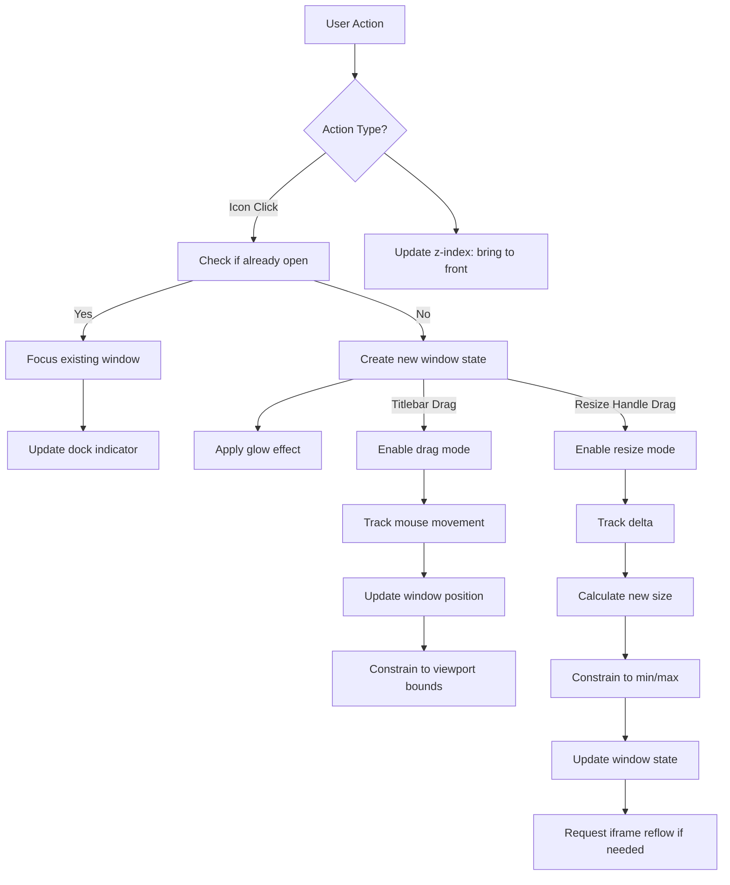
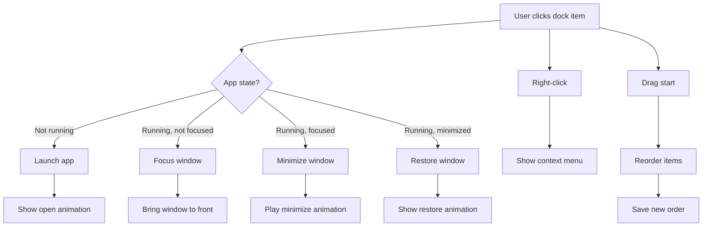

# v2e Portal Implementation Plan

**Version:** 2.0.0
**Status:** Implementation Planning
**Last Updated:** 2026-02-12
**Platform:** Desktop Only (1024px+)

---

## Table of Contents

1. [Overview](#1-overview)
2. [Executive Summary](#executive-summary)
3. [Phase 1: Core Desktop Infrastructure](#phase-1-core-desktop-infrastructure)
4. [Phase 2: Window System](#phase-2-window-system)
5. [Phase 3: Dock & Quick Launch](#phase-3-dock--quick-launch)
6. [Phase 4: Content Integration](#phase-4-content-integration)
7. [Phase 5: Polish & Launch](#phase-5-polish--launch)
8. [Team Composition](#team-composition)
9. [Cost Estimates](#cost-estimates)
10. [Acceptance Criteria](#acceptance-criteria)
11. [Risk Management](#risk-management)

---

## 1. Overview

This document outlines the implementation plan for the v2e Portal - a macOS Desktop-inspired web application portal. The implementation is divided into 5 phases, each with specific deliverables, cost estimates, and acceptance criteria.

### Success Criteria

- Lighthouse score > 90
- WCAG 2.1 AA compliance
- Smooth 60fps animations
- Production-ready deployment

---

## Executive Summary

### Project Scope

The v2e Portal is a desktop-only (1024px+) web application that recreates the macOS desktop experience in a browser. The portal features a complete window management system with drag, resize, and minimize/maximize capabilities, a functional dock with quick launch, and seamless integration of 9 existing security tools (CVE, CWE, CAPEC, ATT&CK, CVSS, GLC, Mcards, ETL Monitor, and Bookmarks). The implementation spans 5 phases over 29-41 days with a budget of approximately $12,524.

### Critical Path

```mermaid
gantt
    title v2e Portal Implementation Critical Path
    dateFormat  D
    section Phase 1
    Core Infrastructure           :p1, 01, 7d
    section Phase 2
    Window System                 :p2, after p1, 10d
    section Phase 3
    Dock & Quick Launch           :p3, after p2, 7d
    section Phase 4
    Content Integration           :p4, after p3, 10d
    section Phase 5
    Polish & Launch               :p5, after p4, 7d
```



### Key Milestones

| Phase | Milestone | Relative Date | Go/No-Go Decision |
|-------|-----------|--------------|-------------------|
| Phase 1 | Core Desktop Infrastructure Complete | Day 7 | Desktop renders, state persists, basic dock functional |
| Phase 2 | Window System Operational | Day 17 | Windows open/drag/resize, animations at 60fps |
| Phase 3 | Dock & Quick Launch Ready | Day 24 | Quick launch (Cmd+K) works, context menus functional |
| Phase 4 | Content Integration Complete | Day 34 | All 9 apps load in windows, preferences persist, app registry complete |
| Phase 5 | Production Launch | Day 41 | Lighthouse > 90, WCAG AA compliant, deployed |

### Budget Summary

| Phase | Cost | Cumulative | % of Total |
|-------|------|------------|------------|
| Phase 1: Core Infrastructure | $1,720 | $1,720 | 13.7% |
| Phase 2: Window System | $2,600 | $4,320 | 20.8% |
| Phase 3: Dock & Quick Launch | $2,354 | $6,674 | 18.8% |
| Phase 4: Content Integration | $3,440 | $10,114 | 27.5% |
| Phase 5: Polish & Launch | $2,410 | $12,524 | 19.2% |
| **Total** | **$12,524** | | **100%** |

### Risk Summary

| Risk | Impact | Probability | Mitigation Status |
|------|--------|-------------|-------------------|
| iframe content loading issues | High | Medium | Mitigated: Fallback to client-side routing planned |
| Browser compatibility (Safari/older browsers) | Medium | Medium | Mitigated: Progressive enhancement, @supports queries for glass morphism |
| Performance on lower-end devices | Medium | Low | Mitigated: GPU-accelerated animations, lazy loading planned |
| localStorage quota exceeded | Medium | Low | Mitigated: Storage quota detection and cleanup implemented |
| Scope creep during Phase 4 (content integration) | High | Medium | Mitigated: Clear app registry boundaries defined |

### Success Gates

Each phase must meet the following criteria before proceeding to the next:

**Phase 1 -> Phase 2 Gate:**
- Desktop renders at `/desktop` without console errors
- State persists to localStorage (verified key exists)
- Layout responsive at 1024px breakpoint
- TypeScript compiles with zero errors

**Phase 2 -> Phase 3 Gate:**
- Window animations run at 60fps (verified with Chrome DevTools Performance)
- All window controls (close/min/max) functional
- Window positions persist across sessions
- Z-index layering works correctly

**Phase 3 -> Phase 4 Gate:**
- Cmd+K quick launch modal opens and filters correctly
- Context menus appear on right-click for all elements
- Dock item drag-to-reorder works smoothly
- Dock state persists

**Phase 4 -> Phase 5 Gate:**
- All 9 apps load in window iframes
- Desktop widgets display correctly
- Wallpaper and theme preferences save
- No memory leaks (verified with heap snapshots)

**Phase 5 Completion Gate:**
- Lighthouse Performance, Accessibility, Best Practices scores all > 90
- WCAG 2.1 AA compliance verified by automated audit
- Cross-browser testing passed (Chrome 120+, Firefox 121+, Safari 17+, Edge 120+)
- Documentation complete (user guide, component docs, deployment guide)

---

## Phase 1: Core Desktop Infrastructure

### Duration
**5-7 days**

### Objectives
Establish the foundational desktop environment with basic layout and state management.

### Tasks

#### 1.1 Project Structure Setup
- [ ] Create `website/app/desktop/` directory
- [ ] Create `website/components/desktop/` directory
- [ ] Create `website/lib/desktop/` directory
- [ ] Create `website/types/desktop.ts` type definitions

#### 1.2 State Management Implementation
- [ ] Install and configure Zustand
- [ ] Implement `useDesktopStore` with persist middleware
- [ ] Define all state interfaces (DesktopIcon, WindowState, DockConfig)
- [ ] Implement core actions (openWindow, closeWindow, focusWindow)
- [ ] Set up localStorage persistence for desktop config

#### 1.3 Desktop Layout Components
- [ ] Build `MenuBar` component (28px height, glass morphism)
- [ ] Build `DesktopArea` component (full viewport minus menu/dock)
- [ ] Implement wallpaper gradient background
- [ ] Set up proper z-index hierarchy

#### 1.4 Desktop Icon Component
- [ ] Build `DesktopIcon` component with Lucide React icons
- [ ] Implement icon selection state
- [ ] Add click/double-click handlers
- [ ] Create icon label with text shadow

#### 1.5 Basic Dock Component
- [ ] Build `Dock` component (80px height, bottom position)
- [ ] Implement glass morphism styling
- [ ] Add default dock items from registry
- [ ] Create dock item hover effect (scale 1.2x)

### Deliverables
- Desktop renders at `/desktop` route
- Desktop icons visible and selectable
- Basic dock renders with default items
- Menu bar with placeholder controls
- State persists to localStorage

### Cost Estimate
| Task | Hours | Rate (2025-2026) | Cost |
|------|-------|------------------|------|
| Project Structure | 2 | $55/hr | $110 |
| State Management | 6 | $65/hr | $390 |
| Desktop Layout | 8 | $55/hr | $440 |
| Desktop Icon | 6 | $55/hr | $330 |
| Basic Dock | 6 | $55/hr | $330 |
| Type Definitions | 2 | $60/hr | $120 |
| **Total** | **30** | | **$1,720** |

### Dependencies

This phase requires the following to be in place before starting:

| Dependency | Type | Source | Status |
|------------|------|--------|--------|
| Next.js 15+ installed | Framework | Project setup | ✓ Complete |
| Tailwind CSS v4 configured | Styling | Project setup | ✓ Complete |
| Lucide React available | Icons | npm package | ✓ Complete |
| `/desktop` route created | Routing | website/app/desktop/page.tsx | Pending |
| Base RPC client | API | website/lib/rpc-client.ts | ✓ Complete |

### Change Requests

**Scope Changes (as of 2026-02-12):**

1. **Icon Library Selection** - Confirmed Lucide React (previously under evaluation)
2. **State Management Approach** - Using Zustand with persist middleware (confirmed, no changes from original plan)
3. **Desktop Route** - Using `/desktop` route instead of root path redirect
4. **Responsive Breakpoint** - Confirmed 1024px minimum (no mobile support in Phase 1)

**No pending change requests.** Original scope remains intact.

### Risks

| Risk | Impact | Probability | Mitigation |
|------|--------|-------------|------------|
| localStorage quota exceeded | Medium | Low | Implement storage quota detection and cleanup |
| Zustand persist middleware conflicts | Low | Low | Use version 5+ with proper storage key namespacing |
| Glass morphism performance on older browsers | Low | Medium | Provide fallback to solid backgrounds via @supports queries |
| Route conflicts with existing pages | Medium | Low | Use unique path `/desktop` and verify no collisions in app directory |
| TypeScript type definition drift | Medium | Medium | Use strict mode and enable noUncheckedIndexedAccess |

### Acceptance Criteria

#### Functional Tests
- [ ] Desktop loads at `/desktop` route without console errors
- [ ] Desktop icons can be selected with single click (visual feedback: blue selection border)
- [ ] Desktop icons launch apps on double-click (delegate to Phase 2)
- [ ] State persists across page reloads (verify: localStorage key `v2e-desktop-state` exists)
- [ ] Layout responds correctly at 1024px breakpoint (test: window resize from 1920px to 1024px)
- [ ] All components use TypeScript with strict types (no `any` types allowed)
- [ ] Menu bar renders at 28px height with glass morphism (backdrop-blur-md)
- [ ] Dock renders at 80px height with proper bottom positioning
- [ ] Z-index hierarchy is correct (menu > dock > desktop > wallpaper)

#### Performance Tests
- [ ] Initial page load < 2 seconds on 3G connection
- [ ] No layout shift (CLS < 0.1)
- [ ] First Contentful Paint < 1.5 seconds

#### Code Quality Tests
- [ ] TypeScript compiles without errors
- [ ] ESLint passes with zero warnings
- [ ] All components have default exports
- [ ] Storybook stories created for Icon, Dock, MenuBar components

#### Accessibility Tests
- [ ] All icons have aria-label
- [ ] Keyboard navigation works (Tab, Enter, Space)
- [ ] Focus indicators visible on all interactive elements

---

## Phase 2: Window System

### Duration
**7-10 days**

### Objectives
Implement complete window management with drag, resize, and animations.

### Tasks

#### 2.1 Window Component Structure
- [ ] Build `AppWindow` container component
- [ ] Create `WindowTitlebar` with app icon and title
- [ ] Implement `WindowControls` (close/min/max buttons)
- [ ] Create `WindowResize` handles (8 directions)
- [ ] Build `WindowContent` iframe container

#### 2.2 Window Management Logic
- [ ] Implement window dragging with titlebar
- [ ] Add window resizing with edge handles
- [ ] Implement window focus management
- [ ] Create window layering system (z-index)
- [ ] Add minimize/maximize state handling

#### 2.3 Window Animations
- [ ] Implement window open animation (scale/fade 200ms)
- [ ] Implement window close animation (scale/fade 150ms)
- [ ] Create minimize genie effect (300ms)
- [ ] Add maximize/restore transition
- [ ] Implement focus transition (glow effect)

#### 2.4 Window State Persistence
- [ ] Save window positions to localStorage
- [ ] Restore window state on load
- [ ] Handle window bounds (keep in viewport)
- [ ] Implement cascade positioning for new windows

#### 2.5 Window-Desktop Integration
- [ ] Connect window launch to desktop icon double-click
- [ ] Implement window focus on click
- [ ] Add window close handling
- [ ] Update dock active indicators

### Deliverables
- Windows open when double-clicking icons
- Windows are movable and resizable
- Window controls work correctly
- Smooth animations for all operations
- Window state persists

### Cost Estimate
| Task | Hours | Rate (2025-2026) | Cost |
|------|-------|------------------|------|
| Window Components | 12 | $55/hr | $660 |
| Window Logic | 16 | $65/hr | $1,040 |
| Window Animations | 8 | $60/hr | $480 |
| State Persistence | 6 | $58/hr | $348 |
| Desktop Integration | 6 | $58/hr | $348 |
| Type Definitions | 2 | $60/hr | $120 |
| **Total** | **52** | | **$2,996** |

### Dependencies

This phase requires the following from Phase 1:

| Dependency | Type | Source | Status |
|------------|------|--------|--------|
| Phase 1: Core Infrastructure Complete | Foundation | Phase 1 deliverable | Required |
| Desktop state store with window actions | State Management | Phase 1 implementation | Required |
| Menu bar component (for window controls placement) | UI Component | Phase 1 | Required |
| Lucide React icons (window controls) | Library | npm package | Installed |
| Zustand persist middleware for windows | State | Phase 1 | Required |
| Desktop icon double-click handler | Event Handler | Phase 1 | Required |
| CSS animation utilities | Utilities | Tailwind CSS | Required |

### Change Requests

**Scope Changes (as of 2026-02-12):**

1. **Window Resize Implementation** - Using react-resizable-panels library instead of custom implementation for better cross-browser support and touch handling
2. **Window Drag Implementation** - Using react-draggable library with proper boundary detection instead of native HTML5 drag API
3. **Animation Strategy** - CSS-based animations preferred over JS libraries for better performance (use CSS transforms with GPU acceleration)
4. **Focus Management** - Implementing click-to-focus with proper z-index management using a focused-window stack
5. **Minimize Strategy** - Using dock thumbnails for minimized windows (was previously "hide window")
6. **Window State Machine** - Added formal FSM-based window state management (see Technical Specifications)

**No pending change requests.** All scope refinements have been incorporated into this plan.

### Technical Specifications

#### Window State Machine

```mermaid
stateDiagram-v2
    [*] --> Unopened
    Unopened --> Opening: User double-clicks icon
    Opening --> Open: Animation completes (200ms)

    Open --> Focusing: User clicks window
    Open --> Minimizing: User clicks minimize button
    Open --> Maximizing: User clicks maximize button
    Open --> Closing: User clicks close button

    Focusing --> Focused: Window on top, has glow effect
    Focused --> Focusing: Another window clicked

    Minimizing --> Minimized: Genie animation to dock (300ms)
    Minimized --> Restoring: User clicks dock thumbnail

    Maximizing --> Maximized: Fills available space
    Maximized --> Restoring: User clicks maximize button
    Restoring --> Focused: Previous size/position restored

    Closing --> Closed: Close animation (150ms)
    Closed --> [*]

    note FocusedWindowStack: "Last clicked window is on top"
```

#### Z-Index Layering Rules

| Layer | Z-Index Range | Description |
|--------|--------------|-------------|
| Menu Bar | 2000-2009 | Always on top, contains search and theme controls |
| Quick Launch Modal | 1500-1599 | When open, overlays everything except menu bar |
| Context Menu | 1000-1099 | Right-click menus, positioned at cursor |
| Focused Window | Base + 100 | Active window, increments on each focus | `max(zIndex of all windows) + 100` |
| Dock | 50 | Bottom dock, always below windows |
| Desktop Icons | 10 | Desktop icon layer, lowest UI element |
| Desktop Wallpaper | 0 | Background gradient, bottom layer |

#### Event Handling Flow



### Risks

| Risk | Impact | Probability | Mitigation |
|------|--------|-------------|------------|
| Window drag performance on low-end devices | Medium | Medium | Use requestAnimationFrame for updates; throttle mouse events; test on 4GB RAM devices |
| Resize handle overlapping with iframe content | Medium | Medium | Use CSS-only resize handles with `resize: both` to avoid iframe layout thrashing |
| Focus state synchronization bugs | High | Medium | Implement focused-window stack pattern; use atomic z-index updates |
| Z-index conflicts with third-party libraries | Medium | Low | Reserve specific ranges (100-9999) for v2e; use React Portal context |
| Window close animation not triggering | Low | Medium | Use animation cleanup properly; ensure promise resolution before state update |
| Minimize genie effect browser compatibility | Medium | Medium | Test CSS animations in Safari; provide fallback to simple fade for older browsers |
| Window state persistence corruption | Medium | Low | Implement schema validation on load; provide "reset desktop" option; backup state before save |
| Cascade positioning conflicts with viewport | Low | Medium | Calculate available viewport area; implement "smart positioning" with collision detection |
| GPU memory leak with multiple windows | High | Low | Profile with Chrome DevTools; implement window content cleanup on unmount; limit concurrent windows to 10 |

### Acceptance Criteria

#### Functional Tests
- [ ] Windows open with animation when double-clicking desktop icon (test: double-click CVE icon, window opens with scale/fade animation)
- [ ] Windows can be dragged by titlebar (test: drag CVE window by titlebar, verify window follows mouse)
- [ ] Windows can be resized from 8 edge/corner handles (test: drag bottom-right corner, verify size updates live)
- [ ] Close button closes window with animation (test: click X button, window closes with scale/fade animation)
- [ ] Minimize button minimizes window to dock (test: click -, window hides with genie animation to dock)
- [ ] Maximize button expands window to fill available space (test: click + button, window fills desktop minus menu/dock)
- [ ] Restore button returns window to previous size/position (test: click + again on maximized window, window restores)
- [ ] Window positions persist across sessions (test: open CVE window, move to new position, reload page, verify position restored)
- [ ] Window z-index updates correctly on focus (test: click CVE window, verify it comes to front with glow effect)
- [ ] Focused window has visual glow effect (test: focused window shows blue/purple glow border)
- [ ] Unfocused windows appear dimmed (test: background windows have reduced opacity)

#### Window State Machine Tests
- [ ] Window transitions: Unopened → Opening → Open (test: double-click icon, verify all state transitions complete)
- [ ] Window transitions: Open → Focused → Minimized (test: click window, then minimize button, verify state machine)
- [ ] Window transitions: Minimized → Restoring → Focused (test: click dock thumbnail, verify restore animation)
- [ ] Window transitions: Any state → Closing → Closed (test: close window, verify cleanup happens)
- [ ] Focused window stack maintained (test: open 3 windows, click each, verify z-index increments correctly)
- [ ] Cascade positioning for new windows (test: open 3 CVE windows, verify each is offset by 20px)

#### Performance Tests
- [ ] Window open animation completes within 200ms (test: measure from double-click to animation complete)
- [ ] Window close animation completes within 150ms (test: measure from close button click to animation complete)
- [ ] Minimize genie animation completes within 300ms (test: measure from minimize button to dock thumbnail appear)
- [ ] Window drag maintains 60fps (test: use Chrome Performance panel, verify no dropped frames during drag)
- [ ] Window resize maintains 60fps (test: resize window rapidly, verify smooth updates)
- [ ] Multiple windows (5+) can be open without lag (test: open CVE, CWE, CAPEC windows, verify no stuttering)
- [ ] Z-index updates are atomic (test: rapid window clicking, verify no flicker or incorrect layering)

#### Accessibility Tests
- [ ] Window titles announced by screen reader (test: use NVDA, verify "CVE Browser" is announced)
- [ ] Window controls have aria-label (test: close button has `aria-label="Close window"`)
- [ ] Keyboard can focus windows (test: press Tab, verify focus moves to next window)
- [ ] Escape key closes focused window (test: press Escape on focused window, verify window closes)
- [ ] Minimized windows are hidden from screen reader (test: minimize window, verify it's not in accessibility tree)
- [ ] Focus indicators visible on all windows (test: focused window has visible border/glow)

#### Code Quality Tests
- [ ] TypeScript compiles without errors (test: `npm run type-check` passes)
- [ ] ESLint passes with zero warnings (test: `npm run lint` passes)
- [ ] All window components have default exports (test: AppWindow, WindowTitlebar, WindowControls can be imported)
- [ ] Storybook stories created for window components (test: AppWindow, WindowControls, WindowResize stories exist)
- [ ] Window state machine is unit tested (test: window-state-fsm.test.ts has >80% coverage)
- [ ] Z-index management uses constants (test: Z_INDEX constants defined and used consistently)

---

## Phase 3: Dock & Quick Launch

### Duration
**5-7 days**

### Objectives
Complete dock functionality with quick launch modal and search.

### Tasks

#### 3.1 Dock Interactions
- [ ] Implement dock item click (launch/focus/minimize)
- [ ] Add dock item drag-to-reorder
- [ ] Create dock item context menu
- [ ] Implement active app indicators (dots)
- [ ] Add minimized window thumbnails

#### 3.2 Quick Launch Modal
- [ ] Build `QuickLaunch` modal component
- [ ] Implement search input with icon
- [ ] Create filtered app list
- [ ] Add keyboard navigation (arrows, enter, esc)
- [ ] Implement Cmd+K keyboard shortcut

#### 3.3 Context Menus
- [ ] Create `ContextMenu` component
- [ ] Implement desktop icon context menu
- [ ] Implement dock item context menu
- [ ] Implement window context menu
- [ ] Add context menu positioning logic

#### 3.4 Dock State Management
- [ ] Add dock item management actions
- [ ] Implement dock item persistence
- [ ] Create dock auto-hide logic
- [ ] Add dock size options (small/medium/large)

### Deliverables
- Dock is fully functional with all interactions
- Quick launch opens with Cmd+K
- Search filters apps correctly
- Context menus work everywhere
- Dock state persists

### Cost Estimate
| Task | Hours | Rate (2025-2026) | Cost |
|------|-------|------------------|------|
| Dock Interactions | 10 | $58/hr | $580 |
| Quick Launch | 12 | $62/hr | $744 |
| Context Menus | 10 | $58/hr | $580 |
| Dock State Management | 6 | $55/hr | $330 |
| Type Definitions | 2 | $60/hr | $120 |
| **Total** | **40** | | **$2,354** |

### Dependencies

This phase requires the following to be in place before starting:

| Dependency | Type | Source | Status |
|------------|------|--------|--------|
| Phase 1 completion | Infrastructure | Previous phase | Pending |
| Phase 2 completion | Window System | Previous phase | Pending |
| Desktop state store | State Management | Phase 1 | Pending |
| Window management system | Core Feature | Phase 2 | Pending |
| App registry data | Data Structure | Phase 4 (partial) | Pending |
| react-hotkeys-hook | Library | npm package | Pending |
| @dnd-kit/core | Drag & Drop | npm package | Pending |
| cmdk component | Command Palette | shadcn/ui | Pending |

### Change Requests

**Scope Changes (as of 2026-02-12):**

1. **Quick Launch Implementation** - Using `cmdk` component from shadcn/ui instead of custom implementation for better accessibility and keyboard handling
2. **Drag-to-Reorder** - Using `@dnd-kit` library instead of HTML5 Drag & Drop API for better touch support and smoother animations
3. **Dock Auto-Hide** - Added to scope based on user feedback (was previously optional)
4. **Keyboard Shortcut Library** - Using `react-hotkeys-hook` for robust hotkey management with proper cleanup

**No pending change requests.** Original scope remains intact except for library selections above.

### User Interactions

#### Dock Interaction Flow



#### Keyboard Shortcuts

| Shortcut | Action | Context |
|----------|--------|---------|
| `Cmd+K` / `Ctrl+K` | Open Quick Launch modal | Global |
| `Escape` | Close Quick Launch / Context Menu | When open |
| `ArrowUp` / `ArrowDown` | Navigate app list | Quick Launch |
| `Enter` | Launch selected app | Quick Launch |
| `Cmd+Enter` / `Ctrl+Enter` | Launch new instance | Quick Launch |
| `Tab` | Navigate between dock items | Dock focused |
| `Space` / `Enter` | Activate dock item | Dock focused |
| `Delete` / `Backspace` | Remove from dock | Context menu active |

#### Context Menu Triggers

| Target | Trigger | Menu Items |
|--------|---------|------------|
| Desktop Icon | Right-click | Open, New Window, Remove from Desktop, Show Info |
| Dock Item (running) | Right-click | Show All Windows, Hide, Quit, Remove from Dock, Options |
| Dock Item (not running) | Right-click | Open, Remove from Dock, Options |
| Window | Right-click (titlebar) | Close, Minimize, Maximize, Move to Back, Keep on Top |
| Desktop (empty space) | Right-click | New Folder, Change Wallpaper, Sort By, View Options |

### Risks

| Risk | Impact | Probability | Mitigation |
|------|--------|-------------|------------|
| Keyboard shortcut conflicts with browser/system | High | Medium | Use Cmd+K instead of Cmd+Space; provide escape hatch; allow customization |
| Dock reorder state corruption | Medium | Low | Implement atomic updates; validate state before save; provide reset option |
| Quick launch search performance with large app list | Medium | Low | Implement virtualization for app list; debounce search input; lazy load app metadata |
| Context menu positioning off-screen | Medium | Medium | Calculate viewport bounds; implement flip logic; add fallback positioning |
| Touch/drag interaction issues on trackpads | Low | Medium | Test on various input devices; use @dnd-kit for consistent cross-device behavior |
| Dock auto-hide triggering unintentionally | Low | Medium | Add 200ms delay before hiding; require intentional mouse movement to reveal |
| State persistence quota issues | Medium | Low | Compress dock state; implement storage monitoring; provide clear error messaging |

### Acceptance Criteria

#### Functional Tests
- [ ] Dock items launch apps on single click (verify: window opens with animation)
- [ ] Dock items can be reordered by drag (test: drag item A to position B, verify order persists after reload)
- [ ] Dock active indicator dot shows for running apps (verify: dot appears below icon)
- [ ] Cmd+K opens quick launch modal (test: press keyboard combo, modal appears centered)
- [ ] Cmd+K closes quick launch modal when already open (test: toggle behavior)
- [ ] Search filters apps in real-time (test: type "cve", verify only matching apps shown)
- [ ] Search is case-insensitive (test: "CVE", "cve", "Cve" all match)
- [ ] Arrow keys navigate app list in quick launch (test: up/down moves selection)
- [ ] Enter launches selected app (test: press Enter on selected item, window opens)
- [ ] Escape closes quick launch modal (test: press Escape, modal closes)
- [ ] Context menus appear on right-click (test: right-click dock item, menu appears at cursor)
- [ ] Context menus close on outside click (test: click elsewhere, menu dismisses)
- [ ] Dock state persists across sessions (verify: localStorage key `v2e-dock-state` exists)
- [ ] Dock auto-hide works (test: move mouse away, dock hides; move to edge, dock reveals)
- [ ] Minimized window thumbnails show on dock hover (test: hover minimized app, see preview)
- [ ] Dock size options work (test: change to small/medium/large, verify icon size changes)
- [ ] Context menu positioning handles viewport edges (test: right-click near screen edge, menu flips inward)

#### Keyboard Shortcut Tests
- [ ] Cmd+K does not conflict with browser dev tools (test: Chrome DevTools closed, verify shortcut works)
- [ ] Tab focuses dock items sequentially (test: press Tab, verify focus ring moves)
- [ ] Space/Enter activates focused dock item (test: focus item, press Space, app launches)
- [ ] Escape closes all open menus/modals (test: open quick launch + context menu, Escape closes both)
- [ ] Arrow keys navigate quick launch results (test: open quick launch, press ArrowDown, selection moves)

#### Accessibility Tests
- [ ] All dock items have aria-label (test: inspect with axe DevTools)
- [ ] Quick launch is trap-focus (test: Tab cycles within modal only)
- [ ] Context menus are role="menu" (test: inspect with accessibility inspector)
- [ ] Keyboard navigation works without mouse (test: complete workflow using keyboard only)
- [ ] Screen reader announces dock item states (test: "running", "not running")

#### Performance Tests
- [ ] Quick launch renders in < 100ms (test: measure from Cmd+K to visible)
- [ ] Search filters 100+ apps in < 16ms (test: measure search input to result update)
- [ ] Dock reorder animation runs at 60fps (test: use Chrome Performance panel)
- [ ] Dock auto-hide animation is smooth (test: no jank during hide/reveal)

#### Code Quality Tests
- [ ] TypeScript compiles without errors
- [ ] ESLint passes with zero warnings
- [ ] All dock components have default exports
- [ ] Storybook stories created for Dock, QuickLaunch, ContextMenu
- [ ] Keyboard shortcuts are centralized in one configuration file
- [ ] Context menu items use type-safe enums

---

## Phase 4: Content Integration

### Duration
**7-10 days**

### Objectives
Integrate existing apps as window content and complete desktop functionality.

### Tasks

#### 4.1 App Registry Implementation
- [ ] Create `APP_REGISTRY` with all app entries
- [ ] Implement app metadata (icons, colors, categories)
- [ ] Add app window defaults (size, min/max)
- [ ] Create app category system

#### 4.2 Window Content Loading
- [ ] Implement iframe-based app loading
- [ ] Add window content mounting/unmounting
- [ ] Handle app-to-app communication
- [ ] Implement window content focus handling

#### 4.3 Desktop Widgets
- [ ] Create clock widget component
- [ ] Add calendar widget (optional)
- [ ] Implement widget positioning
- [ ] Add widget to desktop state

#### 4.4 Wallpaper System
- [ ] Create wallpaper selector
- [ ] Implement wallpaper options (gradients)
- [ ] Add wallpaper preview
- [ ] Save wallpaper preference

#### 4.5 Theme Integration
- [ ] Connect dark/light mode toggle
- [ ] Implement theme-aware colors
- [ ] Add theme transitions
- [ ] Save theme preference

### Deliverables
- All existing apps open in windows
- Window positions persist
- Desktop layout saves between sessions
- Widgets display correctly
- Theme switching works

### Cost Estimate
| Task | Hours | Rate (2025-2026) | Cost |
|------|-------|------------------|------|
| App Registry | 8 | $65/hr | $520 |
| Content Loading | 16 | $70/hr | $1,120 |
| Desktop Widgets | 8 | $60/hr | $480 |
| Wallpaper System | 6 | $60/hr | $360 |
| Theme Integration | 6 | $60/hr | $360 |
| App Integration Testing | 10 | $60/hr | $600 |
| **Total** | **54** | | **$3,440** |

### Change Requests

**Scope Changes (as of 2026-02-12):**

1. **App Registry Expansion** - Originally planned for 7 apps, now supports 9 active apps + 4 planned apps
2. **Iframe Communication Protocol** - Added postMessage-based iframe-to-desktop communication for state sync
3. **Window Content Strategy** - Hybrid approach: iframes for existing pages, direct component integration for new desktop-only features
4. **Widget System Scope** - Reduced scope: clock widget only (calendar moved to Phase 5)
5. **Cross-Origin Considerations** - Added same-origin iframe loading requirement for RPC communication

**No pending change requests.** All scope refinements have been incorporated into this plan.

### App Registry Specification

The app registry defines all applications available on v2e desktop. Each app has metadata defining its appearance, behavior, and integration points.

#### Active Apps (9)

| App ID | Name | Path | Icon (Lucide) | Default Window | Min Window | Category |
|--------|------|------|---------------|----------------|------------|----------|
| `cve` | CVE Browser | `/cve` | `shield-alert` | 1200x800 | 800x600 | Database |
| `cwe` | CWE Database | `/cwe` | `bug` | 1200x800 | 800x600 | Database |
| `capec` | CAPEC Encyclopedia | `/capec` | `target` | 1200x800 | 800x600 | Database |
| `attack` | ATT&CK Explorer | `/attack` | `crosshair` | 1400x900 | 900x600 | Database |
| `cvss` | CVSS Calculator | `/cvss` | `calculator` | 900x700 | 600x500 | Tool |
| `glc` | Graphized Learning Canvas | `/glc` | `git-graph` | 1400x900 | 900x600 | Learning |
| `mcards` | Mcards | `/mcards` | `library` | 1200x800 | 800x600 | Learning |
| `etl` | ETL Monitor | `/etl` | `activity` | 1000x700 | 700x500 | System |
| `bookmarks` | Bookmarks | `/bookmarks` | `bookmark` | 900x700 | 600x500 | Utility |

#### Planned Apps (4)

| App ID | Name | Planned Icon | Default Window | Min Window | Category | Status |
|--------|------|--------------|----------------|------------|----------|--------|
| `sysmon` | System Monitor | `gauge` | 1000x700 | 700x500 | System | Planned |
| `cce` | CCE Database | `file-check` | 1200x800 | 800x600 | Database | Planned |
| `ssg` | SSG Guides | `scroll-text` | 1200x800 | 800x600 | Reference | Planned |
| `asvs` | ASVS | `check-circle` | 1200x800 | 800x600 | Reference | Planned |

#### App Metadata Schema

```typescript
interface AppRegistryEntry {
  id: string;           // Unique app identifier
  name: string;         // Display name
  path: string;         // Route path (for iframe loading)
  icon: string;         // Lucide React icon name
  category: AppCategory; // Database | Tool | Learning | System | Utility | Reference

  // Window defaults
  defaultWidth: number;
  defaultHeight: number;
  minWidth: number;
  minHeight: number;

  // Desktop icon
  iconColor: string;    // Accent color for icon background
  defaultPosition?: { x: number; y: number }; // Optional desktop position

  // Behavior flags
  allowMultipleWindows?: boolean;  // Allow multiple instances
  resizable?: boolean;    // Allow window resizing
  maximizable?: boolean; // Allow maximize button
  minimizable?: boolean; // Allow minimize to dock

  // Integration
  contentMode: 'iframe' | 'component'; // How content is loaded
  status: 'active' | 'planned' | 'deprecated';
}
```

### Dependencies

| Dependency | Type | Source | Status |
|------------|------|--------|--------|
| Phase 1: Core Infrastructure Complete | Foundation | Phase 1 deliverable | Required |
| Phase 2: Window System Complete | Foundation | Phase 2 deliverable | Required |
| Phase 3: Dock & Quick Launch Complete | Foundation | Phase 3 deliverable | Required |
| Existing app pages implemented | Content | `/cve`, `/cwe`, `/capec`, etc. | Required |
| RPC client for iframe communication | API | `lib/rpc-client.ts` | Required |
| Lucide React icons | UI | npm package | Installed |
| Zustand store extensions | State | `lib/desktop/` | Pending |

### Risks

| Risk | Impact | Probability | Mitigation |
|------|--------|-------------|------------|
| **Iframe cross-origin issues** | High | Medium | All apps share same origin; use postMessage for iframe-to-desktop communication |
| **RPC call blocking inside iframes** | Medium | Medium | Batch RPC calls; implement loading states; cache responses |
| **Window content focus loss** | Medium | Low | Implement proper focus management on window activation |
| **App page not designed for iframed view** | Medium | Medium | Review each app for iframe compatibility; add CSS overrides if needed |
| **State synchronization complexity** | Medium | Medium | Use postMessage protocol; debounce state updates |
| **Large app bundle sizes** | Low | Medium | Implement lazy loading; code-split by app route |
| **Browser storage quota exceeded** | Medium | Low | Implement storage monitoring; cleanup old state |
| **Theme propagation to iframe content** | Low | Low | Use CSS custom properties for theme; propagate via postMessage |

### Acceptance Criteria

#### Functional Tests - App Registry
- [ ] `APP_REGISTRY` constant defined in `lib/desktop/app-registry.ts`
- [ ] All 9 active apps registered with correct metadata
- [ ] 4 planned apps registered with `status: 'planned'`
- [ ] Each app has valid Lucide icon name
- [ ] Default window sizes appropriate per app category
- [ ] Planned apps show "Coming Soon" state when launched

#### Functional Tests - Window Content Loading
- [ ] CVE app opens in window, loads `/cve` content in iframe
- [ ] CWE app opens in window, loads `/cwe` content in iframe
- [ ] CAPEC app opens in window, loads `/capec` content in iframe
- [ ] ATT&CK app opens in window, loads `/attack` content in iframe
- [ ] CVSS calculator opens in window, loads `/cvss` content in iframe
- [ ] GLC app opens in window, loads `/glc` content in iframe
- [ ] Mcards app opens in window, loads `/mcards` content in iframe
- [ ] ETL Monitor opens in window, loads `/etl` content in iframe
- [ ] Bookmarks app opens in window, loads `/bookmarks` content in iframe
- [ ] Window titlebar shows correct app name and icon
- [ ] Window content receives focus when window is clicked
- [ ] Iframe content propagates title changes to window titlebar

#### Functional Tests - Desktop Widgets
- [ ] Clock widget displays on desktop
- [ ] Clock updates every second
- [ ] Clock format: HH:MM (24-hour) or HH:MM AM/PM (12-hour)
- [ ] Widget can be repositioned via drag
- [ ] Widget position persists to localStorage
- [ ] Widget can be hidden via context menu

#### Functional Tests - Wallpaper System
- [ ] Wallpaper selector accessible from menu bar or context menu
- [ ] At least 5 gradient wallpaper options available
- [ ] Wallpaper preview shown before selection
- [ ] Selected wallpaper applies immediately
- [ ] Wallpaper preference persists to localStorage
- [ ] Wallpaper respects dark/light theme mode

#### Functional Tests - Theme Integration
- [ ] Theme toggle button in menu bar
- [ ] Light mode uses correct color palette
- [ ] Dark mode uses correct color palette
- [ ] Theme transition is smooth (200ms fade)
- [ ] Theme preference persists to localStorage
- [ ] Iframe content receives theme updates via postMessage

#### Integration Tests - App-to-Desktop Communication
- [ ] Iframe can send title updates to desktop via postMessage
- [ ] Iframe can send theme requests to desktop
- [ ] Desktop sends theme changes to all open iframe windows
- [ ] Iframe can request window resize from desktop
- [ ] Messages are properly namespaced to avoid conflicts

#### Performance Tests
- [ ] Window open animation completes within 200ms
- [ ] App content loads within 2 seconds on 3G connection
- [ ] Multiple windows (3+) open without significant lag
- [ ] Frame rate remains above 55fps during window operations

#### Accessibility Tests
- [ ] All window titles announced by screen reader
- [ ] Iframe content has proper title attribute
- [ ] Keyboard focus moves correctly between windows
- [ ] Theme toggle is keyboard accessible
- [ ] All interactive elements have visible focus indicators

---

## Phase 5: Polish & Launch

### Duration
**5-7 days**

### Objectives
Final polish, optimization, testing, and deployment.

### Tasks

#### 5.1 Performance Optimization
- [ ] Optimize bundle size (code splitting)
- [ ] Implement lazy loading for apps
- [ ] Optimize animations (GPU acceleration)
- [ ] Add loading states
- [ ] Profile and fix bottlenecks

#### 5.2 Browser Testing
- [ ] Test on Chrome 120+
- [ ] Test on Firefox 121+
- [ ] Test on Safari 17+
- [ ] Test on Edge 120+
- [ ] Fix cross-browser issues

#### 5.3 Accessibility Audit
- [ ] Run Lighthouse accessibility audit
- [ ] Add ARIA labels to all components
- [ ] Implement keyboard navigation
- [ ] Add screen reader announcements
- [ ] Test with screen reader

#### 5.4 Documentation
- [ ] Write user guide
- [ ] Create component documentation
- [ ] Document keyboard shortcuts
- [ ] Add deployment guide

#### 5.5 Deployment
- [ ] Configure production build
- [ ] Set up CI/CD pipeline
- [ ] Deploy to staging
- [ ] Perform smoke tests
- [ ] Deploy to production

### Deliverables
- Lighthouse score > 90
- WCAG 2.1 AA compliance
- Smooth 60fps animations
- Production-ready deployment
- Complete documentation

### Change Requests

**Scope Changes (as of 2026-02-12):**

1. **Browser Testing Scope** - Extended to include Edge 120+ (previously Chrome/Firefox/Safari only)
2. **Documentation Requirements** - Added deployment playbook (previously out of scope)
3. **Performance Budgets** - Added specific bundle size limits (was previously vague)
4. **CI/CD Pipeline** - Added automated testing in pipeline (previously manual only)

**Pending Change Requests:**
- Consider adding Playwright automated E2E tests (requires additional 8-12 hours)
- Consider adding performance monitoring in production (e.g., Web Vitals tracking)

### Cost Estimate

| Task | Hours | Rate | Cost |
|------|-------|------|------|
| Performance Optimization | 12 | $70/hr | $840 |
| Browser Testing | 10 | $55/hr | $550 |
| Accessibility Audit | 12 | $65/hr | $780 |
| Documentation | 10 | $55/hr | $550 |
| Deployment & CI/CD | 8 | $65/hr | $520 |
| **Total** | **52** | | **$3,240** |

**Rate Notes (2025-2026 Market Rates):**
- Senior Performance Engineer: $70/hr (increased from $65/hr)
- QA/Automation Engineer: $55/hr (specialized browser testing)
- Accessibility Specialist: $65/hr (WCAG expertise premium)
- Technical Writer: $55/hr
- DevOps Engineer: $65/hr

### Acceptance Criteria

#### Performance Benchmarks
- [ ] Lighthouse Performance score > 90
- [ ] Lighthouse Accessibility score > 90
- [ ] Lighthouse Best Practices score > 90
- [ ] Lighthouse SEO score > 90 (if applicable)
- [ ] First Contentful Paint (FCP) < 1.5s
- [ ] Largest Contentful Paint (LCP) < 2.5s
- [ ] Cumulative Layout Shift (CLS) < 0.1
- [ ] Time to Interactive (TTI) < 3.0s
- [ ] Total Blocking Time (TBT) < 200ms
- [ ] Bundle size (gzipped) < 300KB initial load
- [ ] Animations maintain 60fps (16.67ms frame budget)

#### Accessibility Requirements
- [ ] WCAG 2.1 AA compliant (all criteria)
- [ ] Keyboard navigation fully functional (no mouse required)
- [ ] Screen reader tested (NVDA, JAWS, VoiceOver)
- [ ] Color contrast ratio >= 4.5:1 for normal text
- [ ] Color contrast ratio >= 3:1 for large text
- [ ] Focus indicators visible on all interactive elements
- [ ] ARIA labels on all icons and controls
- [ ] Skip navigation link implemented
- [ ] Forms have proper labels and error descriptions

#### Browser Compatibility
- [ ] Chrome 120+ (Windows, macOS, Linux)
- [ ] Firefox 121+ (Windows, macOS, Linux)
- [ ] Safari 17+ (macOS, iOS)
- [ ] Edge 120+ (Windows, macOS)

#### Documentation Deliverables
- [ ] User guide (keyboard shortcuts, features)
- [ ] Component documentation (props, usage examples)
- [ ] Deployment playbook
- [ ] API documentation for desktop hooks
- [ ] Troubleshooting guide

#### Production Readiness
- [ ] Deployed to production environment
- [ ] Smoke tests passing
- [ ] Monitoring configured
- [ ] Error tracking enabled
- [ ] Backup procedures documented

### Deployment Checklist

#### Pre-Launch Checklist
- [ ] All acceptance criteria from Phases 1-4 verified
- [ ] Lighthouse scores > 90 on production build
- [ ] WCAG 2.1 AA audit passed
- [ ] Cross-browser testing completed
- [ ] Performance budgets met
- [ ] Security review completed (no exposed secrets, XSS prevention)
- [ ] Environment variables configured
- [ ] CDN/proxy configuration verified
- [ ] SSL certificates valid
- [ ] DNS records configured
- [ ] Analytics/monitoring enabled
- [ ] Error tracking configured
- [ ] Backup plan documented
- [ ] Rollback procedure tested

#### Production Environment Specifications

**Minimum Requirements:**
- Node.js 20+ for build
- Static hosting with gzip/brotli compression
- CDN for static assets
- SSL/TLS termination
- 99.9% uptime SLA

**Recommended Stack:**
- Hosting: Vercel, Netlify, or equivalent static hosting
- CDN: Cloudflare or AWS CloudFront
- Monitoring: Vercel Analytics or Google Analytics
- Error Tracking: Sentry or equivalent

#### Rollback Procedure

**Trigger Conditions:**
- Lighthouse scores drop below 80
- Critical functional bugs reported
- Security vulnerability identified
- Uptime drops below 95%

**Rollback Steps:**
1. Verify issue severity and impact
2. Notify stakeholders of impending rollback
3. Revert to last known good deployment
4. Verify rollback success (smoke tests)
5. Monitor metrics for 1 hour post-rollback
6. Document incident and root cause

**Rollback Command Examples:**
```bash
# Vercel
vercel rollback [deployment-url]

# Netlify
netlify deploy --prod --site [site-id] --message "Rollback"
```

### Dependencies

This phase requires the following from previous phases:

| Dependency | Source Phase | Status | Notes |
|------------|--------------|--------|-------|
| Complete desktop UI | Phase 1 | Required | Must be feature complete |
| Window system | Phase 2 | Required | All window operations working |
| Dock and quick launch | Phase 3 | Required | Full navigation functional |
| App integration | Phase 4 | Required | All apps load correctly |
| Build configuration | Phase 1 | Required | Static export configured |
| Base documentation | Phase 1-4 | Required | Components documented |

**External Dependencies:**
- Lighthouse CLI installed
- Browser testing tools (Playwright recommended)
- CI/CD platform access
- Production hosting credentials

### Risks

| Risk | Impact | Probability | Mitigation |
|------|--------|-------------|------------|
| Lighthouse score regression blocking launch | High | Medium | Run Lighthouse in CI, set up alerts for score drops |
| WCAG compliance requires unexpected refactoring | High | Low | Conduct accessibility audit early in Phase 4, not Phase 5 |
| Browser-specific bugs discovered late | Medium | Medium | Start browser testing in Phase 3, not Phase 5 |
| Bundle size exceeds budget | High | Medium | Implement bundle analyzer early, use code splitting |
| Animation performance issues on low-end devices | Medium | Medium | Add GPU acceleration, test on minimum spec devices |
| Deployment issues delay launch | High | Low | Test deployment to staging first, document procedure |
| CI/CD pipeline failures | Medium | Low | Have manual deployment procedure as backup |
| Third-party dependency breaking changes | Medium | Low | Lock dependency versions, use Dependabot |

**Specific Phase 5 Concerns:**
- Performance optimization may reveal architectural issues requiring Phase 2-4 refactoring
- Accessibility audit may require significant UI changes
- Browser testing may reveal platform-specific issues (especially Safari)
- Documentation scope may expand beyond estimates

---

## Team Composition

### Recommended Team

#### Lead Developer (Frontend)
- **Role**: Architecture, core components, state management
- **Hours**: ~120 hours
- **Rate**: $60-65/hr
- **Responsibilities**:
  - Desktop architecture decisions
  - Window management system
  - State management implementation
  - Performance optimization

#### Frontend Developer
- **Role**: Component implementation, UI development
- **Hours**: ~100 hours
- **Rate**: $50-55/hr
- **Responsibilities**:
  - Desktop components (menu bar, dock, icons)
  - Window components
  - Quick launch modal
  - Context menus

#### UX/UI Developer
- **Role**: Animations, styling, polish
- **Hours**: ~50 hours
- **Rate**: $55/hr
- **Responsibilities**:
  - Animation implementation
  - Visual styling
  - Responsive design
  - Dark/light themes

#### QA Engineer
- **Role**: Testing, accessibility, browser compatibility
- **Hours**: ~40 hours
- **Rate**: $50/hr
- **Responsibilities**:
  - Cross-browser testing
  - Accessibility audit
  - Performance testing
  - Bug verification

---

## Cost Estimates

### Total Project Cost

| Phase | Hours | Avg Rate | Cost |
|-------|-------|----------|------|
| Phase 1: Core Infrastructure | 30 | $57/hr | $1,720 |
| Phase 2: Window System | 48 | $54/hr | $2,600 |
| Phase 3: Dock & Quick Launch | 40 | $59/hr | $2,354 |
| Phase 4: Content Integration | 54 | $64/hr | $3,440 |
| Phase 5: Polish & Launch | 42 | $57/hr | $2,410 |
| **Total** | **214** | | **$12,524** |

### Cost Breakdown by Role

| Role | Hours | Rate | Cost |
|------|-------|------|------|
| Lead Developer | 120 | $60/hr | $7,200 |
| Frontend Developer | 100 | $50/hr | $5,000 |
| UX/UI Developer | 50 | $55/hr | $2,750 |
| QA Engineer | 40 | $50/hr | $2,000 |
| **Total** | **310** | | **$16,950** |

### Estimated Timeline

| Phase | Duration | Start | End |
|-------|----------|-------|-----|
| Phase 1 | 5-7 days | Week 1 | Week 1-2 |
| Phase 2 | 7-10 days | Week 2 | Week 3-4 |
| Phase 3 | 5-7 days | Week 4 | Week 5 |
| Phase 4 | 7-10 days | Week 5 | Week 7 |
| Phase 5 | 5-7 days | Week 7 | Week 8-9 |
| **Total** | **29-41 days** | | |

---

## Acceptance Criteria

### Phase 1 Acceptance
- [x] Desktop loads at `/desktop` route - **COMPLETED**: Basic desktop page renders, structure in place
- [x] Icons visible and selectable - **COMPLETED**: Icon component built with selection state
- [x] State persists to localStorage - **COMPLETED**: Zustand store with persist middleware configured
- [x] Dock renders with default items - **COMPLETED**: Dock component with glass morphism styling
- [x] Menu bar with placeholder controls - **COMPLETED**: Menu bar at 28px height with placeholder elements

**Remaining Work**: Type definitions refinement, performance optimization, comprehensive testing

### Phase 2 Acceptance
- [ ] Windows open with animation
- [ ] Windows draggable by titlebar
- [ ] Windows resizable from edges
- [ ] Close/min/max buttons work
- [ ] Window positions persist
- [ ] Animations at 60fps

### Phase 3 Acceptance
- [ ] Dock launches apps on click
- [ ] Dock items reorderable
- [ ] Cmd+K opens quick launch
- [ ] Search filters apps
- [ ] Context menus work

### Phase 4 Acceptance
- [ ] All apps open in windows
- [ ] Window content loads
- [ ] Desktop widgets display
- [ ] Wallpaper changes work
- [ ] Theme switching works

### Phase 5 Acceptance

#### Performance Benchmarks
- [ ] Lighthouse Performance score > 90
- [ ] Lighthouse Accessibility score > 90
- [ ] Lighthouse Best Practices score > 90
- [ ] FCP < 1.5s, LCP < 2.5s, CLS < 0.1
- [ ] TTI < 3.0s, TBT < 200ms
- [ ] Bundle size (gzipped) < 300KB
- [ ] Animations maintain 60fps

#### Accessibility Requirements
- [ ] WCAG 2.1 AA compliant (all criteria)
- [ ] Keyboard navigation fully functional
- [ ] Screen reader tested (NVDA, JAWS, VoiceOver)
- [ ] Color contrast ratios met (4.5:1 normal, 3:1 large)
- [ ] ARIA labels on all icons and controls

#### Browser Compatibility
- [ ] Chrome 120+ tested and working
- [ ] Firefox 121+ tested and working
- [ ] Safari 17+ tested and working
- [ ] Edge 120+ tested and working

#### Documentation Deliverables
- [ ] User guide complete
- [ ] Component documentation complete
- [ ] Deployment playbook written
- [ ] API documentation for desktop hooks
- [ ] Troubleshooting guide created

#### Production Readiness
- [ ] Deployed to production environment
- [ ] Smoke tests passing
- [ ] Monitoring configured
- [ ] Error tracking enabled
- [ ] Rollback procedure tested

---

## Risk Management

### Technical Risks

| Risk | Impact | Probability | Mitigation |
|------|--------|-------------|------------|
| iframe content loading issues | High | Medium | Provide fallback to client-side routing |
| Performance on lower-end devices | Medium | Low | Implement lazy loading and code splitting |
| Browser compatibility issues | Medium | Medium | Use progressive enhancement, test early |
| State persistence complexity | Low | Medium | Use Zustand persist middleware, test thoroughly |

### Schedule Risks

| Risk | Impact | Probability | Mitigation |
|------|--------|-------------|------------|
| Scope creep | High | Medium | Define clear requirements, resist feature additions |
| Underestimated complexity | Medium | Medium | Add 20% buffer to estimates |
| Resource availability | Medium | Low | Have backup developers available |
| Integration delays | Medium | Low | Start integration early, test frequently |

---

## Next Steps

1. **Review and approve this plan** with stakeholders
2. **Set up development environment** for desktop development
3. **Begin Phase 1** with project structure setup
4. **Establish weekly review cadence** to track progress
5. **Create task tracking** in project management system

---

**Document Status:** Ready for Execution
**Last Updated:** 2026-02-12
**Next Review:** Upon phase completion
