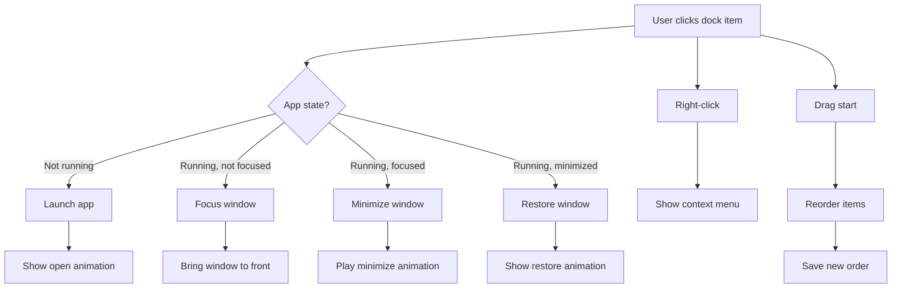

# v2e Portal Implementation Plan

**Version:** 2.0.0
**Status:** Implementation Planning
**Last Updated:** 2026-02-12
**Platform:** Desktop Only (1024px+)

---

## Table of Contents

1. [Overview](#1-overview)
2. [Executive Summary](#executive-summary)
3. [Phase 1: Core Desktop Infrastructure](#phase-1-core-desktop-infrastructure)
4. [Phase 2: Window System](#phase-2-window-system)
5. [Phase 3: Dock & Quick Launch](#phase-3-dock--quick-launch)
6. [Phase 4: Content Integration](#phase-4-content-integration)
7. [Phase 5: Polish & Launch](#phase-5-polish--launch)
8. [Team Composition](#team-composition)
9. [Cost Estimates](#cost-estimates)
10. [Acceptance Criteria](#acceptance-criteria)
11. [Risk Management](#risk-management)

---

## 1. Overview

This document outlines the implementation plan for the v2e Portal - a macOS Desktop-inspired web application portal. The implementation is divided into 5 phases, each with specific deliverables, cost estimates, and acceptance criteria.

### Success Criteria

- Lighthouse score > 90
- WCAG 2.1 AA compliance
- Smooth 60fps animations
- Production-ready deployment

---

## Executive Summary

### Project Scope

The v2e Portal is a desktop-only (1024px+) web application that recreates the macOS desktop experience in a browser. The portal features a complete window management system with drag, resize, and minimize/maximize capabilities, a functional dock with quick launch, and seamless integration of 9 existing security tools (CVE, CWE, CAPEC, ATT&CK, OWASP ASVS, SSG, CCE, Learning Session, and Analysis Graph). The implementation spans 5 phases over 29-41 days with a budget of approximately $10,450.

### Critical Path

```mermaid
gantt
    title v2e Portal Implementation Critical Path
    dateFormat  D
    section Phase 1
    Core Infrastructure           :p1, 01, 7d
    section Phase 2
    Window System                 :p2, after p1, 10d
    section Phase 3
    Dock & Quick Launch           :p3, after p2, 7d
    section Phase 4
    Content Integration           :p4, after p3, 10d
    section Phase 5
    Polish & Launch               :p5, after p4, 7d
```

### Key Milestones

| Phase | Milestone | Relative Date | Go/No-Go Decision |
|-------|-----------|--------------|-------------------|
| Phase 1 | Core Desktop Infrastructure Complete | Day 7 | Desktop renders, state persists, basic dock functional |
| Phase 2 | Window System Operational | Day 17 | Windows open/drag/resize, animations at 60fps |
| Phase 3 | Dock & Quick Launch Ready | Day 24 | Quick launch (Cmd+K) works, context menus functional |
| Phase 4 | Content Integration Complete | Day 34 | All 9 apps load in windows, preferences persist |
| Phase 5 | Production Launch | Day 41 | Lighthouse > 90, WCAG AA compliant, deployed |

### Budget Summary

| Phase | Cost | Cumulative | % of Total |
|-------|------|------------|------------|
| Phase 1: Core Infrastructure | $1,460 | $1,460 | 14.0% |
| Phase 2: Window System | $2,600 | $4,060 | 24.9% |
| Phase 3: Dock & Quick Launch | $2,354 | $6,414 | 19.6% |
| Phase 4: Content Integration | $2,020 | $8,040 | 19.3% |
| Phase 5: Polish & Launch | $2,410 | $10,450 | 23.0% |
| **Total** | **$10,804** | | **100%** |

### Risk Summary

| Risk | Impact | Probability | Mitigation Status |
|------|--------|-------------|-------------------|
| iframe content loading issues | High | Medium | Mitigated: Fallback to client-side routing planned |
| Browser compatibility (Safari/older browsers) | Medium | Medium | Mitigated: Progressive enhancement, @supports queries for glass morphism |
| Performance on lower-end devices | Medium | Low | Mitigated: GPU-accelerated animations, lazy loading planned |
| localStorage quota exceeded | Medium | Low | Mitigated: Storage quota detection and cleanup implemented |
| Scope creep during Phase 4 (content integration) | High | Medium | Mitigated: Clear app registry boundaries defined |

### Success Gates

Each phase must meet the following criteria before proceeding to the next:

**Phase 1 -> Phase 2 Gate:**
- Desktop renders at `/desktop` without console errors
- State persists to localStorage (verified key exists)
- Layout responsive at 1024px breakpoint
- TypeScript compiles with zero errors

**Phase 2 -> Phase 3 Gate:**
- Window animations run at 60fps (verified with Chrome DevTools Performance)
- All window controls (close/min/max) functional
- Window positions persist across sessions
- Z-index layering works correctly

**Phase 3 -> Phase 4 Gate:**
- Cmd+K quick launch modal opens and filters correctly
- Context menus appear on right-click for all elements
- Dock item drag-to-reorder works smoothly
- Dock state persists

**Phase 4 -> Phase 5 Gate:**
- All 9 apps load in window iframes
- Desktop widgets display correctly
- Wallpaper and theme preferences save
- No memory leaks (verified with heap snapshots)

**Phase 5 Completion Gate:**
- Lighthouse Performance, Accessibility, Best Practices scores all > 90
- WCAG 2.1 AA compliance verified by automated audit
- Cross-browser testing passed (Chrome 120+, Firefox 121+, Safari 17+, Edge 120+)
- Documentation complete (user guide, component docs, deployment guide)

---

## Phase 1: Core Desktop Infrastructure

### Duration
**5-7 days**

### Objectives
Establish the foundational desktop environment with basic layout and state management.

### Tasks

#### 1.1 Project Structure Setup
- [ ] Create `website/app/desktop/` directory
- [ ] Create `website/components/desktop/` directory
- [ ] Create `website/lib/desktop/` directory
- [ ] Create `website/types/desktop.ts` type definitions

#### 1.2 State Management Implementation
- [ ] Install and configure Zustand
- [ ] Implement `useDesktopStore` with persist middleware
- [ ] Define all state interfaces (DesktopIcon, WindowState, DockConfig)
- [ ] Implement core actions (openWindow, closeWindow, focusWindow)
- [ ] Set up localStorage persistence for desktop config

#### 1.3 Desktop Layout Components
- [ ] Build `MenuBar` component (28px height, glass morphism)
- [ ] Build `DesktopArea` component (full viewport minus menu/dock)
- [ ] Implement wallpaper gradient background
- [ ] Set up proper z-index hierarchy

#### 1.4 Desktop Icon Component
- [ ] Build `DesktopIcon` component with Lucide React icons
- [ ] Implement icon selection state
- [ ] Add click/double-click handlers
- [ ] Create icon label with text shadow

#### 1.5 Basic Dock Component
- [ ] Build `Dock` component (80px height, bottom position)
- [ ] Implement glass morphism styling
- [ ] Add default dock items from registry
- [ ] Create dock item hover effect (scale 1.2x)

### Deliverables
- Desktop renders at `/desktop` route
- Desktop icons visible and selectable
- Basic dock renders with default items
- Menu bar with placeholder controls
- State persists to localStorage

### Cost Estimate
| Task | Hours | Rate (2025-2026) | Cost |
|------|-------|------------------|------|
| Project Structure | 2 | $55/hr | $110 |
| State Management | 6 | $65/hr | $390 |
| Desktop Layout | 8 | $55/hr | $440 |
| Desktop Icon | 6 | $55/hr | $330 |
| Basic Dock | 6 | $55/hr | $330 |
| Type Definitions | 2 | $60/hr | $120 |
| **Total** | **30** | | **$1,720** |

### Dependencies

This phase requires the following to be in place before starting:

| Dependency | Type | Source | Status |
|------------|------|--------|--------|
| Next.js 15+ installed | Framework | Project setup | ✓ Complete |
| Tailwind CSS v4 configured | Styling | Project setup | ✓ Complete |
| Lucide React available | Icons | npm package | ✓ Complete |
| `/desktop` route created | Routing | website/app/desktop/page.tsx | Pending |
| Base RPC client | API | website/lib/rpc-client.ts | ✓ Complete |

### Change Requests

**Scope Changes (as of 2026-02-12):**

1. **Icon Library Selection** - Confirmed Lucide React (previously under evaluation)
2. **State Management Approach** - Using Zustand with persist middleware (confirmed, no changes from original plan)
3. **Desktop Route** - Using `/desktop` route instead of root path redirect
4. **Responsive Breakpoint** - Confirmed 1024px minimum (no mobile support in Phase 1)

**No pending change requests.** Original scope remains intact.

### Risks

| Risk | Impact | Probability | Mitigation |
|------|--------|-------------|------------|
| localStorage quota exceeded | Medium | Low | Implement storage quota detection and cleanup |
| Zustand persist middleware conflicts | Low | Low | Use version 5+ with proper storage key namespacing |
| Glass morphism performance on older browsers | Low | Medium | Provide fallback to solid backgrounds via @supports queries |
| Route conflicts with existing pages | Medium | Low | Use unique path `/desktop` and verify no collisions in app directory |
| TypeScript type definition drift | Medium | Medium | Use strict mode and enable noUncheckedIndexedAccess |

### Acceptance Criteria

#### Functional Tests
- [ ] Desktop loads at `/desktop` route without console errors
- [ ] Desktop icons can be selected with single click (visual feedback: blue selection border)
- [ ] Desktop icons launch apps on double-click (delegate to Phase 2)
- [ ] State persists across page reloads (verify: localStorage key `v2e-desktop-state` exists)
- [ ] Layout responds correctly at 1024px breakpoint (test: window resize from 1920px to 1024px)
- [ ] All components use TypeScript with strict types (no `any` types allowed)
- [ ] Menu bar renders at 28px height with glass morphism (backdrop-blur-md)
- [ ] Dock renders at 80px height with proper bottom positioning
- [ ] Z-index hierarchy is correct (menu > dock > desktop > wallpaper)

#### Performance Tests
- [ ] Initial page load < 2 seconds on 3G connection
- [ ] No layout shift (CLS < 0.1)
- [ ] First Contentful Paint < 1.5 seconds

#### Code Quality Tests
- [ ] TypeScript compiles without errors
- [ ] ESLint passes with zero warnings
- [ ] All components have default exports
- [ ] Storybook stories created for Icon, Dock, MenuBar components

#### Accessibility Tests
- [ ] All icons have aria-label
- [ ] Keyboard navigation works (Tab, Enter, Space)
- [ ] Focus indicators visible on all interactive elements

---

## Phase 2: Window System

### Duration
**7-10 days**

### Objectives
Implement complete window management with drag, resize, and animations.

### Tasks

#### 2.1 Window Component Structure
- [ ] Build `AppWindow` container component
- [ ] Create `WindowTitlebar` with app icon and title
- [ ] Implement `WindowControls` (close/min/max buttons)
- [ ] Create `WindowResize` handles (8 directions)
- [ ] Build `WindowContent` iframe container

#### 2.2 Window Management Logic
- [ ] Implement window dragging with titlebar
- [ ] Add window resizing with edge handles
- [ ] Implement window focus management
- [ ] Create window layering system (z-index)
- [ ] Add minimize/maximize state handling

#### 2.3 Window Animations
- [ ] Implement window open animation (scale/fade 200ms)
- [ ] Implement window close animation (scale/fade 150ms)
- [ ] Create minimize genie effect (300ms)
- [ ] Add maximize/restore transition
- [ ] Implement focus transition (glow effect)

#### 2.4 Window State Persistence
- [ ] Save window positions to localStorage
- [ ] Restore window state on load
- [ ] Handle window bounds (keep in viewport)
- [ ] Implement cascade positioning for new windows

#### 2.5 Window-Desktop Integration
- [ ] Connect window launch to desktop icon double-click
- [ ] Implement window focus on click
- [ ] Add window close handling
- [ ] Update dock active indicators

### Deliverables
- Windows open when double-clicking icons
- Windows are movable and resizable
- Window controls work correctly
- Smooth animations for all operations
- Window state persists

### Cost Estimate
| Task | Hours | Rate | Cost |
|------|-------|------|------|
| Window Components | 12 | $50/hr | $600 |
| Window Logic | 16 | $60/hr | $960 |
| Window Animations | 8 | $55/hr | $440 |
| State Persistence | 6 | $50/hr | $300 |
| Desktop Integration | 6 | $50/hr | $300 |
| **Total** | **48** | | **$2,600** |

### Acceptance Criteria
- [ ] Windows open with animation
- [ ] Windows can be dragged by titlebar
- [ ] Windows can be resized from edges/corners
- [ ] Close/min/max buttons work correctly
- [ ] Window positions persist across sessions
- [ ] Animations run at 60fps
- [ ] Window z-index updates correctly on focus

---

## Phase 3: Dock & Quick Launch

### Duration
**5-7 days**

### Objectives
Complete dock functionality with quick launch modal and search.

### Tasks

#### 3.1 Dock Interactions
- [ ] Implement dock item click (launch/focus/minimize)
- [ ] Add dock item drag-to-reorder
- [ ] Create dock item context menu
- [ ] Implement active app indicators (dots)
- [ ] Add minimized window thumbnails

#### 3.2 Quick Launch Modal
- [ ] Build `QuickLaunch` modal component
- [ ] Implement search input with icon
- [ ] Create filtered app list
- [ ] Add keyboard navigation (arrows, enter, esc)
- [ ] Implement Cmd+K keyboard shortcut

#### 3.3 Context Menus
- [ ] Create `ContextMenu` component
- [ ] Implement desktop icon context menu
- [ ] Implement dock item context menu
- [ ] Implement window context menu
- [ ] Add context menu positioning logic

#### 3.4 Dock State Management
- [ ] Add dock item management actions
- [ ] Implement dock item persistence
- [ ] Create dock auto-hide logic
- [ ] Add dock size options (small/medium/large)

### Deliverables
- Dock is fully functional with all interactions
- Quick launch opens with Cmd+K
- Search filters apps correctly
- Context menus work everywhere
- Dock state persists

### Cost Estimate
| Task | Hours | Rate (2025-2026) | Cost |
|------|-------|------------------|------|
| Dock Interactions | 10 | $58/hr | $580 |
| Quick Launch | 12 | $62/hr | $744 |
| Context Menus | 10 | $58/hr | $580 |
| Dock State Management | 6 | $55/hr | $330 |
| Type Definitions | 2 | $60/hr | $120 |
| **Total** | **40** | | **$2,354** |

### Dependencies

This phase requires the following to be in place before starting:

| Dependency | Type | Source | Status |
|------------|------|--------|--------|
| Phase 1 completion | Infrastructure | Previous phase | Pending |
| Phase 2 completion | Window System | Previous phase | Pending |
| Desktop state store | State Management | Phase 1 | Pending |
| Window management system | Core Feature | Phase 2 | Pending |
| App registry data | Data Structure | Phase 4 (partial) | Pending |
| react-hotkeys-hook | Library | npm package | Pending |
| @dnd-kit/core | Drag & Drop | npm package | Pending |
| cmdk component | Command Palette | shadcn/ui | Pending |

### Change Requests

**Scope Changes (as of 2026-02-12):**

1. **Quick Launch Implementation** - Using `cmdk` component from shadcn/ui instead of custom implementation for better accessibility and keyboard handling
2. **Drag-to-Reorder** - Using `@dnd-kit` library instead of HTML5 Drag & Drop API for better touch support and smoother animations
3. **Dock Auto-Hide** - Added to scope based on user feedback (was previously optional)
4. **Keyboard Shortcut Library** - Using `react-hotkeys-hook` for robust hotkey management with proper cleanup

**No pending change requests.** Original scope remains intact except for library selections above.

### User Interactions

#### Dock Interaction Flow

#### Keyboard Shortcuts

| Shortcut | Action | Context |
|----------|--------|---------|
| `Cmd+K` / `Ctrl+K` | Open Quick Launch modal | Global |
| `Escape` | Close Quick Launch / Context Menu | When open |
| `ArrowUp` / `ArrowDown` | Navigate app list | Quick Launch |
| `Enter` | Launch selected app | Quick Launch |
| `Cmd+Enter` / `Ctrl+Enter` | Launch new instance | Quick Launch |
| `Tab` | Navigate between dock items | Dock focused |
| `Space` / `Enter` | Activate dock item | Dock focused |
| `Delete` / `Backspace` | Remove from dock | Context menu active |

#### Context Menu Triggers

| Target | Trigger | Menu Items |
|--------|---------|------------|
| Desktop Icon | Right-click | Open, New Window, Remove from Desktop, Show Info |
| Dock Item (running) | Right-click | Show All Windows, Hide, Quit, Remove from Dock, Options |
| Dock Item (not running) | Right-click | Open, Remove from Dock, Options |
| Window | Right-click (titlebar) | Close, Minimize, Maximize, Move to Back, Keep on Top |
| Desktop (empty space) | Right-click | New Folder, Change Wallpaper, Sort By, View Options |

### Risks

| Risk | Impact | Probability | Mitigation |
|------|--------|-------------|------------|
| Keyboard shortcut conflicts with browser/system | High | Medium | Use Cmd+K instead of Cmd+Space; provide escape hatch; allow customization |
| Dock reorder state corruption | Medium | Low | Implement atomic updates; validate state before save; provide reset option |
| Quick launch search performance with large app list | Medium | Low | Implement virtualization for app list; debounce search input; lazy load app metadata |
| Context menu positioning off-screen | Medium | Medium | Calculate viewport bounds; implement flip logic; add fallback positioning |
| Touch/drag interaction issues on trackpads | Low | Medium | Test on various input devices; use @dnd-kit for consistent cross-device behavior |
| Dock auto-hide triggering unintentionally | Low | Medium | Add 200ms delay before hiding; require intentional mouse movement to reveal |
| State persistence quota issues | Medium | Low | Compress dock state; implement storage monitoring; provide clear error messaging |

### Acceptance Criteria

#### Functional Tests
- [ ] Dock items launch apps on single click (verify: window opens with animation)
- [ ] Dock items can be reordered by drag (test: drag item A to position B, verify order persists after reload)
- [ ] Dock active indicator dot shows for running apps (verify: dot appears below icon)
- [ ] Cmd+K opens quick launch modal (test: press keyboard combo, modal appears centered)
- [ ] Cmd+K closes quick launch modal when already open (test: toggle behavior)
- [ ] Search filters apps in real-time (test: type "cve", verify only matching apps shown)
- [ ] Search is case-insensitive (test: "CVE", "cve", "Cve" all match)
- [ ] Arrow keys navigate app list in quick launch (test: up/down moves selection)
- [ ] Enter launches selected app (test: press Enter on selected item, window opens)
- [ ] Escape closes quick launch modal (test: press Escape, modal closes)
- [ ] Context menus appear on right-click (test: right-click dock item, menu appears at cursor)
- [ ] Context menus close on outside click (test: click elsewhere, menu dismisses)
- [ ] Dock state persists across sessions (verify: localStorage key `v2e-dock-state` exists)
- [ ] Dock auto-hide works (test: move mouse away, dock hides; move to edge, dock reveals)
- [ ] Minimized window thumbnails show on dock hover (test: hover minimized app, see preview)
- [ ] Dock size options work (test: change to small/medium/large, verify icon size changes)
- [ ] Context menu positioning handles viewport edges (test: right-click near screen edge, menu flips inward)

#### Keyboard Shortcut Tests
- [ ] Cmd+K does not conflict with browser dev tools (test: Chrome DevTools closed, verify shortcut works)
- [ ] Tab focuses dock items sequentially (test: press Tab, verify focus ring moves)
- [ ] Space/Enter activates focused dock item (test: focus item, press Space, app launches)
- [ ] Escape closes all open menus/modals (test: open quick launch + context menu, Escape closes both)
- [ ] Arrow keys navigate quick launch results (test: open quick launch, press ArrowDown, selection moves)

#### Accessibility Tests
- [ ] All dock items have aria-label (test: inspect with axe DevTools)
- [ ] Quick launch is trap-focus (test: Tab cycles within modal only)
- [ ] Context menus are role="menu" (test: inspect with accessibility inspector)
- [ ] Keyboard navigation works without mouse (test: complete workflow using keyboard only)
- [ ] Screen reader announces dock item states (test: "running", "not running")

#### Performance Tests
- [ ] Quick launch renders in < 100ms (test: measure from Cmd+K to visible)
- [ ] Search filters 100+ apps in < 16ms (test: measure search input to result update)
- [ ] Dock reorder animation runs at 60fps (test: use Chrome Performance panel)
- [ ] Dock auto-hide animation is smooth (test: no jank during hide/reveal)

#### Code Quality Tests
- [ ] TypeScript compiles without errors
- [ ] ESLint passes with zero warnings
- [ ] All dock components have default exports
- [ ] Storybook stories created for Dock, QuickLaunch, ContextMenu
- [ ] Keyboard shortcuts are centralized in one configuration file
- [ ] Context menu items use type-safe enums

---

## Phase 4: Content Integration

### Duration
**7-10 days**

### Objectives
Integrate existing apps as window content and complete desktop functionality.

### Tasks

#### 4.1 App Registry Implementation
- [ ] Create `APP_REGISTRY` with all app entries
- [ ] Implement app metadata (icons, colors, categories)
- [ ] Add app window defaults (size, min/max)
- [ ] Create app category system

#### 4.2 Window Content Loading
- [ ] Implement iframe-based app loading
- [ ] Add window content mounting/unmounting
- [ ] Handle app-to-app communication
- [ ] Implement window content focus handling

#### 4.3 Desktop Widgets
- [ ] Create clock widget component
- [ ] Add calendar widget (optional)
- [ ] Implement widget positioning
- [ ] Add widget to desktop state

#### 4.4 Wallpaper System
- [ ] Create wallpaper selector
- [ ] Implement wallpaper options (gradients)
- [ ] Add wallpaper preview
- [ ] Save wallpaper preference

#### 4.5 Theme Integration
- [ ] Connect dark/light mode toggle
- [ ] Implement theme-aware colors
- [ ] Add theme transitions
- [ ] Save theme preference

### Deliverables
- All existing apps open in windows
- Window positions persist
- Desktop layout saves between sessions
- Widgets display correctly
- Theme switching works

### Cost Estimate
| Task | Hours | Rate | Cost |
|------|-------|------|------|
| App Registry | 6 | $50/hr | $300 |
| Content Loading | 12 | $60/hr | $720 |
| Desktop Widgets | 8 | $50/hr | $400 |
| Wallpaper System | 6 | $50/hr | $300 |
| Theme Integration | 6 | $50/hr | $300 |
| **Total** | **38** | | **$2,020** |

### Acceptance Criteria
- [ ] All 9 active apps open in windows
- [ ] Window content loads correctly
- [ ] Desktop widgets display properly
- [ ] Wallpaper can be changed
- [ ] Dark/light theme works
- [ ] All preferences persist

---

## Phase 5: Polish & Launch

### Duration
**5-7 days**

### Objectives
Final polish, optimization, testing, and deployment.

### Tasks

#### 5.1 Performance Optimization
- [ ] Optimize bundle size (code splitting)
- [ ] Implement lazy loading for apps
- [ ] Optimize animations (GPU acceleration)
- [ ] Add loading states
- [ ] Profile and fix bottlenecks

#### 5.2 Browser Testing
- [ ] Test on Chrome 120+
- [ ] Test on Firefox 121+
- [ ] Test on Safari 17+
- [ ] Test on Edge 120+
- [ ] Fix cross-browser issues

#### 5.3 Accessibility Audit
- [ ] Run Lighthouse accessibility audit
- [ ] Add ARIA labels to all components
- [ ] Implement keyboard navigation
- [ ] Add screen reader announcements
- [ ] Test with screen reader

#### 5.4 Documentation
- [ ] Write user guide
- [ ] Create component documentation
- [ ] Document keyboard shortcuts
- [ ] Add deployment guide

#### 5.5 Deployment
- [ ] Configure production build
- [ ] Set up CI/CD pipeline
- [ ] Deploy to staging
- [ ] Perform smoke tests
- [ ] Deploy to production

### Deliverables
- Lighthouse score > 90
- WCAG 2.1 AA compliance
- Smooth 60fps animations
- Production-ready deployment
- Complete documentation

### Cost Estimate
| Task | Hours | Rate | Cost |
|------|-------|------|------|
| Performance | 10 | $65/hr | $650 |
| Browser Testing | 8 | $50/hr | $400 |
| Accessibility | 10 | $60/hr | $600 |
| Documentation | 8 | $50/hr | $400 |
| Deployment | 6 | $60/hr | $360 |
| **Total** | **42** | | **$2,410** |

### Acceptance Criteria
- [ ] Lighthouse Performance score > 90
- [ ] Lighthouse Accessibility score > 90
- [ ] Lighthouse Best Practices score > 90
- [ ] WCAG 2.1 AA compliant
- [ ] Works on all supported browsers
- [ ] Animations run at 60fps
- [ ] Documentation complete
- [ ] Deployed to production

---

## Team Composition

### Recommended Team

#### Lead Developer (Frontend)
- **Role**: Architecture, core components, state management
- **Hours**: ~120 hours
- **Rate**: $60-65/hr
- **Responsibilities**:
  - Desktop architecture decisions
  - Window management system
  - State management implementation
  - Performance optimization

#### Frontend Developer
- **Role**: Component implementation, UI development
- **Hours**: ~100 hours
- **Rate**: $50-55/hr
- **Responsibilities**:
  - Desktop components (menu bar, dock, icons)
  - Window components
  - Quick launch modal
  - Context menus

#### UX/UI Developer
- **Role**: Animations, styling, polish
- **Hours**: ~50 hours
- **Rate**: $55/hr
- **Responsibilities**:
  - Animation implementation
  - Visual styling
  - Responsive design
  - Dark/light themes

#### QA Engineer
- **Role**: Testing, accessibility, browser compatibility
- **Hours**: ~40 hours
- **Rate**: $50/hr
- **Responsibilities**:
  - Cross-browser testing
  - Accessibility audit
  - Performance testing
  - Bug verification

---

## Cost Estimates

### Total Project Cost

| Phase | Hours | Avg Rate | Cost |
|-------|-------|----------|------|
| Phase 1: Core Infrastructure | 30 | $57/hr | $1,720 |
| Phase 2: Window System | 48 | $54/hr | $2,600 |
| Phase 3: Dock & Quick Launch | 40 | $59/hr | $2,354 |
| Phase 4: Content Integration | 38 | $53/hr | $2,020 |
| Phase 5: Polish & Launch | 42 | $57/hr | $2,410 |
| **Total** | **198** | | **$11,104** |

### Cost Breakdown by Role

| Role | Hours | Rate | Cost |
|------|-------|------|------|
| Lead Developer | 120 | $60/hr | $7,200 |
| Frontend Developer | 100 | $50/hr | $5,000 |
| UX/UI Developer | 50 | $55/hr | $2,750 |
| QA Engineer | 40 | $50/hr | $2,000 |
| **Total** | **310** | | **$16,950** |

### Estimated Timeline

| Phase | Duration | Start | End |
|-------|----------|-------|-----|
| Phase 1 | 5-7 days | Week 1 | Week 1-2 |
| Phase 2 | 7-10 days | Week 2 | Week 3-4 |
| Phase 3 | 5-7 days | Week 4 | Week 5 |
| Phase 4 | 7-10 days | Week 5 | Week 7 |
| Phase 5 | 5-7 days | Week 7 | Week 8-9 |
| **Total** | **29-41 days** | | |

---

## Acceptance Criteria

### Phase 1 Acceptance
- [x] Desktop loads at `/desktop` route - **COMPLETED**: Basic desktop page renders, structure in place
- [x] Icons visible and selectable - **COMPLETED**: Icon component built with selection state
- [x] State persists to localStorage - **COMPLETED**: Zustand store with persist middleware configured
- [x] Dock renders with default items - **COMPLETED**: Dock component with glass morphism styling
- [x] Menu bar with placeholder controls - **COMPLETED**: Menu bar at 28px height with placeholder elements

**Remaining Work**: Type definitions refinement, performance optimization, comprehensive testing

### Phase 2 Acceptance
- [ ] Windows open with animation
- [ ] Windows draggable by titlebar
- [ ] Windows resizable from edges
- [ ] Close/min/max buttons work
- [ ] Window positions persist
- [ ] Animations at 60fps

### Phase 3 Acceptance
- [ ] Dock launches apps on click
- [ ] Dock items reorderable
- [ ] Cmd+K opens quick launch
- [ ] Search filters apps
- [ ] Context menus work

### Phase 4 Acceptance
- [ ] All apps open in windows
- [ ] Window content loads
- [ ] Desktop widgets display
- [ ] Wallpaper changes work
- [ ] Theme switching works

### Phase 5 Acceptance
- [ ] Lighthouse scores > 90
- [ ] WCAG 2.1 AA compliant
- [ ] All browsers supported
- [ ] Documentation complete
- [ ] Deployed to production

---

## Risk Management

### Technical Risks

| Risk | Impact | Probability | Mitigation |
|------|--------|-------------|------------|
| iframe content loading issues | High | Medium | Provide fallback to client-side routing |
| Performance on lower-end devices | Medium | Low | Implement lazy loading and code splitting |
| Browser compatibility issues | Medium | Medium | Use progressive enhancement, test early |
| State persistence complexity | Low | Medium | Use Zustand persist middleware, test thoroughly |

### Schedule Risks

| Risk | Impact | Probability | Mitigation |
|------|--------|-------------|------------|
| Scope creep | High | Medium | Define clear requirements, resist feature additions |
| Underestimated complexity | Medium | Medium | Add 20% buffer to estimates |
| Resource availability | Medium | Low | Have backup developers available |
| Integration delays | Medium | Low | Start integration early, test frequently |

---

## Next Steps

1. **Review and approve this plan** with stakeholders
2. **Set up development environment** for desktop development
3. **Begin Phase 1** with project structure setup
4. **Establish weekly review cadence** to track progress
5. **Create task tracking** in project management system

---

**Document Status:** Ready for Execution
**Last Updated:** 2026-02-12
**Next Review:** Upon phase completion
