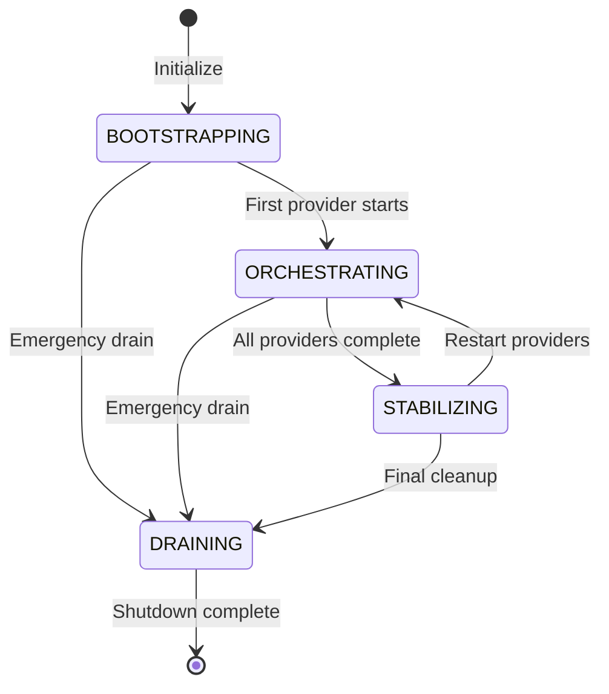
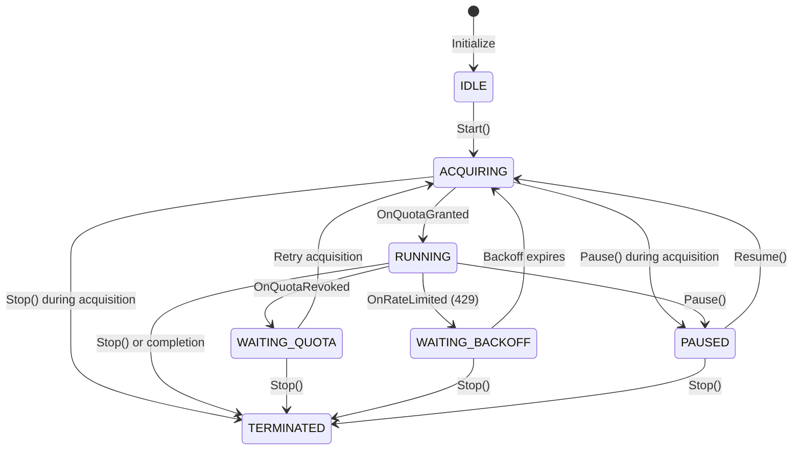
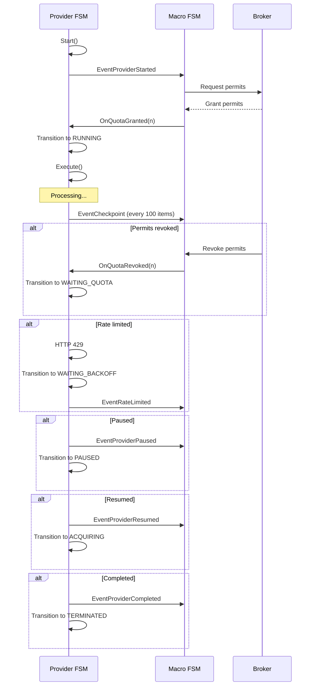

# Provider FSM Lifecycle and Transitions

This document describes the hierarchical Finite State Machine (HFSM) architecture used by the Unified ETL Engine (UEE) in the v2e meta service.

## Overview

The meta service implements a two-level FSM hierarchy:

1. **Macro FSM (Orchestrator)** - High-level coordination
2. **Provider FSM (Worker)** - Individual data source providers (CVE, CWE, CAPEC, ATT&CK, SSG, ASVS, CCE)

The FSM design enables:
- Resource-aware execution with permit management
- Auto-recovery after service restart
- Graceful handling of rate limiting and quota changes
- Event-driven state transitions

## Macro FSM States

The Macro FSM manages the overall orchestration of all providers.

### State Diagram



### State Descriptions

| State | Description |
|--------|-------------|
| **BOOTSTRAPPING** | Initial state, setting up resources and loading persisted state |
| **ORCHESTRATING** | Active state, coordinating provider FSMs, processing events |
| **STABILIZING** | Winding down, waiting for providers to finish cleanup |
| **DRAINING** | Final state, cleaning up resources before shutdown |

### Valid Macro Transitions

| From | To | Trigger |
|-------|-----|---------|
| BOOTSTRAPPING | ORCHESTRATING | First provider starts (`EventProviderStarted`) |
| BOOTSTRAPPING | DRAINING | Emergency shutdown requested |
| ORCHESTRATING | STABILIZING | All providers complete (`EventProviderCompleted`) |
| ORCHESTRATING | DRAINING | Emergency shutdown requested |
| STABILIZING | ORCHESTRATING | Provider restart triggered |
| STABILIZING | DRAINING | Final cleanup requested |

## Provider FSM States

Each data provider (CVE, CWE, CAPEC, ATT&CK, SSG, ASVS, CCE) has its own Provider FSM.

### State Diagram



### State Descriptions

| State | Description |
|--------|-------------|
| **IDLE** | Not executing, waiting for work. Initial state for all providers. |
| **ACQUIRING** | Requesting permits from broker to begin processing. |
| **RUNNING** | Actively processing items, holding permits. |
| **WAITING_QUOTA** | Paused due to permit revocation by broker. Will retry acquisition. |
| **WAITING_BACKOFF** | Paused due to API rate limiting (HTTP 429). Waiting before retry. |
| **PAUSED** | Manually paused by user request. |
| **TERMINATED** | Completed processing or stopped. Final state. |

### Valid Provider Transitions

| From | To | Trigger | Method |
|-------|-----|----------|---------|
| IDLE | ACQUIRING | `Start()` | Start() |
| ACQUIRING | RUNNING | Permit granted | `OnQuotaGranted(n)` |
| ACQUIRING | PAUSED | User pause during acquisition | `Pause()` |
| ACQUIRING | TERMINATED | Stop during acquisition | `Stop()` |
| RUNNING | WAITING_QUOTA | Broker revoked permits | `OnQuotaRevoked(n)` |
| RUNNING | WAITING_BACKOFF | HTTP 429 rate limit | `OnRateLimited(duration)` |
| RUNNING | PAUSED | User pause | `Pause()` |
| RUNNING | TERMINATED | Stop or completion | `Stop()` |
| WAITING_QUOTA | ACQUIRING | Retry permit acquisition | Auto-retry |
| WAITING_QUOTA | TERMINATED | Stop while waiting | `Stop()` |
| WAITING_BACKOFF | ACQUIRING | Backoff timer expires | Auto-retry |
| WAITING_BACKOFF | TERMINATED | Stop during backoff | `Stop()` |
| PAUSED | ACQUIRING | User resume | `Resume()` |
| PAUSED | TERMINATED | Stop while paused | `Stop()` |

## Event System

Events are emitted by providers and bubble up to the Macro FSM for coordination.

### Event Types

| Event | Source | Description |
|--------|---------|-------------|
| `PROVIDER_STARTED` | Provider | Provider has started processing |
| `PROVIDER_COMPLETED` | Provider | Provider has completed successfully |
| `PROVIDER_FAILED` | Provider | Provider has failed |
| `PROVIDER_PAUSED` | Provider | Provider was paused |
| `PROVIDER_RESUMED` | Provider | Provider was resumed |
| `QUOTA_REVOKED` | Broker | Broker revoked permits |
| `QUOTA_GRANTED` | Broker | Broker granted permits |
| `RATE_LIMITED` | External API | Provider hit rate limit |
| `CHECKPOINT` | Provider | Provider reached a checkpoint (every 100 items) |

### Event Flow



## Dependency Management

Providers can declare dependencies on other providers. A provider will not start until all its dependencies are in `TERMINATED` state.

### Dependency Validation

Before starting a provider, the Macro FSM validates:
1. All dependency provider IDs exist
2. All dependency providers are in `TERMINATED` state

If validation fails, the provider cannot start.

### Topological Ordering

The Macro FSM uses topological sort (Kahn's algorithm) to determine provider startup order:
1. Providers with no dependencies start first
2. Dependent providers start after their dependencies complete
3. Cycles are detected and rejected at registration time

## Auto-Recovery

On service restart, the FSM restores state from persistent storage (BoltDB).

### Recovery Strategy by State

| Saved State | Recovery Action |
|--------------|-----------------|
| RUNNING | Resume with permit re-acquisition |
| PAUSED | Keep paused (manual resume required) |
| WAITING_QUOTA | Transition to ACQUIRING (retry permit request) |
| WAITING_BACKOFF | Maintain state (auto-retry timer active) |
| TERMINATED | Skip (do not recover) |
| IDLE | Keep idle |

### Recovery Example

```go
// On meta service startup
macroFSM := fsm.NewMacroFSMManager("main", storage)
err := macroFSM.LoadState()

// RUNNING providers automatically request permits
// PAUSED providers wait for manual Resume()
// WAITING_QUOTA providers transition to ACQUIRING
```

## Checkpointing

Providers save checkpoints using URN (Uniform Resource Name) identifiers for atomic recovery.

### URN Format

| Data Type | URN Example |
|------------|--------------|
| CVE | `v2e::nvd::cve::CVE-2024-12233` |
| CWE | `v2e::mitre::cwe::CWE-79` |
| CAPEC | `v2e::mitre::capec::CAPEC-66` |
| ATT&CK | `v2e::mitre::attack::T1078` |
| SSG | `v2e::nist::ssg::guide-rhel8` |
| ASVS | `v2e::owasp::asvs::14.1` |
| CCE | `v2e::nist::cce::CCE-12345` |

### Checkpoint Storage

Checkpoints are saved to BoltDB with the following schema:

| Field | Type | Description |
|--------|--------|-------------|
| URN | string | Full URN of checkpoint |
| ProviderID | string | Provider FSM identifier |
| ProcessedAt | timestamp | When checkpoint was created |
| Success | bool | Whether processing succeeded |
| ErrorMessage | string (optional) | Error message if failed |

## Configuration

Providers accept common configuration via `ProviderConfig`:

| Field | Type | Default | Description |
|--------|--------|----------|-------------|
| ID | string | (required) | Unique provider identifier |
| ProviderType | string | (required) | Type: "cve", "cwe", "capec", "attack", etc. |
| Storage | *Store | nil | Storage for state persistence |
| Executor | func() error | nil | Custom execution logic |
| Dependencies | []string | nil | Provider IDs that must complete first |
| BatchSize | int | 100 | Items per batch |
| MaxRetries | int | 3 | Maximum retry attempts |
| RetryDelay | duration | 5s | Delay between retries |

## Monitoring

### Provider Statistics

Each provider exposes statistics via `GetStats()`:

| Metric | Type | Description |
|---------|--------|-------------|
| id | string | Provider identifier |
| state | string | Current state |
| provider_type | string | Provider type |
| last_checkpoint | string | URN of last checkpoint |
| processed_count | int64 | Total items processed |
| error_count | int64 | Total errors encountered |
| permits_held | int32 | Current permits held |
| created_at | timestamp | When provider was created |
| updated_at | timestamp | Last state change |

### Macro FSM Statistics

The Macro FSM exposes aggregated statistics:

| Metric | Type | Description |
|---------|--------|-------------|
| id | string | Macro FSM identifier |
| state | string | Current macro state |
| provider_count | int | Total number of providers |
| event_queue_len | int | Number of pending events |
| provider_states | map | Count of providers in each state |
| created_at | timestamp | When macro FSM was created |
| updated_at | timestamp | Last state change |

## Implementation Pattern

To implement a new provider, embed `BaseProviderFSM` and override `Execute()`:

```go
package providers

import "github.com/cyw0ng95/v2e/pkg/meta/fsm"

type CustomProvider struct {
    *fsm.BaseProviderFSM
    // Add provider-specific fields
    client *http.Client
    batchSize int
}

func NewCustomProvider(id string, storage *storage.Store) *CustomProvider {
    base, _ := fsm.NewBaseProviderFSM(fsm.ProviderConfig{
        ID:           id,
        ProviderType:  "custom",
        Storage:       storage,
        BatchSize:     100,
        MaxRetries:    3,
        RetryDelay:     5 * time.Second,
        Dependencies:  []string{"cve"}, // Requires CVE data
    })

    return &CustomProvider{
        BaseProviderFSM: base,
        // Initialize provider-specific fields
    }
}

func (p *CustomProvider) Execute() error {
    // Custom execution logic
    // Use p.SaveCheckpoint() for progress tracking
    // Use p.Transition() for state changes
    return nil
}
```

## Related Files

- `pkg/meta/fsm/types.go` - FSM state definitions and interfaces
- `pkg/meta/fsm/provider.go` - BaseProviderFSM implementation
- `pkg/meta/fsm/macro.go` - MacroFSMManager implementation
- `pkg/meta/fsm/strategy.go` - Transition validation strategy
- `pkg/meta/storage/storage.go` - State persistence layer
- `cmd/v2meta/service.md` - RPC API documentation
